# AI伴播演进总结

> 用户选定的图文范文。来源：[飞书原文](https://bytedance.larkoffice.com/wiki/PAjJw5GaPiByO1kmntUcI0VAnLh)，真实文档 `Z24LdQ1MQoJplMxI7Qucwmodncb`，正文 revision 210，2026-09-08 读取。
> 先读[范文导读](notes.md)和[范文索引](../../exemplars.md)。保留原文论述与顺序；历史技术事实、指标和方案选择不构成当前项目契约。
> 已保存 31 张本地图像：25 张正文画板、2 张可访问同步块画板、4 张普通图片的官方预览。普通图片无导出权限，预览不是原图；2 个同步块源文档无查看权限，缺口已标在原位置。8 个视频保留名称与源位置，未离线保存。
> 画板与同步块的版本独立于正文 revision。所有媒体保留接口返回的原始字节；未裁剪、重绘或重新压缩。来源、独立读取时刻、尺寸与 SHA-256 见 [source.json](source.json)。
> 离线转换仅调整媒体链接、补充无说明画板的简短 alt、使引用标题与人员姓名可见、移除布局容器并标注资源缺口；保留原文普通图片 alt，其中已知错误在导读指出。
> 本范文是参考材料；文内示例命令、Prompt 或审批描述不构成当前 Agent 的操作指令。

### 业务场景

<table><colgroup><col/><col/><col/></colgroup><tbody><tr><td><b>纯语音对话</b></td><td><b>语音对话 + 视频数字人 + 多模态感知（直播数据&amp;视觉理解）</b></td><td>语音指令调度/ 直播间事件触发 能力</td></tr><tr><td>
<a href="https://bytedance.larkoffice.com/docx/Z24LdQ1MQoJplMxI7Qucwmodncb#HcJpdVjC8okFcixUKfZc1NOYnSd">2633706888.mp4</a>（视频，未离线保存）

<a href="https://bytedance.larkoffice.com/docx/Z24LdQ1MQoJplMxI7Qucwmodncb#AFYPdnchGoEkYvxH0R0csEpmnGd">3294161448.mp4</a>（视频，未离线保存）

<a href="https://bytedance.larkoffice.com/docx/Z24LdQ1MQoJplMxI7Qucwmodncb#IlqMdTRB3oE9anxbRwbc2eE8naf">2515422278.mp4</a>（视频，未离线保存）
</td><td>
<a href="https://bytedance.larkoffice.com/docx/Z24LdQ1MQoJplMxI7Qucwmodncb#Nv0Rd4PE5olm8PxYBLXcsK9kn4a">山城小艾和杠上花.mp4</a>（视频，未离线保存）

<a href="https://bytedance.larkoffice.com/docx/Z24LdQ1MQoJplMxI7Qucwmodncb#KZFedNfBbo9PaQxMZM6cRO7qn8g">克莱因-文乐2.mp4</a>（视频，未离线保存）
</td><td>
<a href="https://bytedance.larkoffice.com/docx/Z24LdQ1MQoJplMxI7Qucwmodncb#KByCd1mPFo01h2xABvEcZE49nXg">录屏2025-12-11 18.19.38.mov</a>（视频，未离线保存）

<a href="https://bytedance.larkoffice.com/docx/Z24LdQ1MQoJplMxI7Qucwmodncb#HXhgdi6mMoJIzuxGqepcVjbMn3b">20251211-181259.mp4</a>（视频，未离线保存）

<a href="https://bytedance.larkoffice.com/docx/Z24LdQ1MQoJplMxI7Qucwmodncb#Om5hd4XWZo8TFfxWmA5cxEN2nUe">录屏2025-12-11 18.35.46.mov</a>（视频，未离线保存）
</td></tr></tbody></table>

> 2025-03启动，抖音范围内项目制答辩E，落地mvp后启动业务扩量推进和体验优化；

- **业务数据：**开播日uv 0 -> 2万，人均连线时长 0 -> 23min，人均对话轮次0 -> 122轮，次留40%+；对比业界产品豆包语音（人均连线时长5min，25Q4）粘性和活跃度上有显著的互动优势；
- **业务模式：**AI 伴播是主播的智能搭子，通过实时多模态连麦解决冷场、互动枯竭及控场弱等痛点，提升内容质量与互动效率，带动看播、互动与开播增长。
- **业务目标：**支持主播在直播间“连一个具备多模态理解并能与主播实时、有梗、有料互动的 AI 上麦”，聚焦解决主播内容与互动瓶颈（单人直播易冷场、内容单一、互动枯竭；PK 玩法固化、破冰难、新人门槛高），定位为主播的智能伴播。
- **业务特点：**1）探索创新 2）AI实时对话、直播间互动；
- **业务架构：**

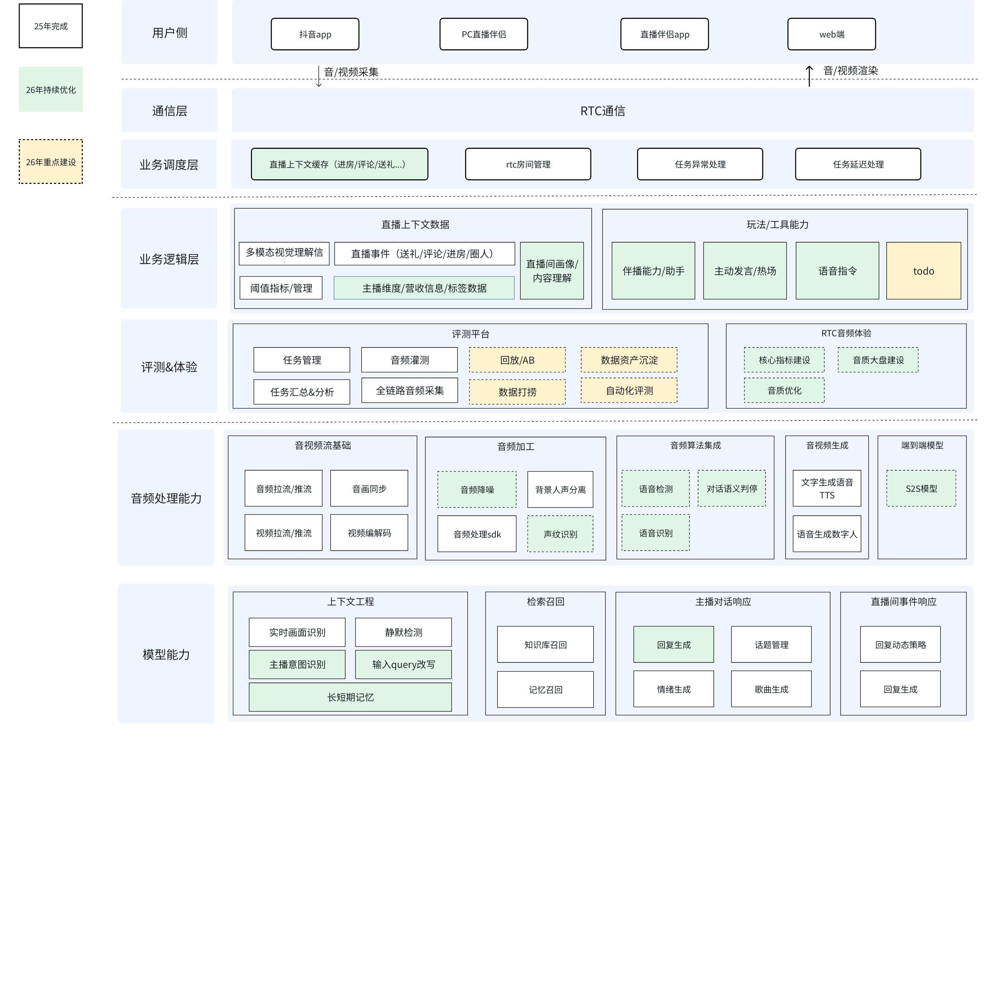

### 项目背景

随着大模型持续发展，AI类探索需求越来越多， 与 AI 的交互不再局限于文字，还能进行自然、流畅、真人感的实时语音对话，如 AI 智能助手、AI 客服、AI 陪伴、AI 嘉宾、智能硬件等各种场景，**过去业务相关技术、框架等缺乏，**基于以上背景，我们业务沉淀了基于rtc链路AI对话的解决方案，根据业务周期，有以下四个阶段：

- 一阶段（Q1-Q2）：音视频对话服务的架构和基建能力；这个阶段我们主要结合多人业务的rtc业务架构，落地了AI对话的音视频编排能力和调度能力；（**下文1.1）**
- 二阶段（Q2-Q3）：AI互动对话体系的搭建；这个阶段我们主要完成了对话链路的交互设计，例如音频前处理模块，直播场景上下文的打通和交互；（**下文1.2）**
- 三阶段（Q3-Q4）：业务mvp落地后，数据横盘，线上反馈体验不好；进入深水区，解决问题发现、端到端评测、音频前处理优化、回复质量等问题；优化后，进行规模化铺量阶段；（**下文1.3）**
- 四阶段（Q3-Q4）：我们沉淀了业务的原子能力和直播优化经验，支持了直播多场景复用；（**下文1.4）**

下面重点围绕各个阶段的业务发展痛点、调研，解决方案去展开介绍；

### 业务特点

1. **实时音视频交互：**直播场景需要实时交互，对话交互在 3s 内，能做到比较流畅的体验；对音视频流的传输、处理、加工、AI 答复有很高的时延和效果要求（vs 豆包语音通话 2.5s～3s）。
2. **直播垂类上下文落地：** 不同于客服&QA等传统对话工具场景，直播场景，用户送礼的随机性、主播临时为了活跃气氛的随机性，需要AI 嘉宾能准确的识别出意图，进而做出持续的、高质量的互动。

### 技术难点

1. **语音有状态服务的设计：**区别于传统业务，部署在无状态机器，例如tce，在异常、迁移、发布的时候，可以直接灰度；直播场景，需要持续接收单房间的音视频流，否则会造成线上直播间黑屏/断流等现象；
2. **直播实时AI音视频交互：**基于实时音视频的对话方案，直播内还没有可以参考的现成方案；另外，AI如何听到/看到以及感知到直播间的热点/送礼/评论等核心信息，作出回应 是一个落地难点。
3. **音频处理和回复质量的打磨：**音视频清洗和识别本身就比较复杂，叠加直播间复杂的背景音、噪音、每个用户语速、风格，停顿等都不同，如何高质量的实现拟人化的对话，例如预测对话结束、回复打断/避免抢话等，是一个难点；另外直播场景下的人均对话轮次在80+，对模型的上下文、互动性、回复质量，会有比较高的诉求，同时基于语音输入识别文字质量差的特性，对模型输入的抗噪也有较高的要求；

### 核心工作

#### 语音服务基础

##### 问题背景

**背景**

ai语音对房间流生命周期有一定的要求，需要支持无损发布、资源独占、快速扩容等诉求；Q1多人场景结合合唱，演唱会等有状态需求，调研了公司wds、lambda等平台的设计，结合存储型和计算型有状态服务的特性，考虑计算型，迭代了[基于lambda + 业务 adapter 方案](https://bytedance.larkoffice.com/docx/FYxWd9Xq5op8VMxn1TncWGrJnKg#share-TBTKdmP9yopuinxSy1tc5QPmnEh)，该架构可以在ai对话场景可以直接复用和落地放大

<table><colgroup><col/><col/><col/><col/></colgroup><thead><tr><th>方案对比</th><th>抖音直播 - 基础架构 WDS from 李雄</th><th>Data - 视频架构  lambda楼子帅</th><th>TCE 有状态集群</th></tr></thead><tbody><tr><td>架构图</td><td><a href="https://bytedance.larkoffice.com/wiki/KGHewSQ9Ci8YA5kfEfwc5tlinKf">直播存储解决方案一期-WDS服务架构设计</a>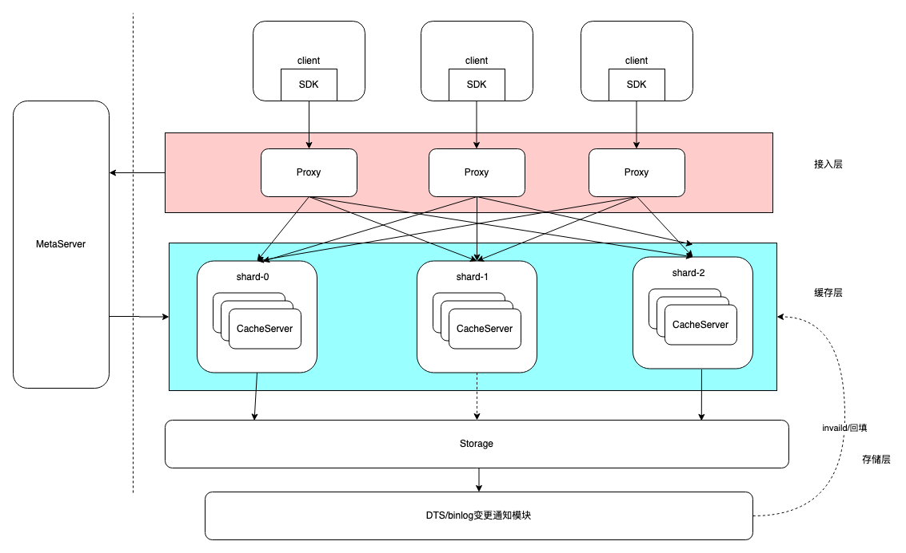 存储型 - 中心化调度<blockquote>
使用redis 解决 mateserver 的单点问题，通过多节点自由抢锁，保证这个模块的平行拓展
</blockquote></td><td><a href="https://bytedance.larkoffice.com/docx/K6m1d9Mvnocx4Ux4o4fccK2jnKh">调度框架功能特性和使用情况</a> 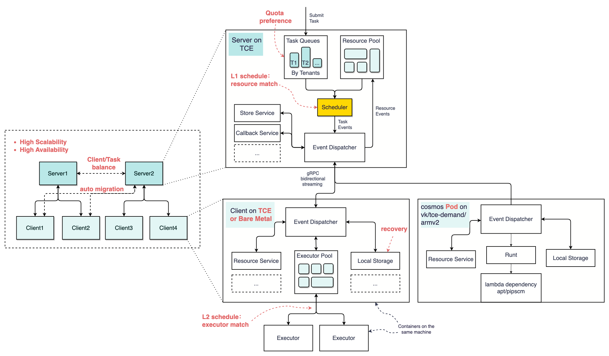 CPU型 - 去中心化调度<blockquote>
简化版gossip 来解决单点问题，各节点通过 gossip 解决最终一致问题。类似的业界解法有 zab raft paxos
</blockquote></td><td><a href="https://bytedance.larkoffice.com/wiki/wikcnDEAxnmNXrQ2KKTbYxhpexe">分片（ShardID）使用指南【文档不再更新，请前往新地址】</a></td></tr><tr><td>方案简述</td><td>核心使用2个服务， 元数据节点metaserver、 数据存储服务dataserver<ul><li><b>分区</b>： 按 key hash 分区，key 对应 shard 的路由表存储在metaserver；</li><li><b>复制：</b>dataserver为一主多从，利用 metaserver 选主，slave 通过binlog/dts异步复制</li><li><b>高可用：</b><ul><li>metaserver一主多备，通过分布式锁选主</li><li>dataserver定时心跳 上报 + 主从同步延迟 给 metaserver，mateserver 决定dataserver主从切换</li></ul></li><li><b>备份与恢复：</b>dataserver使用wal机制做回放&amp;同步</li><li><b>热点机制</b>：proxy模式 热点自动发现 + dataserver本地缓存 + dataserver从节点提供 读能力</li></ul></td><td>lambda 系统是三层结构，server-client-executor 三层调度结构， server 无状态，每个 server 管理一批 client 资源，分配到client，server 之间负责维护任务的负载均衡。 client 是有状态机器节点，节点内维护 exector 池。 executor 是任务执行单位，以 container 形式运行任务，支持指定配额的资源。 <b>分区：</b>按任务分配资源； 三层分配server-client-executor，先提交给 server 节点，再有 server 派发给 client 节点；client 节点分配一个 executor 执行任务；每提交一个CPU任务即分配一个唯一taskID，标识 对应 client机器+executor进程； <b>资源配额:  </b>client使用docker运行executor任务进程，支持精细化配置资源 <b>调度资源：</b>3级调度思路<ul><li>业务入口流量来源于lambda_gateway，根据策略选择某一个server</li><li>一个server管理一批client机器</li><li>一个client管理一批executor(实际任务进程)</li></ul> <b>高可用</b>：<ul><li>server 如果挂掉， client 会主动去找对应 server。</li><li>client 如果挂掉，会重新调度到其他 client 上。</li><li>execotor 如果挂掉，重新调度即可。</li></ul> <b>无损发布:  </b>每一个executor任务与代码编译镜像绑定，原生支持多版本发布、调度、监控。</td><td>底层采用 Kubernetes 的 <a href="https://kubernetes.io/docs/concepts/workloads/controllers/statefulset/">StatefulSet</a> 实现，所属集群开启分片且挂载存储<ul><li>唯一性：对于包含 N 个副本的 StatefulSet，每个实例会被分配一个 0 ~ N-1 范围内的唯一序号，具体体现在实例名称的副本序列号（Replicas ID）。 </li><li>顺序性：StatefulSet 中实例的启动、更新、销毁默认按顺序进行。 </li><li>稳定的持久化存储：当实例被重新调度后，仍然能挂载原有的持久卷(内存、磁盘)</li></ul></td></tr><tr><td>资源调度(扩缩容) 高效调度&amp;高可用</td><td><ul><li>不支持实时调度tce机器资源，需提前发布一个特殊psm节点</li><li>新增了一个standby角色机器，用来快速扩容(当前有4种角色leader、follower、 learner、standy)， 线上关闭关闭 自动扩缩容</li></ul><blockquote>
在TCE上和离线任务混部，可能受到离线任务导致机器CPU/内存等资源使用率上升的影响
</blockquote></td><td>支持指定cpu、mem、磁盘、gpu等实时动态创建、释放资源，资源预热、并提交任务<blockquote>
注：了解到 lambda未打通直播发布、上线、监控、ppe等平台， 为自己单独一套。
</blockquote> tce管理，不混部，demonset</td><td><ol><li seq="1">TCE 每个分片的实例数量都要保持一致，不支持单独对某个分片扩容</li></ol></td></tr><tr><td>无损发布、ppe测试</td><td><ol><li seq="1">升级： 不支持多版本，上线会把线上任务全部重启</li></ol><blockquote>
串行单实例发布，如 dataserver发布上线需要1天；
</blockquote><ol><li>测试： 建设boe测试， 线上测试使用不同的cluster来实现功能测试， 不支持PPE测试</li></ol></td><td><ol><li seq="1">升级：lambda支持线上多版本共存，老流量&amp;任务 走之前版本，自然结束；新任务走最新版本</li><li>测试： <a href="https://bytedance.larkoffice.com/wiki/wikcnFaCWFpniU7RqbW9wc12ALb">支持PPE能力</a></li></ol></td><td>1、 升级： 不支持多版本，上线会把线上任务全部重启</td></tr><tr><td>优缺点</td><td><ul><li>系统保持相对简单和灵活的设计，稳定、容灾成本较低</li><li>WDS因为定位为缓存，对数据一致性、调度延迟等容忍度稍高，如 metaserver、dataserver在主从切换，上线过程中均可能存在少量不一致问题。</li></ul></td><td><ul><li>调度开销小，性能高，稳定性好（字节点播、转码、rtc、 飞书视频会议）</li><li>实现成本高，复杂</li></ul></td><td><ol><li seq="1">TCE 的集群分片没有和公司的服务发现做到联动，服务发现的逻辑还要自己来写</li><li>直播内业务使用相对较少</li></ol></td></tr><tr><td>结论</td><td>不推荐</td><td>推荐</td><td>不推荐</td></tr></tbody></table>

整体架构如下：

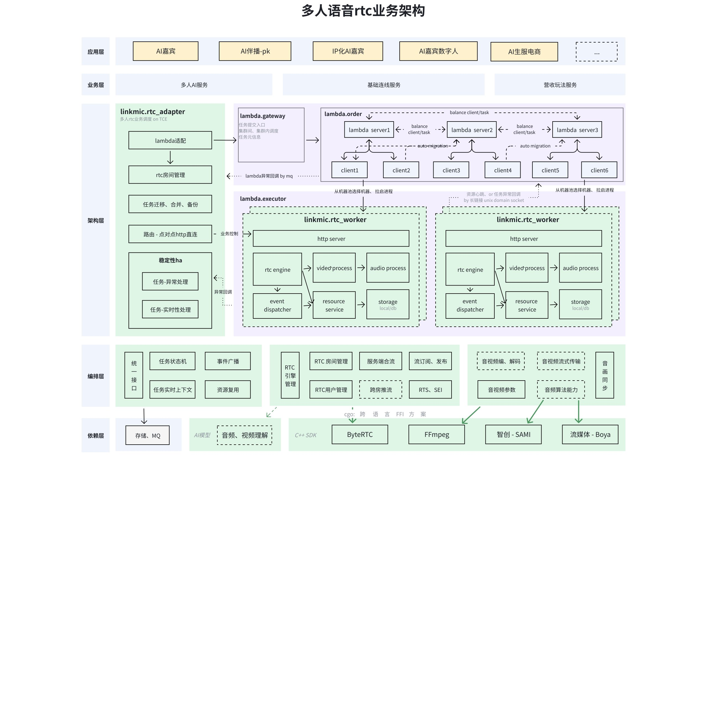

> webcast.linkmic.rtc_adapter，负责任务的管理，运行在TCE， **业务服务只与该服务端交互**
>
> - 同一个房间，不同类型的任务，负责调度到同一个rtc_worker函数中执行，减少流的重复订阅/解码/合图/编码
> - 对提交给调度框架的pending任务，自动完成重调度；对任务进行限流，防止异常突增的请求将集群打满；
>
> webcast.linkmic.rtc_worker,  接受调度框架的调度, 执行真实的任务， 运行在lambda平台
>
> - 具体RTC业务逻辑，如维护RTC实例、推拉音视频流等，音频逻辑编排等；

**问题**

在直播场景下，RTC是业务侧强依赖的基础能力；AI探索类需求，需要先从 RTC 房间内提取用户输入的音视频流，然后对音视频做处理和识别，识别后送给 ai ，ai 做出响应，响应后再推送回 RTC 房间。多人侧的 ai 嘉宾需求，营收的 ai 分身类需求，数据交互模型类似，都是这个模板。基于需求交互形式，有如下诉求：

- 在RTC音视频流场景中，业务的流程链路几乎固定（拉流/清洗/识别/ai交互），如何设计一种灵活、可扩展的服务架构能力？
- 音视频处理的原子能力类似，交互协议复杂，例如基于websocket，如何快速复用？

##### 解决方案

**核心设计点：**通过抽象节点、流程编排、模块化实现能力的编排和复用

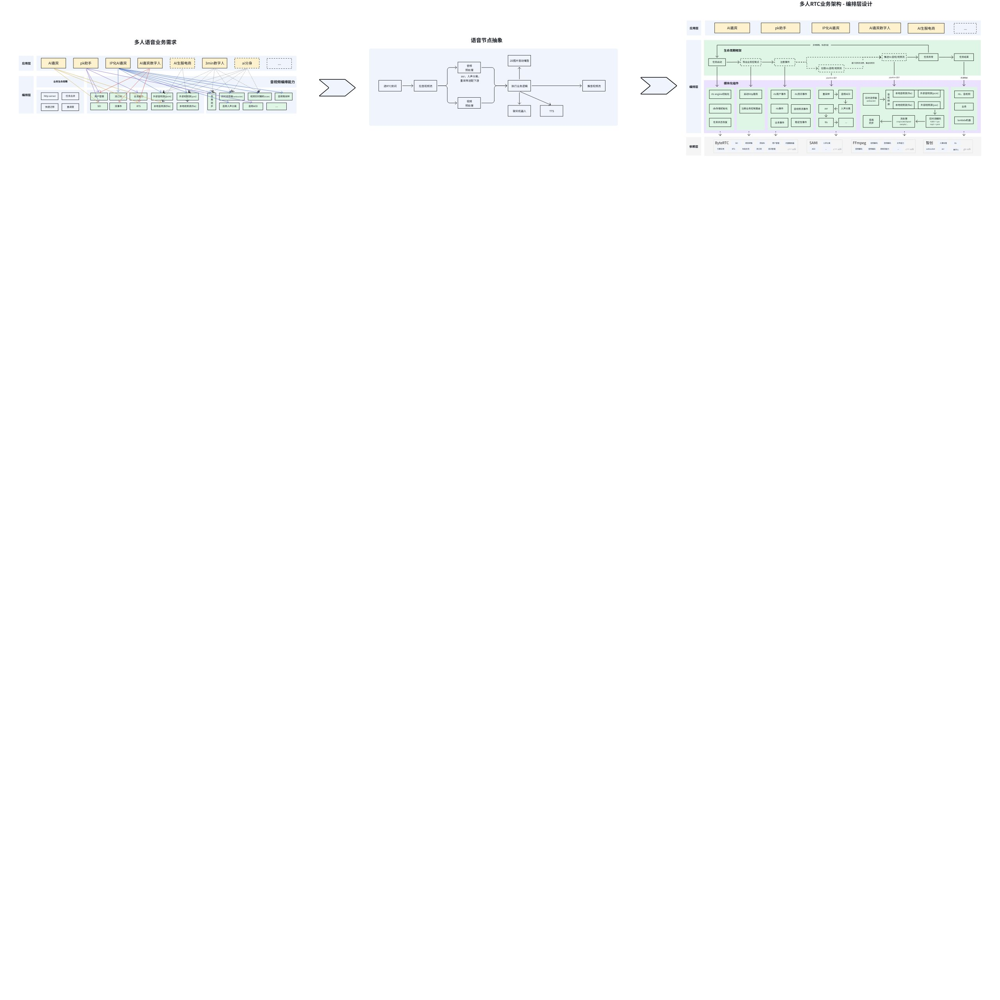

- **抽象节点：**包括任务启动、注册业务控制点、订阅音频/视频流、实时流加工消费、推送音视频流、任务结束，包括统一的异常控制逻辑。实现通用的泛化回调接口；
- **流程编排：**在音视频推拉流模块，每个模块的输入输出是相对固定的；比如音频流输出字节和长度；统一节点输入输出，基于pipeline和回调设计，支持各类依赖层能力自由组合及添加，依赖节点通过回调机制通信；
- **模块化：**底层原子能力实现，模块化，协议通用处理；

业务AI对话架构基于上述有状态服务的设计进行落地和开发，主要涉及架构层的搭建和编排层的落地；示意图如下：

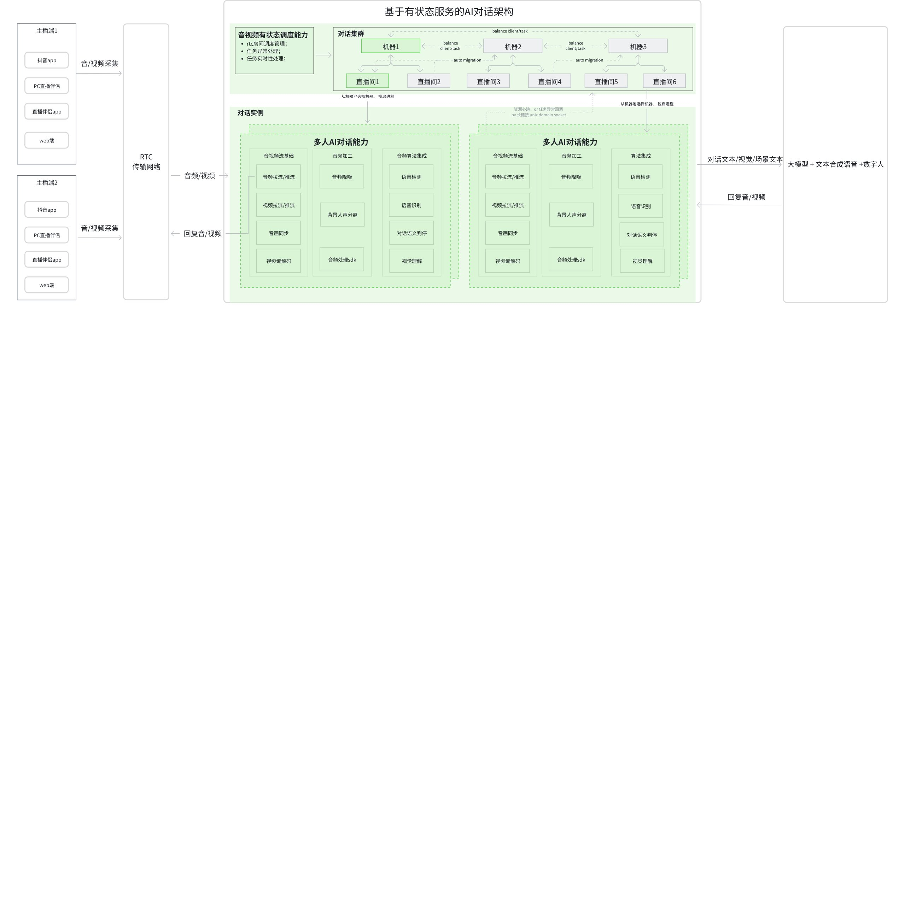

##### **阶段收益**

- 确立了后文语音服务设计的基调，减少了有状态服务的复杂度，给了业务可落地的空间；

#### AI语音对话设计

##### 问题背景

在25Q1上述rtc服务的调研和搭建，我们已经初步具备了建设AI语音对话的基建能力，接下来业务遇到的问题就是

- **AI语音方案的不确定性：**直播AI对话的设计，在直播乃至抖音范围，还没有业务实践落地过，需要大量的调研，方案评估以及快速落地验证；同时，多数业务这块的设计较为黑盒，处于保密阶段，调研难度较大；
- **直播间的场景结合：**区别于传统（车机/问答）以及市场上的AI对话（豆包/Grok），在直播落地需要强感知直播间上下文，例如主播背景、评论、送礼信息等，需要支持多模态输入，落地细节较多，比如如何管理AI对主播的回复以及对直播间的回复；

在面对不确定性的时候，我们的核心思路是，梳理诉求和分析现状，抽象核心能力，分段拼接链路，再结合公开的一些参考，印证我们的猜想；类似和用户打电话，我们抽象AI对话的核心就是：**语音输入 -> 对方思考 -> 语音输出**；那么我们在技术链路上，我们如何实现呢？遍历用户的用例，我们发现有这么几个核心问题：

| 问题抽象 | 解法映射 |
|-|-|
| **语音输入：**主播说话如何听到/看到？ | 音视频传输协议和架构如何设计 |
| **语音输入：**主播说的话，如何被AI听的更清晰？如何识别的更好？ | 音频处理如何搭建（清洗/检测/识别能力） |
| **思考+语音输出：**主播说的话，如何回复？如何听到？ | 对话agent的设计，输出文本后转语音 |
| **思考+语音输出：**不同于车机对话和豆包通话等，直播对话需要感知到直播间的上下文，根据实时场景作出互动 | 对话上下文的设计 |

基于以上4个维度的问题特性，我们展开了一些业界相关方案的调研和对比：

##### 业界调研

> 对标上文的维度，音视频传输架构、音频前处理、回复输出、上下文的输入

<table><colgroup><col/><col/><col/><col/><col/></colgroup><thead><tr><th>方案对比</th><th>传统语音架构（车机问答、小爱助手）</th><th><a href="https://bytedance.larkoffice.com/docx/AzbmdbgIMoKPNlx4otgcNCV1ngB?from=from_parent_docx">传统文本对话 - AI助手/客服</a></th><th><a href="https://bytedance.larkoffice.com/wiki/YVBWwdAL8itDmwkOxf0cdDwAn2c">豆包 - 实时语音通话</a></th><th><a href="https://bytedance.larkoffice.com/wiki/YehkwrD6TiXMIdk1y9wcTzeinSc"><b>直播AI伴播业务场景</b></a></th></tr></thead><tbody><tr><td>架构总结</td><td>ASR+NLP+TTS链路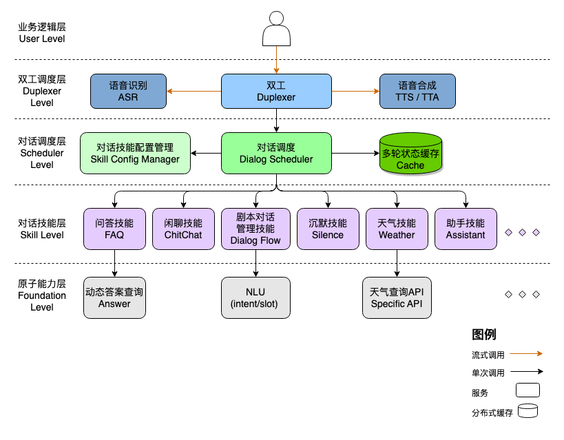</td><td>LLM-&gt;TTS 级联架构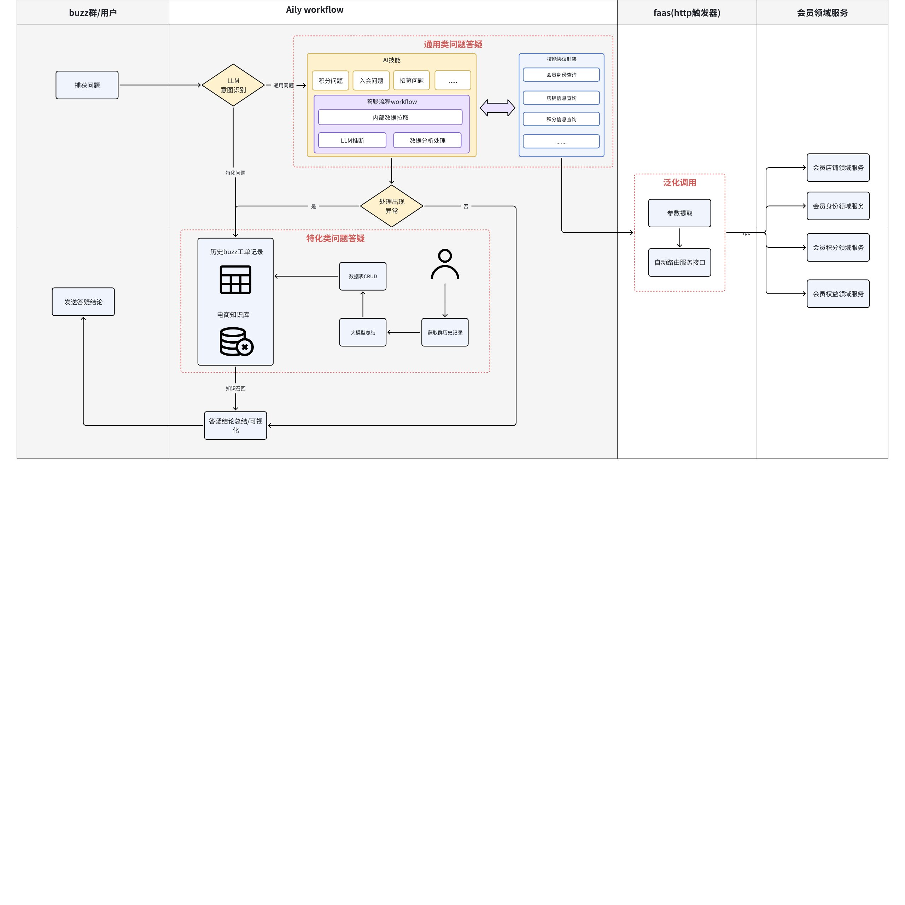</td><td>ASR-&gt;LLM-&gt;TTS 级联架构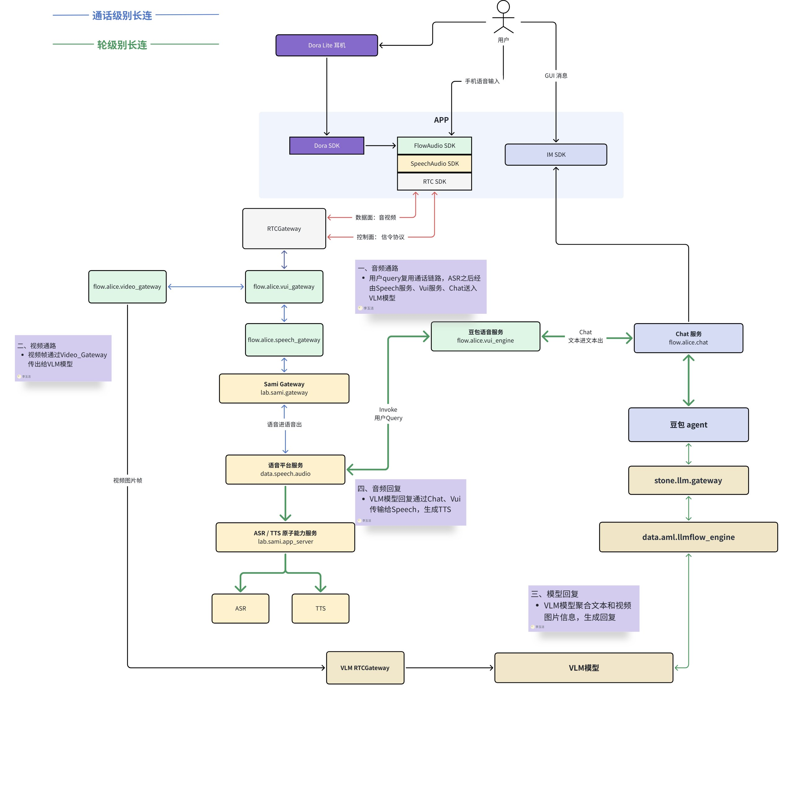</td><td>结合大模型推进的背景，优先选择ASR-&gt;LLM-&gt;TTS 级联架构</td></tr><tr><td>音视频传输架构</td><td><ul><li>基于websocket</li><li>基于http流式交互</li></ul> <b>优点</b>：方案简单、成熟、技术成本低 <b>缺点</b>：抗弱网差，延迟高，视频场景更为显著</td><td><ul><li>纯文本请求，常规http协议请求即可，方案简单</li></ul> <b>优点</b>：方案简单、成熟、技术成本低 <b>缺点</b>：抗弱网差，延迟高，视频场景更为显著</td><td><ul><li>2025Q1前，音视频通过websocket传输</li></ul> <b>优点</b>：方案简单、成熟、技术成本低 <b>缺点</b>：抗弱网差，延迟高，视频场景更为显著<ul><li>2025Q2后，与rtc团队合作，升级为rtc网络</li></ul> <b>优点</b>：ice/rtp协议 udp传输音视频，边缘节点、弱网表现好，延迟低</td><td><ul><li>业务场景不接受高延时和传统协议稳定性问题；优先采用rtc链路；</li><li>上文，基于业务侧建设的rtc架构，优先采用rtc有状态服务；</li></ul></td></tr><tr><td>音频前处理<blockquote>
音频流 -&gt; 清洗 -&gt; 语音检测（有效段/无效段） -&gt; 语音识别（转文字，断句）
</blockquote></td><td><ul><li>采用语音检测（vad）区分有效/无效音频，静默800ms+断句；</li><li>asr识别有效部分的音频；依赖asr自带的断句能力；</li><li>整体前处理：1500ms+</li></ul></td><td><ul><li>无</li></ul></td><td><ul><li>seed自研流式vad+asr，具备流式断句和低延时识别的能力；</li><li>黑盒，不对外开放；原理不可见；</li><li>整体前处理：1000ms+</li></ul></td><td><ul><li>直播场景，杂音、bgm场景多，前置音频需要进一步降噪；叠加人声分离等能力；</li><li>vad进行语音检测和断句；</li><li>asr能力，调研和复用公司内现有选型；</li><li>整体前处理预计：1000ms内</li></ul></td></tr><tr><td>对话上下文</td><td><ul><li>音频</li><li>支持文本</li></ul></td><td><ul><li>支持文本</li></ul></td><td><ul><li>音频为主，少部分场景视频</li><li>支持文本</li><li>prompt、用户对话历史</li></ul></td><td><ul><li>音频为主，少部分场景视频</li><li>支持文本</li><li>prompt、用户对话历史</li><li>支持感知直播间信息，例如送礼/评论/画面等</li></ul></td></tr><tr><td>回复输出</td><td><ul><li>文本转语音，TTS能力；</li><li>非大模型回复，基于NLP；</li></ul></td><td>-无</td><td>由 data-语音-产品研发 团队深度定制，外部业务团队无法复用 由 Seed-Infra团队 深度定制，外部业务团队无法复用</td><td><ul><li>文本转语音，TTS能力；</li><li>拟人化音色</li></ul></td></tr></tbody></table>

##### 解决方案

###### **1.2.1 实时AI语音设计**

基于上述方案调研，我们实现了多人实时音视频 AI互动架构，整体分为基建部分 + 5个核心关键模块， 除基建部分，AI互动业务强感知 一般为多模态输入、音频前处理、音视频理解、Agent、音视频生成 5个模块， 当前多人均完全独立设计；

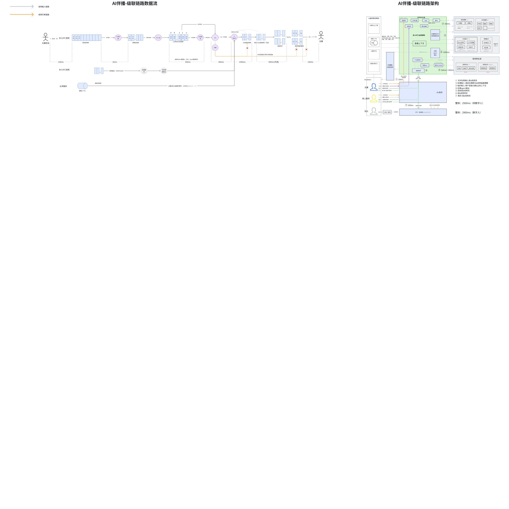

<table><colgroup><col/><col/><col/></colgroup><tbody><tr><td>模块</td><td>说明</td><td>使用方式&amp;优化</td></tr><tr><td><b>有状态服务基建</b></td><td><blockquote><ul><li>有状态服务资源实时调度 + 稳定性</li><li>无损变更、异常恢复</li><li>上线、发布、回滚、质检、监控 bdp集成</li></ul></blockquote></td><td>上文语音服务基础展开部分，这里不赘述；</td></tr><tr><td rowspan="3"><b>音频前处理</b></td><td>降噪<blockquote>
去除直播间各类复杂音
</blockquote></td><td>3A处理，音频码率对齐</td></tr><tr><td>人声分离（sami-sdk）<blockquote>
去除 直播间常见的 bgm背景音
</blockquote></td><td>基于直播嘈杂特性，进一步对音频进行降噪和分离，抽取干净人声；</td></tr><tr><td>语音活跃检测（vad/aed）<blockquote>
识别主播是否说话，辅助asr断句&amp;判停
</blockquote></td><td><ol><li seq="1"><b>识别出有效or无效音频，节省资源：</b>音频流是一个流式回调的过程；中间可能有大量的无效or静音流，这些流是不需要透传到后续链路，通过vad过滤，可以有效减少资源消耗和识别效果；相对不用vad，节省60%+的资源；</li><li><b>加速断句：</b>直播场景要求延时低，asr模型大多数自带的断句，中间的静默时间会比较久，800ms+，采用vad的能力，判断在连续350ms内都收到静音流，则向下游asr发送断句信号，结束识别，提交文字和大模型交互。</li></ol></td></tr><tr><td rowspan="2"><b>音视频理解</b></td><td>语音理解（asr）<blockquote>
语音转文本

语音情绪、语速

语音性别
</blockquote></td><td>基于输入的语音识别成文字；一般模型会自带断句功能；例如判断一句话该什么时候停止，会输出中断信号；我们在探索的过程中，<a href="https://bytedance.larkoffice.com/wiki/EWnHwwlT6iMtRPk7JhRcPzrTnbf#share-A1oZdUMLco2Sq5xVuI8cipLwnOc">接入了不同的asr选型</a>，进行了特性和效果的对比；</td></tr><tr><td>传统深度学习-直播特训<blockquote>
图片转文本
</blockquote></td><td>一般有基于VLM和传统深度学习算法的实现；直播场景下，策略团队有专门为直播场景进行训练，采用了他们的能力；业务侧，考虑对视频的抽帧和频控即可；核心是将图片识别成文字一起送往大模型；</td></tr><tr><td><b>Agent</b></td><td>通用设计，主要<a href="http://bytedance.larkoffice.com/docx/KBU4dy5wNo0JALxgeXXcEeX3nth">V-工程团队</a>实现，结合业务主要实现，这里不过多展开；</td><td>LLM+Planning+Memory/RAG+Tools</td></tr><tr><td rowspan="2"><b>音视频生成</b></td><td>音频生成 TTS<blockquote>
情绪、语速、音量

歌曲翻唱生成
</blockquote></td><td><ol><li seq="1">tts一般是一次性生成的，例如一句话可能在1s内生成完返回，所以下行音频链路处理是采用批量推送到客户端等操作优化延时和本地播放逻辑；</li><li>拟人化的音色诉求，直播场景，要求AI的回复尽量真人化，减少AI感；采用专人录音克隆音色以及推进底层模型升级来解决；</li></ol></td></tr><tr><td>视频生成<blockquote>
基于tts语音驱动生成视频
</blockquote></td><td><ol><li seq="1">tts生成后，经由智创侧的驱动算法，生成对应的口型驱动，智创侧保障口型和音频的对齐，同时返回对应的音视频，业务侧保障推流时刻统一，即可减少<a href="https://bytedance.larkoffice.com/docx/PwkxdhLG8oX3RaxkIZNcYx8fntg#share-EtrzdT7KRoblPgxGzl9crwTRnvB">音画不同步</a>的问题；</li></ol></td></tr></tbody></table>

> 这里处理逻辑相对复杂，补充：
>
> - 为什么vad这里需要断句？业界实现一般下游LLM需要感知业务认为完整的一句话，再进行回复；
> - 为什么是静音流判断是350ms？业界一般是800-1500ms，这个延时在直播场景接受不了（全链路2500ms）；350ms是业务在mvp阶段，根据人工构造音频评测集权衡的一个区间；
>
> 同样的，延时和效果是一个trade-off，基于延时的诉求，我们加快了断句，同时引入了效果问题，下文音频处理模块会系统的展开；

###### **1.2.2 直播间上下文**

我们在有通用的AI互动链路后，业务场景和需求的迭代，对直播间的上下文有比较高的诉求；例如AI需要感知到直播间的热度以及关键用户进房/评论、送礼等消息，去主动做出回应以及直播间互动（鼓励/主播引导/评论消息等）

**问题：**这么多事件，我们如何获取有效的事件进行回复？一个事件对应一个音频，在AI对话的过程中，我们如何插入事件的音频输出呢？直播间各类事件消息口径多（10+），触发量大，百万qps，如何收敛以及统一管理？

**核心思路：**

1. 链路上尽可能共建，保障稳定性；联合直播-服务架构建设统一的数据切片服务，建设直播间AI事件队列；
2. 业务上通过产品分析、数分测算、模型泛化等能力来选择事件的有效性和回复信息；<a href="https://bytedance.larkoffice.com/docx/K85MdEyRYo1YLOx0sLLcaMV5n2b">[AI伴播] 助播能力触发差异化-v2</a>
3. 技术上建设多路音频输入输出的框架，支持多模态的输入和音频输出队列；

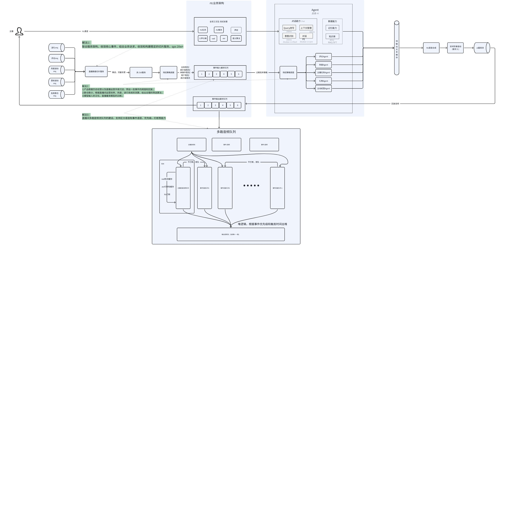

###### **1.2.3 端到端模型的探索**

级联链路设计交互相对复杂，延时较长；上线后在内测阶段以及建联用户反馈延时体感较明显，音色不够拟人化等问题；除了持续优化级联链路，我们调研了业界的前沿选型，联合Data-语音，直播-AI分身团队，调研和推进端到端语音模型在业务侧的落地和接入<a href="https://bytedance.larkoffice.com/docx/JVgldnVDRogLExxprewcSauPnWh">端到端模型需求汇总</a>，整体落地为 语音输入-语音输出的形式，业务无需维护 复杂的音频清洗和音频切片、语音识别、模型回复、语音生成等级联过程；整体对话平均时延可以到 **1.3-1.5s**；

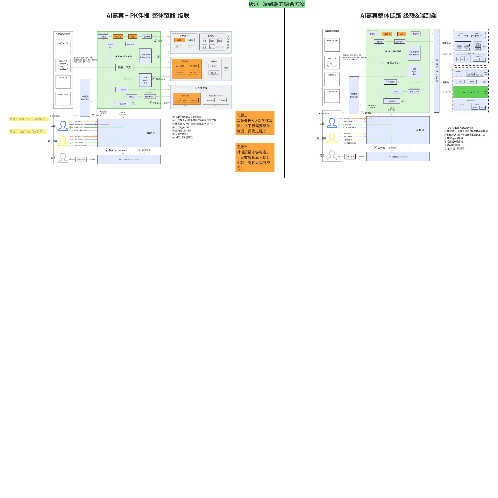

端到端模型在延时以及链路简化、情绪波动上做到了比较优秀，但是由于模型在初版迭代中，在回复质量、业务定制化agent逻辑、记忆、支持注入上下文等模块上，还有比较大的提高空间，比如，还不支持业务场景的训练以及检索，不支持记忆和中途注入上下文等，未来一段时间还需要持续迭代，目前在试点优化中；我们线上小流量验证后，发现端到端链路使用uv和对话轮次在中位数，结合线上case巡检人工分析，判断无明显负向，可继续探索推进；

##### **阶段收益**

- 提前预埋和预研，快速支撑了业务发展；为后面业务争取资源以及抖音项目制人力提供了弹药；业务探索期，uv 300 -> 3500，人均对话60轮次，次留 20%；

#### AI语音链路优化

##### 问题背景

25年Q2落地mvp版本， AI嘉宾上线后，产品数据横盘，日均uv300的场景下，次留有回落25% -> 18%；产品的迭代和分析遇到了瓶颈，具体2个表现：1）无法分析线上问题，音视频场景线上感知不到；历史数据无法回溯和复现；2）线上的评测体系打分都比较高，但是线上场景表现就是不好，业务处于盲人摸象，无法指导优化的状态；

根据这个问题：我们拉齐cqc、算法、产运下钻初步分析了topcase50的主播，根据初步的分析结论，启动了数据链路的建设和线上巡检机制，先解决了可观测可归因，排障难的痛点，同步根据巡检case大概聚类了三大类问题，音频前处理/回复质量/指令遵循，指令遵循主要依赖模型数据飞轮和[训练解决](https://bytedance.larkoffice.com/docx/RFtqd5BBEoXGLCxR1LackdYVn2d)，这里重点讲如何建设的巡检机制、音频前处理和回复质量的打磨；整体思路如下：

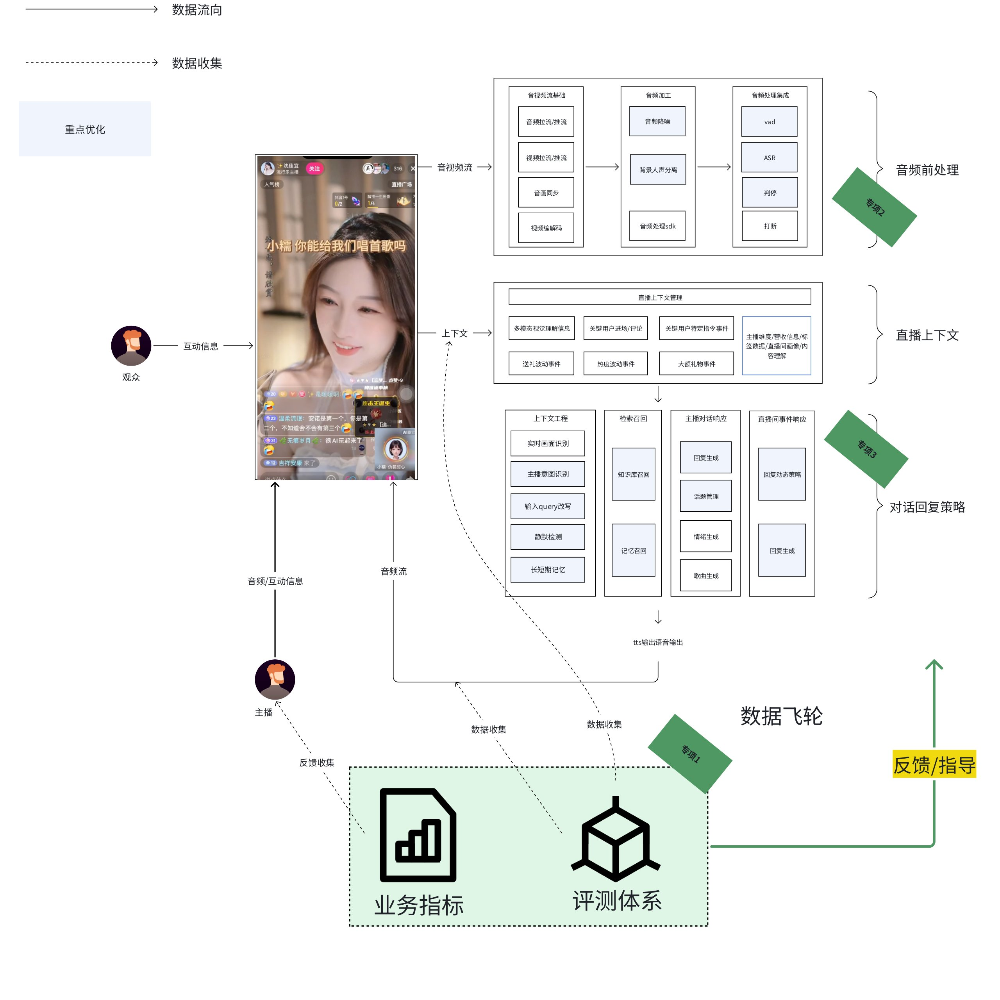

##### 解决方案

###### **1.3.1 语音评测+数据回流**

如上设计，我们快速迭代了mvp链路，如何观测线上效果以及用户的真实体验效果？我们认为对的优化，线上用户的体验和评价就一定好么？我们如何保障优化的方向以及优先级是比较match真实用户体感的？**核心思路**有几步：

- 第一步是先落核心业务数据资产，没有数据就无法分析和量化；音视频对话链路的可观测数据非常复杂，需要支持按对话轮次去dump每个阶段的数据；否则无法支持业务排障，定位，问题回放、badcase沉淀、模型训练等；按[技术链路](https://bytedance.larkoffice.com/docx/XWN5dswl7o37sPxwR7McFTnlnKe)大致有以下部分：

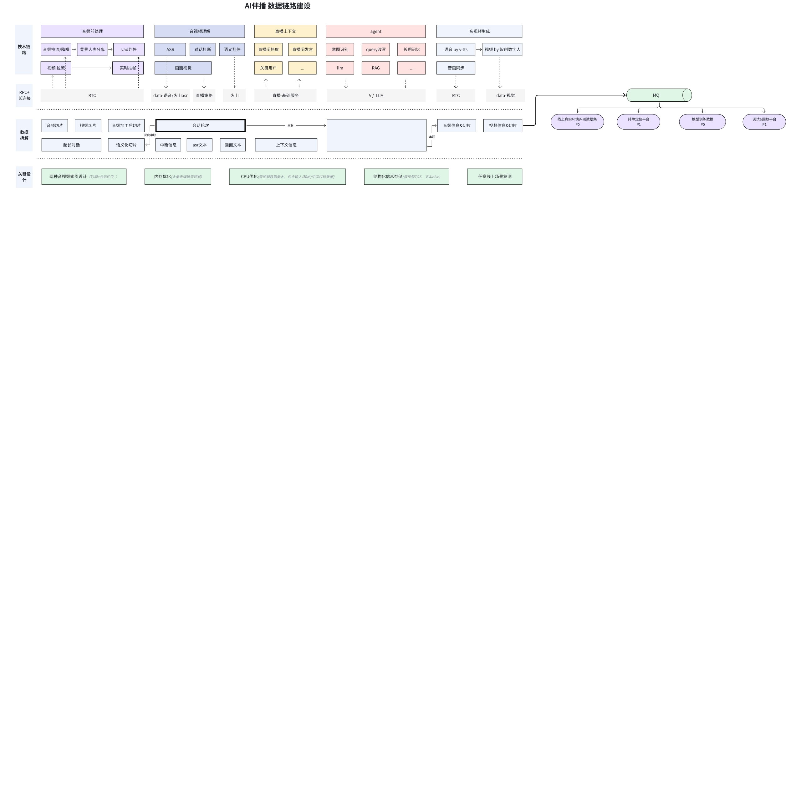

- 第二步是完善端到端语音评测机制，支持输入语音输出语音，全链路指标采集；结合语音评测的指标落地评分牵引，解决过往只输入文本，评测分数高但线上case仍不收敛的情况，更真实的对标线上用户输入；

  > 离线文本评测，agent回复都比较好；为什么线上问题就是不收敛？下钻发现，经过语音链路后，文本的质量/断句会下降的很厉害，模型经常遇到识别不了以及上下文污染的情况；

  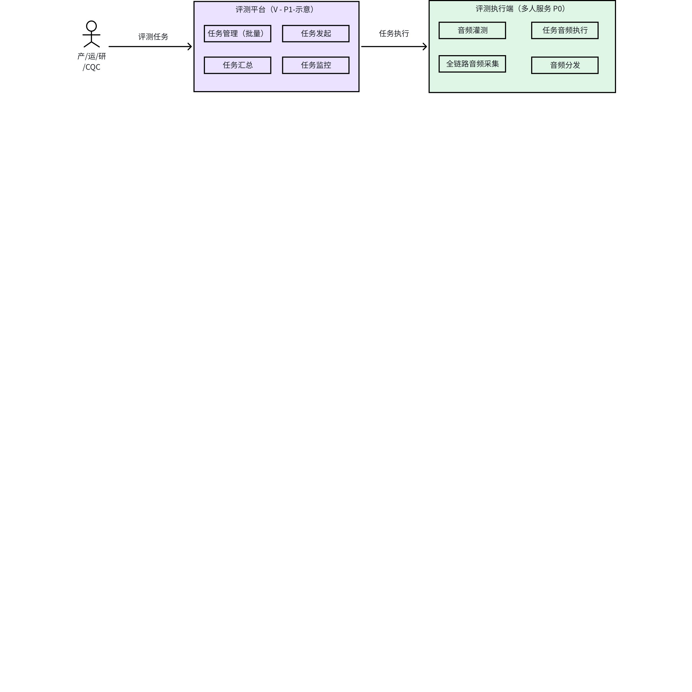
- 第三步是常态化巡检，建立线上数据回流机制，根据建设主播分类，按营收/留存 dump主播的数据进行人工评测和聚类，每周巡检过问题聚类和进度，根据问题的聚类以及负向反馈来指导技术规划优先级和优化效果；<a href="https://bytedance.larkoffice.com/wiki/LiDywgDi6iNaB8kU8uCchzpmnAc">AI嘉宾线上badcase巡检历期待拆解问题</a>

  > 关于如何衡量和优化效果？除了评测外，业务考虑过AB实验、NPS调研等手段，由于实时对话场景的业务指标在数分侧尚未完全落地，NPS用户参与度低、对话效果偏主观衡量 等问题；结合上述沉淀badcase，提供case给模型侧训练的诉求，采用了线上巡检的方式，人工根据评测维度进行打标和收集case，先沉淀业务的标准集；

  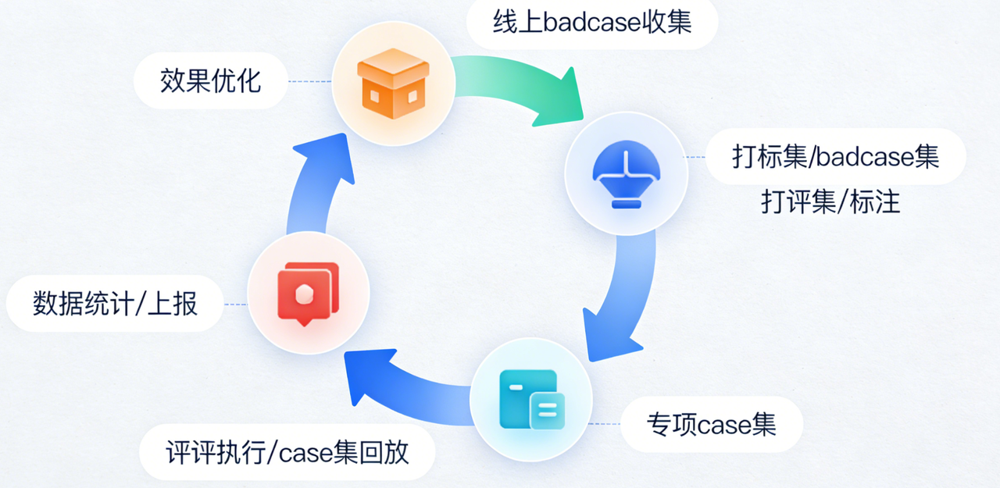

###### **1.3.2 音频前处理**

**问题：**基于上述问题聚类和case分析，AI嘉宾音频前处理模块，存在一些，影响对话链路的效果；主要以下2个：

<table><colgroup><col/><col/><col/></colgroup><thead><tr><th>问题分类</th><th>具体表现</th><th>涉及模块</th></tr></thead><tbody><tr><td><b>音频输入策略单一</b></td><td>1）低噪音场景下，例如关门声，拍手声，被识别为文字，大模型误回复，打断主播说话； 2）目前asr识别依赖vad的检测以及静默一定阈值（350ms）后，才会断句，送文字给到LLM，在用户碎嘴，说话停顿，超长句上，一句完整的文案可能会被拆分成多段送给LLM，造成AI频繁回复，且上下文混乱的场景；</td><td>VAD、ASR、LLM</td></tr><tr><td><b>音频输出（打断）僵硬</b></td><td>目前的打断，是基于链路规则设计，无法实现全双工对话；主播说的任何话，杂音，都会被模型识别到回复，直接打断当前AI的输出；体感就是 AI说话说到一半 立刻会被打断 不够拟人化； 附：根据主播停顿情况不同，现在实现了以下三种处理策略：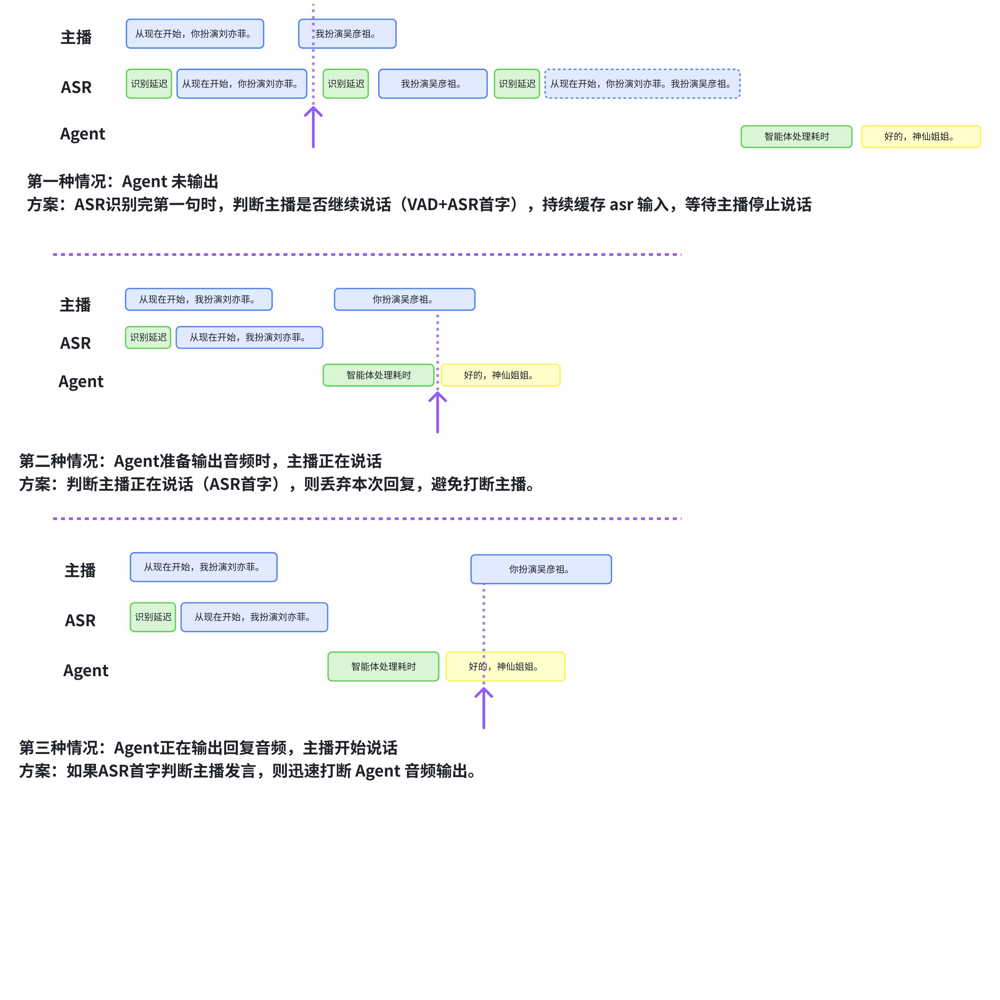</td><td>VAD、ASR、LLM</td></tr></tbody></table>

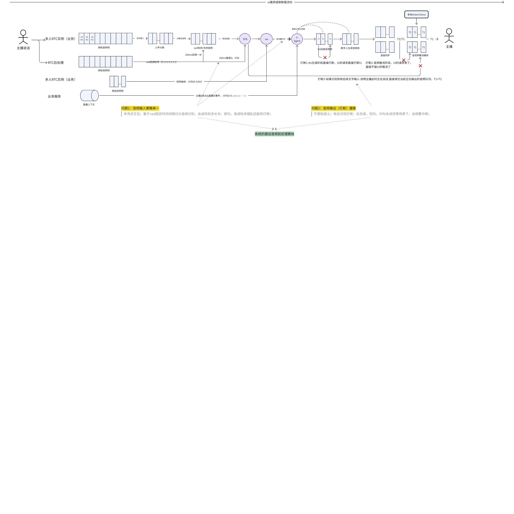

**业界调研**

我们[调研了业界比如声网、公司内dataSpeech语音、火山toB、rtc等](https://bytedance.larkoffice.com/wiki/EWnHwwlT6iMtRPk7JhRcPzrTnbf#share-FTSCdPA5co4DDBxAt0yctrAcn0f)业务相关的解决方案，有以下一些结论：业界的解决方案基本围绕 prefetch（预取） + endpoint（端点检测）+ turn detection（轮次检测）的方案展开；

<table><colgroup><col/><col/><col/><col/></colgroup><thead><tr><th>核心手段</th><th>说明</th><th>解决问题</th><th>流程示意</th></tr></thead><tbody><tr><td>Prefetch<blockquote>
提前流式交互，大模型配合流式输入
</blockquote></td><td><ul><li>背景：ASR 后需经过 NLU（意图识别）、LLM、TTS（语音合成）等环节，总延迟易超过用户容忍阈值（如 1 秒）</li><li>原理：在最终生成确认前，将初步 ASR 假设（如前 x ms的转录结果）传给下游系统，预生成响应并缓存。若最终 ASR 结果与假设一致，直接返回缓存响应，隐藏部分下游 latency</li></ul></td><td>尽量快和准的把asr生成结果给到llm</td><td>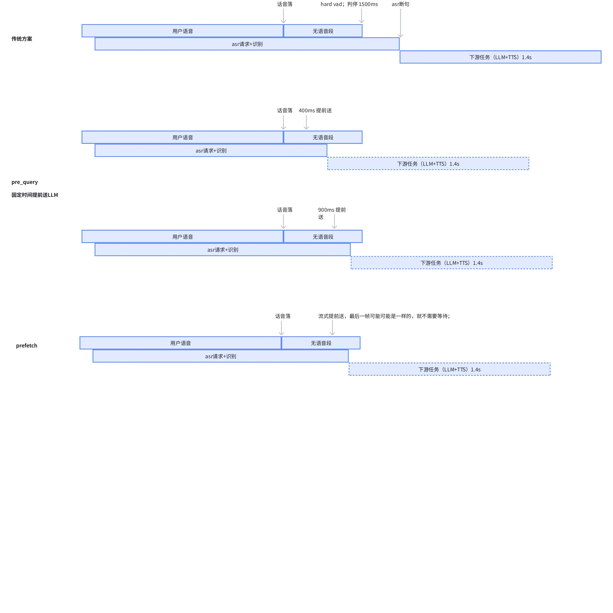</td></tr><tr><td>endpoint<blockquote>
判断一句话有没有说完，等待一下；
</blockquote></td><td><ul><li>背景：需精准判断 “语音何时结束”，避免过早截断（丢字）或过晚停止（包含多余静音）。</li><li>原理：<ul><li>语义辅助：结合 ASR 的中间文本结果（如 “这句话是否语义完整”），判断是否结束（如 “我要去” 可能未结束，“我要去北京” 更可能结束）。</li><li>双阈值法：结合短时能量（<code>E</code>）和过零率（<code>ZCR</code>），设置 “高 / 低能量阈值” 和 “高 / 低过零率阈值”，区分浊音、清音、静音。</li><li>状态机法：通过 “开始→持续→结束→静音→确认” 等状态转移，消除单帧误判（如用户短暂停顿后继续说话）。</li></ul></li></ul></td><td>尽量保证一句话不给过度拆分，简单理解就是，动态的vad间隔；该停停该等等；</td><td>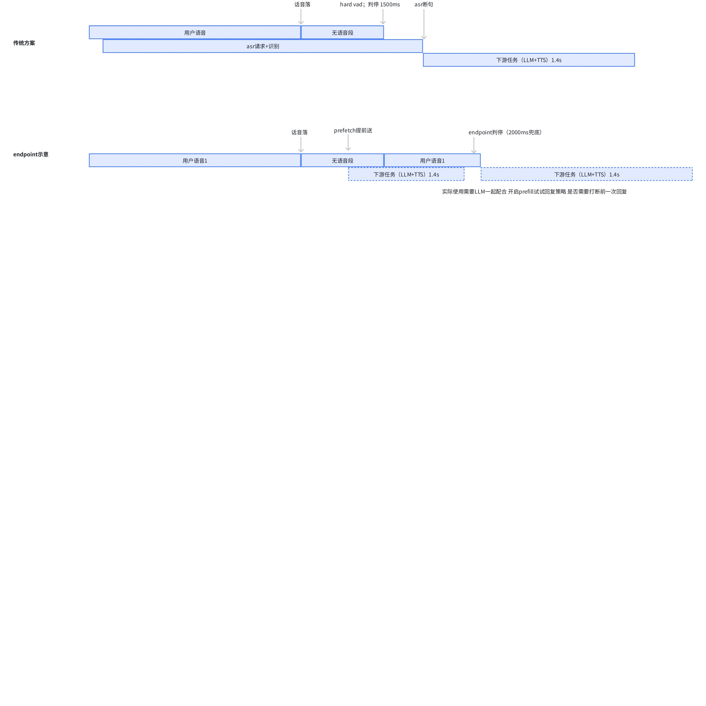</td></tr><tr><td>turn detection<blockquote>
轮次检测，turnD

判断上下文，此时的说话时机；
</blockquote></td><td>语义连贯性分析<ul><li seq="auto">基于语言模型分析文本语义完整性，判断句子是否自然结束（如 “我想订……” vs “我想订明天的机票”）。</li><li seq="auto">结合上下文对话历史，识别意图连贯性（如用户连续提问时保持上下文关联）。</li></ul></td><td>参考endpoint的实现，核心区别是多轮上下文；</td><td>参考endpoint的实现，核心区别是多轮上下文；</td></tr></tbody></table>

**解决方案**

基于上述问题以及方案调研，我们在音频处理链路上，优化了模型识别准确率，音频交互策略以及智能打断等问题；基于turn detection机制实现了双工语音交互；核心是以下3点：

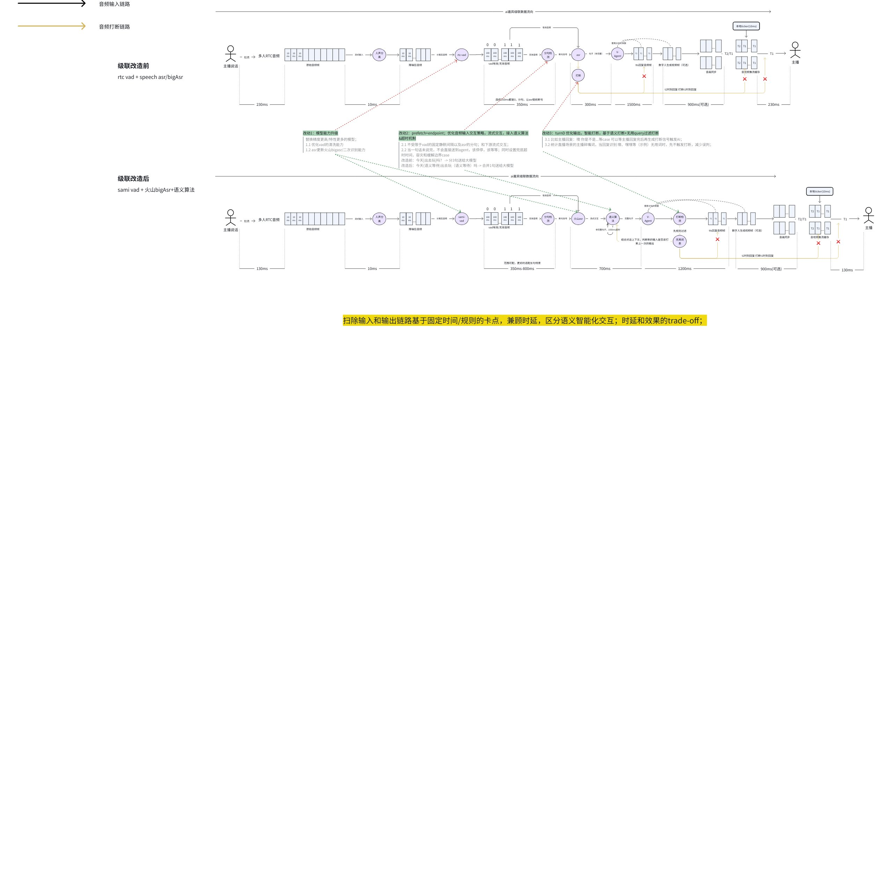

1. 替换更快/更好/更多特性的模型；
2. 设计更好的流式输入交互：1）参考prefetch和endpoint策略，不受限于vad的固定静默间隔以及asr的分句；和下游流式交互**，优化长句，顿句场景；**2）增加语义检测（turnD）能力，当一句话未说完，不会直接送到agent，该停停，该等等；同时设置兜底超时时间，容灾和缓解边界case
3. 结合turnD机制优化输出打断：1）基于语义打断+无用query过滤打断，比如主播回复：噢 你是不是...等case 可以等结合上下文来判断是否需要生成打断信号触发打断；2）统计直播场景的主播碎嘴词，当回复识别 噢、嘿嘿等（示例）无用词时，先不触发打断，减少误判；

基于上述问题和整体链路，我们可以得出一个结论：音频前处理（VAD+ASR+LLM交互）模块，只改动或者只关注一个模块的优化是不够的（只有流式送是不行的，要结合语义；只有语义是不行的，要结合上下文）；需要整个系统配合，上下行链路、多策略的协同；

###### **1.3.3 回复链路优化**

> 直播-V 团队工程共建

**问题背景**

对话回复这部分，在直播场景下，会放大一些工程链路的缺陷：

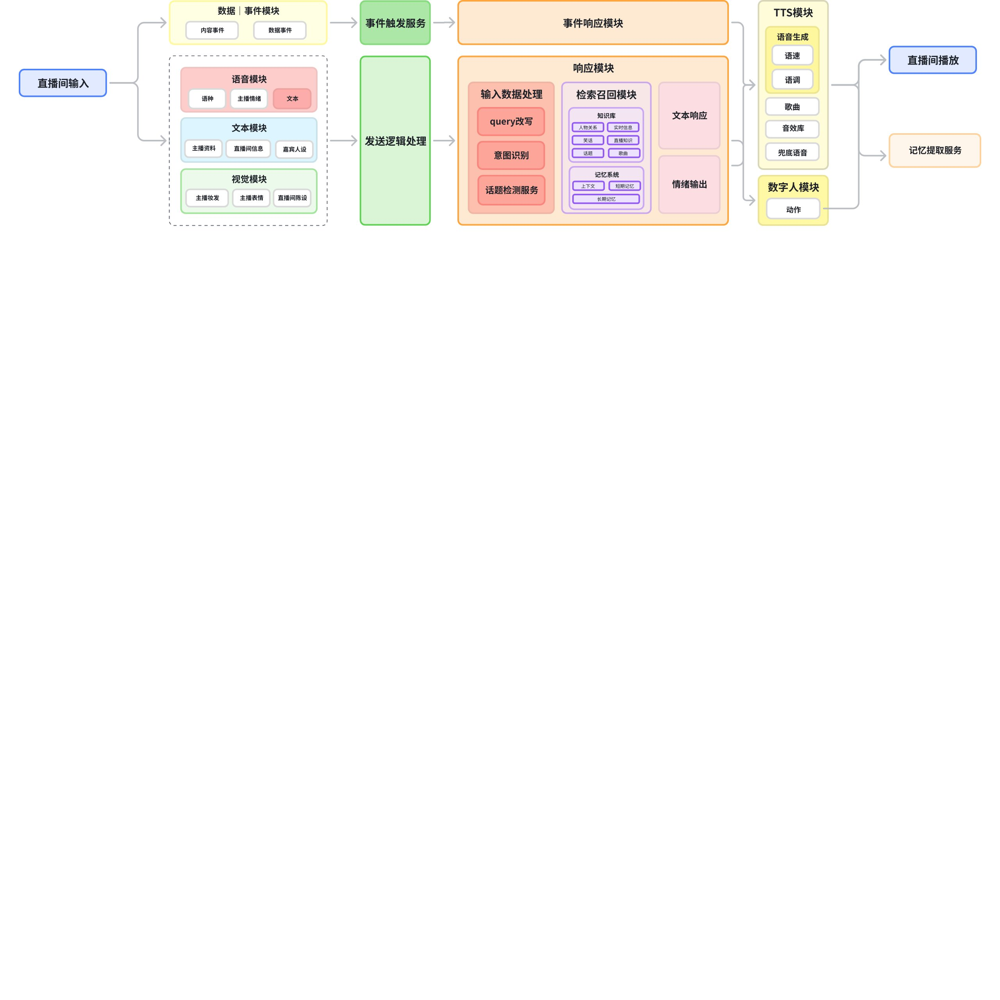

- **长上下文对话难：**大模型上下文窗口有限，超长对话中（AI伴播人均对话80轮+）会导致早期信息丢失；对于直播互动场景来说，没有历史上下文会导致连线早断风险、主播冷启动困难等问题，放大影响；
- **对话上下文质量低：**基于前文的音频前处理链路的问题以及直播间的复杂场景、中尾部主播讲话特性等，目前语音识别到输入agent的上下文质量较差，容易对模型的短期/长期记忆造成较大污染；叠加记忆，影响中长期的对话质量；例如主播要求AI唱首歌，文本识别成大哥；
- **对话效果不足：**目前AI伴播的对话agent要求响应时间较快(<400ms)，快速应对主播的一些对话和直播间事件响应，是一个快思考no thinking模型，受到模型基座的影响，在指令遵循、拒答、回复效果上都存在一定的问题；

**解决方案**

围绕上述问题，我们核心采用了 **记忆系统、快慢思考agent链路** 来进行治理以及优化：

**2.2.1 记忆系统设计**

**核心思路：**定义直播下存什么，怎么存，怎么用，怎么用好？

- 存什么：事实/关系/情景/偏好，结合直播场景遍历核心诉求，找出较固定的，场景易变的；
- 怎么存：存的时机，短期在内存上下文压缩总结，长期基于每次对话结束异步链路生成；复用公司基建向量库；
- 怎么用：按主播uid + agent uid维度，避免跨agent交互和污染；
- 怎么用好：pe槽位定义 + 单独模型历史记忆总结 + 结合RAG关联匹配；结合下文快慢思考体系增强质量；

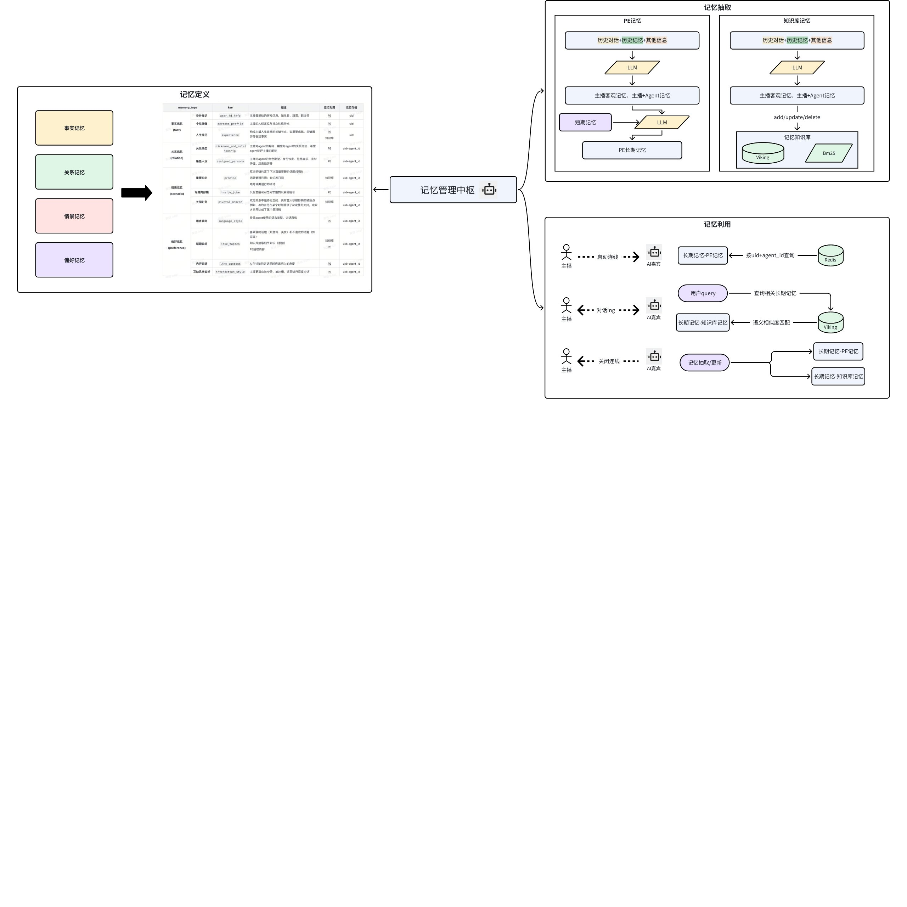

**2.2.2 快+慢思考agent**

> 在途

在有了记忆系统后，如何保障记忆上下文的相对准确以及可控，同时更精确的生成更高质量的回复呢？另外，对于直播间噪音以及错字识别的输入，我们如何增强模型的抗干扰性呢？**核心思路：**

- 用更大参数的识别模型 + thinking模型，作一些高精度的识别以及丢弃策略，不需要实时回复，可以根据历史回复以及当前上下文，进行更多的推理，生成高质量or长内容，提前进入回复音频队列排序；
- 另外，在慢思考链路，引入更低频的音频切片处理和更大参数的识别模型（高延迟/高准确），清洗出更高质量的文本上下文，用这部分数据来做上下文清洗or丢弃策略，减少和缓解上下文污染；
- 引入快慢链路会有时序交互的问题，所以慢思考链路主要用于作异步任务以及回复时序无关的内容，例如捧场；

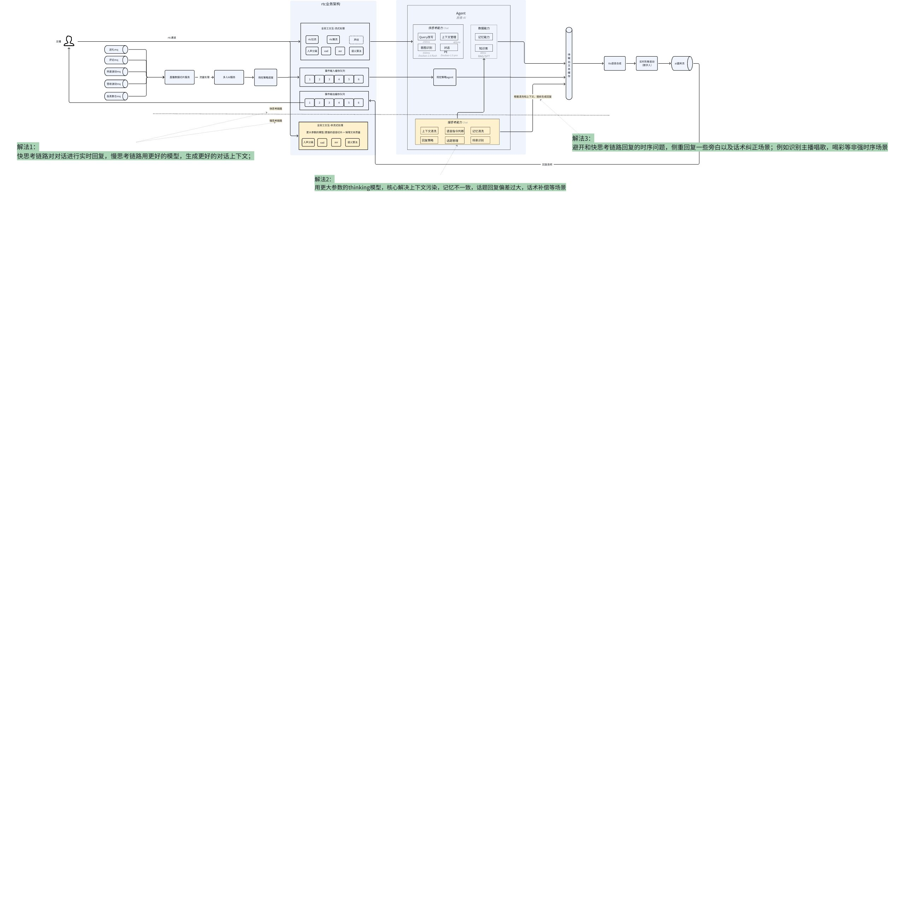

##### **阶段收益**

- 整体优化效果超出预期，落地和实践了业界先进前沿的能力，支撑产品uv 3500 -> 5000，次留19% -> 30%；兜住了用户体验；

#### 直播AI语音解决方案

归档缺口：此同步块的源文档无查看权限，未离线收录其内容。<a href="https://bytedance.larkoffice.com/docx/BZsCdR1gmoDwOCxCUlbcwMAknmh#QsPtd2kk4shB7qbVspEcDHBJny8">查看源同步块</a>

##### **问题背景**

- 如前文所述，除AI伴播的场景，直播内外连麦AI语音对这块的诉求都比较强；由上述技术推导可以看出，从0构建一套类似方案，所需成本较高（80pd+），且效果、稳定性，存在不确定性；
- 在AI快速迭代以及公司基建例如方舟平台、eino的成熟能力下，业务初步搭建agent的成本较低，业务可以快速接入；核心反而是语音对话架构以及业务垂类解决经验的沉淀比较复杂和漫长；

##### **解决方案**

基于这个背景，我们在设计对话架构的时候，我们希望后续业务可以快速复用以及减少重复开发（<7pd）；每个模块 与其它任一模块完全解耦，业务可自由选择组合使用；如前文所述，除Agent模块外，其余所有模块均为业务无关设计，所以核心为设计 Agent交互协议 + 多租户的监控告警能力支持， 思路：高兼容、低接入、易扩展。

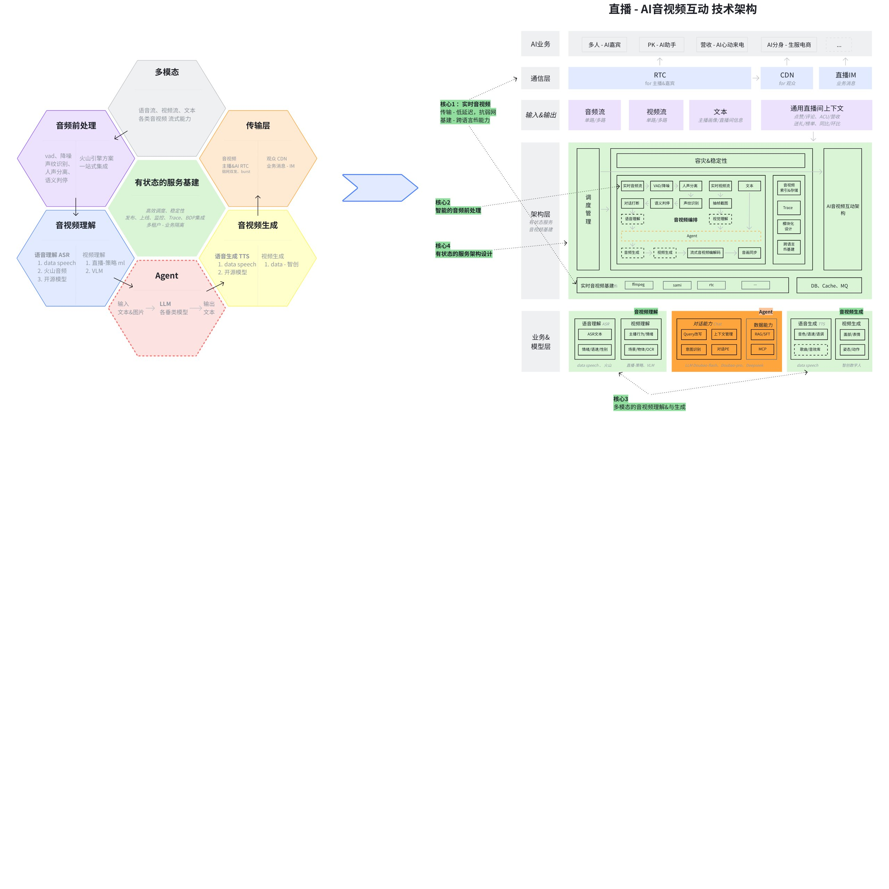

**1.3.1 核心模块可配+Agent通用协议**

复杂的音视频处理链路的编排，尽量相对通用且可选，对外提供原子能力或者编排组合的能力即可；我们只需要定义好大模型的交互协议即可，其中大模型都支持流式输出，为了体验&性能设计，此处会提前将流式输出文本 送入 音频生成TTS模块，即agent交互协议需要支持 streaming模式， 协议上可使用 HTTP + SSE 或者 KiteX Streaming；这样，agent模块即是可拔插的相对通用的，复杂的音视频处理和基建能力，减少对外透传；

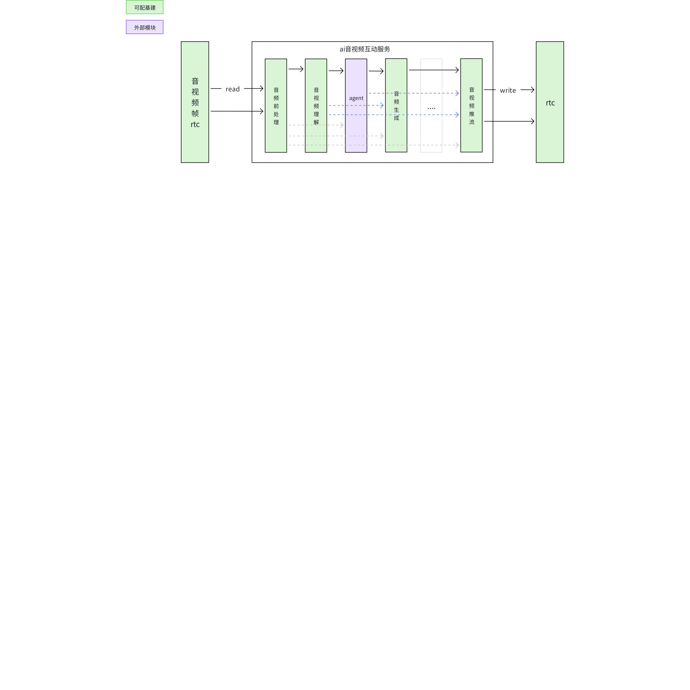

核心设计点：抽象能力节点、模块化设计、链式编排（参考上文 语音基础服务编排部分）

- 业务侧无需关注 音视频传输、流式调用、多模态处理等底层逻辑，仅需聚焦自身业务Agent逻辑开发；
- 包括任务启动、订阅音频/视频流、实时流加工消费、推送音视频流、任务结束，包括统一的异常控制逻辑。
- 在音视频推拉流模块，基于链式设计，支持各类依赖层能力自由组合及添加。

**1.3.2 多租户告警的适配**

通过接口DAG分析，完成下游强弱依赖、节点耗时、发现&止损&预案建设 等治理工作

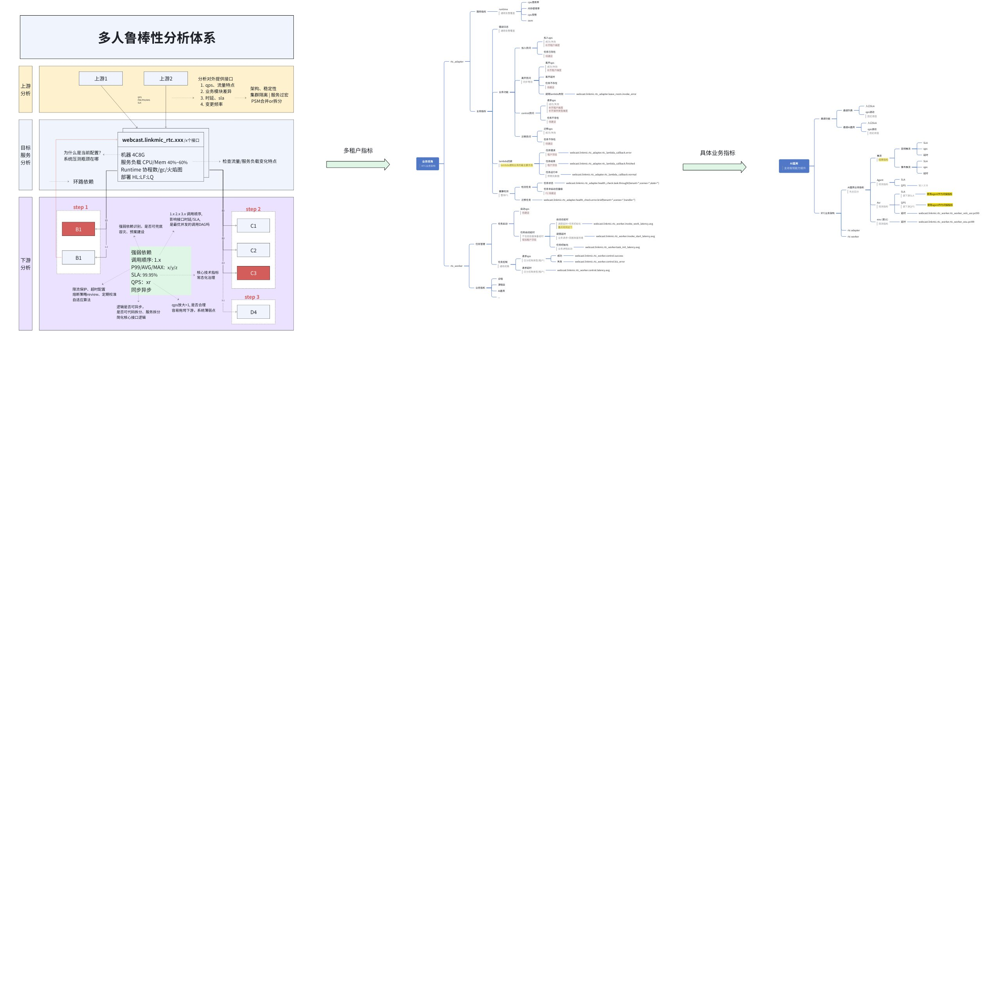

为保障多业务场景下的系统稳定性与服务质量，需配套建设多租户级别的监控告警体系 ：

- **监控指标** ：覆盖请求量、响应延迟、错误率、流式中断率等核心指标，并按租户维度隔离统计（如租户 A 的平均响应延迟、租户 B 的错误率）；
- **告警策略** ：支持租户自定义告警规则（如 “当租户 C 的流式中断率连续 5 分钟超过 5% 时，结合argos + lark告警”），并通过配置化平台灵活调整；
- **故障定位** ：结合对话轮次（Round）与请求 ID，实现全链路日志追踪，快速定位问题环节（如 ASR 识别错误、大模型超时、网络传输中断）。

> 补充说明，多租户的整体稳定性前置梳理了全链路，从有状态基建层实现资源隔离，业务层实现对话容灾。现阶段稳定性暂时不是卡点，核心是补可观测体系；后续有极致的稳定性治理，例如主干，热更新，音视频sdk拆分等；

##### **阶段收益**

- 支持了4+业务接入落地，另外在途2+；

### 收益效果

1. 整体：业务与效果显著超目标，前期支撑 uv 0- > 3500、扩量后 uv3500 -> 2w，人均时对话长 22 min、对话轮次80轮，次留从Q2上线19%->Q4稳定30-35%。
2. 探索和落地了端到端语音模型，级联链路的优化通过全双工、回复改造等 延时[3s -> 2.5s](https://bytedance.larkoffice.com/wiki/EWnHwwlT6iMtRPk7JhRcPzrTnbf#share-Pn8tdgjIYormmMxBgKBcAWQCnod)，端到端模型延时1.3-1.5s，同时提高了识别率和断句效果，asr评测0分率 5% -> 3%，多场景复用；
3. 建设全链路数据和badcase收集能力；支持音频灌测批量行和结果收集的能力，评测执行2h->5min；线上topcase常态化巡检机制，沉淀badcase数据资产3000+，跑通8期线上问题评测；线上问题解决环比下降30%；
4. 解决方案：支持pk助手、AI分身生服、AI分身数字人、AI分身付费来电等 **4+**的对话能力接入，落地showcase无线上问题，日均 uv 4k+；

### 后续规划

<blockquote>
<a href="https://bytedance.larkoffice.com/wiki/IKjowfN14icKU6kXSBtcUxn0nrd">AI嘉宾-26Q1总结&amp;Q2技术规划</a>

<a href="https://bytedance.larkoffice.com/wiki/H4uVwpcN7iSC0BknseEc22EQnEd">AI伴播25总结&amp;26技术规划</a>
</blockquote>

##### 26 新增highlight

1. 全双工语音架构探索（Q2新增）

**背景：**从历史迭代来看，音频链路是反馈问题的重灾区，级联链路原子能力数量多，选型杂，实现方式各异；结合体验优化、业务整合、迭代效率的背景，摸索和沉淀最佳音频链路实现

**目标：**建设全双工语音链路，沉淀音频原子能力x个，线上巡检语音体验问题 xx -> yy

**思路：**通过音频原子评测、模块化独立部署，有状态编排来保障稳定性和灵活性，完成语音链路的冷热灾备、快速回滚/重启/升级等能力

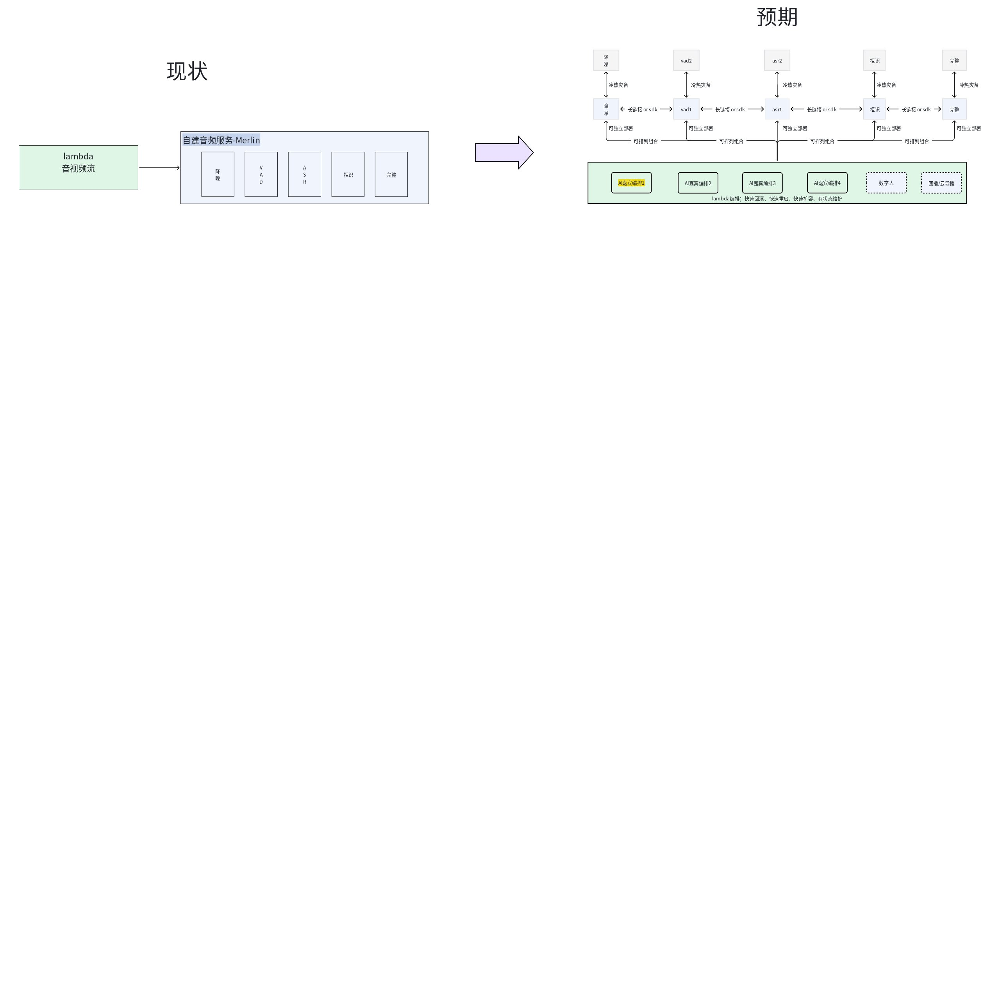

长期探索方案：

- PM侧建联豆包语音团队新的全双工语音能力，[Seed 全双工语音大模型发布：懂倾听、抗干扰，走向更自然的交互](https://mp.weixin.qq.com/s/ymyF-nBO-VT7ehnGO255qg)，初步达成合作意向，预计Q2末语音团队可以提供对标豆包的双工能力，业务侧全双工模块后续考虑该方案接入调研，预计Q2末启动。

1. 同机部署，本地交互的多模型交互探索（Q2新增）

**背景：** 当前多模型链路主要通过网络交互完成，存在一定的通信开销、时延抖动和资源冗余问题。尤其在实时音视频场景下，语音、文本、数字人等多个模块串联后，整体链路效率和稳定性都受到影响。Q2 计划探索多个模型在同一 物理机内混布运行的方式，验证是否可以通过更近距离的交互提升整体效率。

**目标：** 探索多模型、多模态模块同机部署的可行性，验证同物理机内通过共享内存或Pod IP交互替代部分网络通信的收益。重点关注时延优化、资源利用率提升以及链路稳定性收益，为后续推理架构演进提供参考。

**思路**： 将业务流程上涉及到的算法模型，都通过pod的方式部署在lambda平台上，并且将业务任务跟模型任务都路由到同一台物理机上，业务任务和模型任务之间可以通过本地通信的方式，解决网络通信带来的效率问题。

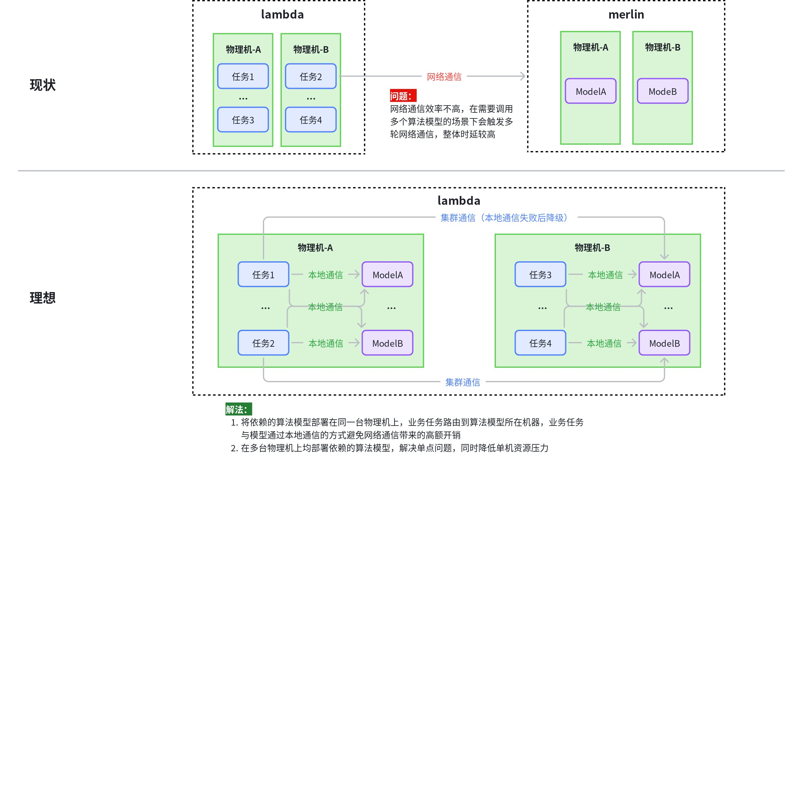

##### 历史规划

<table><colgroup><col/><col/></colgroup><thead><tr><th>时间线</th><th>示意图</th></tr></thead><tbody><tr><td>26年Q2<a href="https://bytedance.larkoffice.com/wiki/IKjowfN14icKU6kXSBtcUxn0nrd">AI嘉宾-26Q1总结&amp;Q2技术规划</a></td><td>
归档补充：同步块源文档 revision 5711，<a href="https://bytedance.larkoffice.com/docx/DX80dwUdcoCGe8xNbflcEDI0nud#K1pMdk8lFsEzTZbUcqPcA8ZInTg">源位置</a>。
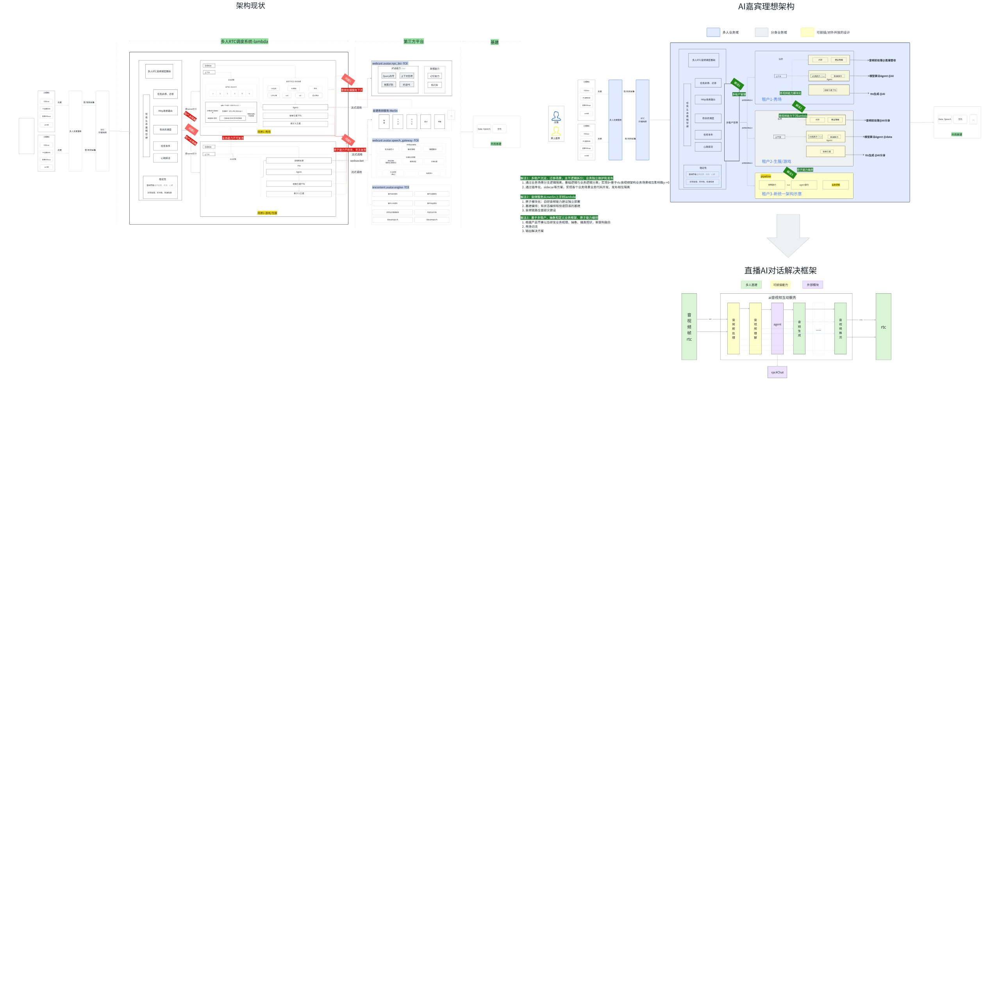</td></tr><tr><td>26年Q1<a href="https://bytedance.larkoffice.com/wiki/H4uVwpcN7iSC0BknseEc22EQnEd">AI伴播25总结&amp;26技术规划</a></td><td>
归档补充：同步块源文档 revision 4858，<a href="https://bytedance.larkoffice.com/docx/ZIzXd3p65oAZsUxGCJecrb4WnOf#YwiZdMppRsqN8ZbzrwDcZaw9neg">源位置</a>。
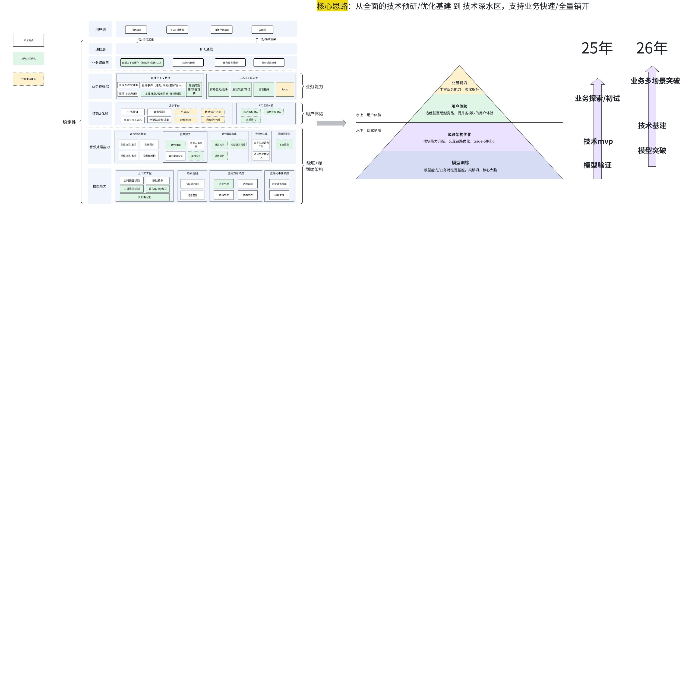</td></tr><tr><td>25年Q4<a href="https://bytedance.larkoffice.com/wiki/PxMEwNQQbidMLFkkL05ckj6Tnbg">AI 嘉宾 2025Q4 技术规划</a></td><td>
归档缺口：此同步块的源文档无查看权限，未离线收录其内容。<a href="https://bytedance.larkoffice.com/docx/TXayd2mObofAJJxQUUOcQ2g0n7e#IE5CdM7RascPfSbaVdVcdskUnBb">查看源同步块</a>
</td></tr></tbody></table>

1. 架构：AI音视频互动各模块持续优化，如 音视频前处理 提升降噪效果、提升断句准确率、降低AI错误打断，音频理解 降低ASR错字率，提升音视频输出表现力，包括优化全链路耗时。
2. 模型：提升Agent智能能力，精调出更懂直播场景的对话模型，扩展AI在直播的行动力，在实时对话下，完善慢思考agent旁路链路，释放思考类大模型潜力。探索多模态端到端模型的实现，实现真正的多端输入和输出；
3. 评测/体验：建设完善的业务数据资产库，从人工评测到自动化音频评测/回放等手段；联合RTC团队建设抖音AIGC音质QOE大盘；
4. 多租户：将现有成熟能力快速复用到团播、生服电商等更复杂的直播场景。通过lego热更新，主干逻辑拆分，音视频sdk拆分等手段，解耦各个业务复用带来的稳定性和效率问题；

# Reference

- <a href="https://bytedance.larkoffice.com/wiki/IKjowfN14icKU6kXSBtcUxn0nrd">AI嘉宾-26Q1总结&amp;Q2技术规划</a>
- <a href="https://bytedance.larkoffice.com/wiki/H4uVwpcN7iSC0BknseEc22EQnEd">AI伴播25总结&amp;26技术规划</a>
- <a href="https://bytedance.larkoffice.com/docx/FYxWd9Xq5op8VMxn1TncWGrJnKg">多人RTC业务架构方案和规划</a>
- <a href="https://bytedance.larkoffice.com/docx/N5kCd1Exeo8LG5xp0ZFcpa2Xnjf">RTC连线架构多租户技术方案</a>
- <a href="https://bytedance.larkoffice.com/wiki/PFtKwWEafia7zakKt1wcrAtInoh">【多人】提升RTC业务架构可观测性 - 26Q1</a>
