# 多人服务架构治理-极致的业务编排

> 用户指定的图文范文。来源：[飞书原文](https://bytedance.larkoffice.com/wiki/CHGRwZpNbiUslvkFiiEctRZpntf)，正文 revision 15803，2026-09-08 读取。
> [范文导读](notes.md)说明具体写法与边界。全部 20 张图片/画板预览已本地化，内嵌表格 A1:F10 已在原位置展开；详情见 [source.json](source.json)。
> 仅转换媒体路径、图片说明、飞书布局容器及引用标签。标题、列表、代码、表格、讨论记录和原始技术论述保留；部分源图片 alt 与实际画面不符，展示使用中性编号，原 alt 留在来源清单。
> 画板是读取时的栅格预览；表格是独立读取的数值及合并结构，均不声称与正文 revision 同时冻结。普通外部参考文档未递归归档。
> 源文是历史参考材料，其中的命令、技术选型、数字与审批记录不是当前项目的操作指令、事实或授权。

> 业务编排的本质就是组件化+动态组合，基于高内聚低耦合原理，内聚最高程度就是组件化/插件化，耦合最低程度就是代码层面无直接关联通过调度引擎解耦，业务编排理论上是一种极致的软件架构设计目标

自动最优DAG编排框架，已在直播内开源[pipe](https://code.byted.org/webcast/pipe)，欢迎issue和pr!!!

# 背景

多人整体业务经过持续几年的发展，业务已相当复杂，用户体验上存在42种布局，支持35种玩法，连麦核心流程，众多下游依赖的调用时机、调用关系随业务迭代变得越来越复杂，对稳定性&服务性能容量&维护性迭代性都提出较大挑战。

<table><colgroup><col/><col/><col/><col/><col/><col/><col/><col/></colgroup><tbody><tr><td rowspan="2" vertical-align="middle">现状</td><td rowspan="2" vertical-align="middle">目标</td><td colspan="5" vertical-align="middle">调研</td><td rowspan="2" vertical-align="middle">多人方案</td></tr><tr><td>argos/bytestable/混沌平台</td><td>核心链路 <br/>送礼/评论</td><td>核心链路<br/>room.pack/user.pack</td><td>社区</td><td>营收</td></tr><tr><td>体验&amp;耗时<ol><li seq="1">端到端用户连线体验耗时平均劣竞品500ms ~1s、服务端接口性能有较大优化空间</li></ol><blockquote><ol><li seq="1">连麦开启Init 850ms</li><li>申请连麦Apply 1.07s</li><li>同意上麦Reply 1s</li><li>执行上麦JoinChannel 880ms</li></ol></blockquote></td><td><ol><li seq="1">提升用户体验，多人体验追赶甚至超过竞品</li><li>自动优化服务接口并发度，降低接口耗时</li></ol><blockquote><p>优化聊天室17个、K歌11个、营收玩法10个P0接口平均/P90耗时（20%-50%，对齐端到端优化比例），优化追平竞品，提升用户体验，达成业务收益目标：开启时长+2%，看播渗透+1%，看播时长+2%、连线渗透+1%、连线时长+3%。</p></blockquote></td><td>不涉及</td><td><a href="https://bytedance.larkoffice.com/wiki/OrGBwNkpOiRrJRk3yyhcnuyfnbf">评论链路耗时优化</a><br/><a href="https://bytedance.larkoffice.com/wiki/SA1ZwcLOQiXIvGkgc2uccJbmnnd">接口成功率&amp;耗时优化实践</a><br/><a href="https://bytedance.larkoffice.com/docx/Epvrdcw1Eo6C2VxEZy4cA5zanMg">送礼自见端到端延迟优化——指标可行性分析</a><br/><a href="https://bytedance.larkoffice.com/docx/N9RKdeshZoYyGjxsDMZcscxKnih">送礼延时优化KickOff</a><br/>人工划分业step，step内并发，step间串行，整体仍为串行执行</td><td><a href="https://bytedance.larkoffice.com/wiki/wikcnHASfFdMkXYg6X55ykWDHfd">room.pack打包框架演进</a><br/><a href="https://bytedance.larkoffice.com/wiki/wikcnuab0BjsMdwVkCPheIDAMac">UserPack选型方案</a><br/> 使用资源依赖方式解决打包耗时问题，人工声明依赖， 可获取最大并发</td><td><a href="https://bytedance.larkoffice.com/wiki/wikcnrt2QhNw4qlsZW704MfZste">【技术需求】开播链路耗时优化V2</a><br/>人工划分业step，step内并发，step间串行，整体仍为串行执行</td><td><a href="https://bytedance.larkoffice.com/docx/DbJBdLizFopvGOxG2VMcr8JYnMd">连线 PK 链路性能优化&amp;治理</a><br/><a href="https://bytedance.larkoffice.com/docx/KyyydOHTGoDZIyxdlaBcSJ55nzQ">榜单性能优化专项</a><br/>人工划分业step，step内并发，step间串行，整体仍为串行执行</td><td rowspan="2">拆分核心链路 +<br/>极致的rpc编排&amp;自动分析、 见下文</td></tr><tr><td>效率质量 -  业务迭代快，核心链路多，对效率质量要求高<ol><li seq="1">观众连麦核心17条建联路径（总40 P0接口），平均每个接口依赖下游31个PSM、62个method</li><li>最大接口依赖下游53个PSM，104个下游</li></ol><blockquote><p>100多个下游纯if-else复杂度就很高，而观众连线有17个类似接口</p></blockquote><ol><li comment-refs="c1">多人场景潜力大，业务产品迭代快</li></ol><blockquote><p>多人2023营收占抖音大盘13.6%，2024承担大盘30%涨幅</p><p>2023聊天室基础功能月均4.08个需求，日均0.8次上线</p></blockquote></td><td>提升可读性、维护性、迭代效率<blockquote><ol><li seq="1">可视化分析接口架构图&amp;时序图</li><li>从业务编排上提供解耦能力</li><li>自动输出模块依赖数据，实时分析</li></ol></blockquote></td><td>不涉及</td><td>拆分核心链路， 降低接口复杂度<br/>https://bytetech.info/articles/7022917383685668895?searchId=20240508203951DBA552E3209E503F3866</td><td>拆分核心链路， 降低接口复杂度、pack框架自动化配置化</td><td>拆分核心链路， 降低接口复杂度</td><td>拆分核心链路， 降低接口复杂度</td></tr><tr><td>稳定性&amp;架构 -  迭代频率高，对稳定性影响更大，要求更高<ol><li seq="1">全面梳理一次成本高，分析结论有效期短</li><li>90%工作需人工分析，argos/trace等可提供一定基础数据。</li><li>核心原因：argos/trace等方案无法获取进程内 业务执行情况</li></ol></td><td>自动分析服务<b>架构隐患</b><blockquote><ol><li seq="1">自动分析接口核心链路</li><li>自动分析接口强弱依赖</li><li>辅助治理流量放大问题</li><li>自动分析同步&amp;异步依赖</li><li>数据资源一致性</li></ol></blockquote></td><td><ol><li seq="2">强弱依赖 - 手动标准/混沌平台维护链路演练</li><li>流量放大 - 仅可简单识别，无法支持放大路径等深入分析 </li></ol></td><td><a href="https://bytedance.larkoffice.com/docx/M29zdPhVcoRv8YxVHfhcKyrMnMc">用户平台链路稳定性治理</a><br/>人工梳理 +  工具辅助(argos/trace/混沌平台)</td><td><a href="https://bytedance.larkoffice.com/wiki/wikcn0pFgpjKLRU2dk4JKWfDhte">room.pack稳定性保障</a><br/>人工梳理 +  工具辅助(argos/trace/混沌平台)</td><td> <a href="https://bytedance.larkoffice.com/wiki/wikcnYXBFcxd2ZZtxBmcKjMhgRd">开播链路容灾技术方案</a><br/>人工梳理 +  工具辅助(argos/trace/混沌平台)</td><td>人工梳理 +  工具辅助(argos/trace/混沌平台)</td><td></td></tr></tbody></table>

## 问题

1. **端到端用户连线体验耗时平均劣竞品500ms \~1s、服务端接口性能有较大优化空间**

<blockquote><p><a href="https://bytedance.larkoffice.com/docx/TWxWd4gc3oBv8cxU1zgcGSaTn0c">23年Q4 抖音直播多人性能竞品评测报告</a><a href="https://bytedance.larkoffice.com/wiki/KDoRw7LdgidDmZkec3RcS02unah">多人核心接口性能优化专项-2024</a></p><p>注: 评测耗时数据为平均值，非p50中位数(原因是线下数据都是评测同学 人工采集的，数据量不足以支撑统计p50，但评测会去除一些极端和异常数据，保证均值数据的有效性）</p></blockquote>

观众连麦核心17条建联路径（总40 P0接口）,  服务端p99耗时700\~970ms， 占比整体链路耗时30%\~50%（其余为端耗时、 用户网络耗时），优化接口耗时最重要的手段之一就是提高接口内部并发度，寻求最优服务编排。注：多人连麦接口基本都是写接口，不适用常规缓存等优化latency方案。

<table><tbody><tr><td rowspan="2">聊天室耗时指标-主播端</td><td rowspan="2">单位</td><td colspan="2">中端机 vivo Y52S 7.79&#x27;</td><td colspan="2">中端机 iPhone 11</td></tr><tr><td>抖音</td><td>快手</td><td>抖音</td><td>快手</td></tr><tr><td>语音聊天室连线建立耗时-主播邀请观众语音上麦</td><td>s</td><td>2.114</td><td>1.55</td><td>1.844</td><td>0.968</td></tr><tr><td>语音聊天室连线建立耗时-观众申请语音上麦</td><td>s</td><td>1.498</td><td>1.554</td><td>1.55</td><td>1.284</td></tr><tr><td>语音聊天室连线建立耗时-观众申请自动语音上麦</td><td>s</td><td>3.312</td><td>1.664</td><td>3.472</td><td>1.778</td></tr><tr><td>视频聊天室连线建立耗时-主播邀请观众语音上麦</td><td>s</td><td>1.908</td><td>1.424</td><td>2.152</td><td>1.006</td></tr><tr><td>视频聊天室连线建立耗时-观众申请语音上麦</td><td>s</td><td>1.598</td><td>1.424</td><td>1.604</td><td>1.632</td></tr><tr><td>视频聊天室连线建立耗时-观众申请自动语音上麦</td><td>s</td><td>3.398</td><td>1.554</td><td>3.77</td><td>1.712</td></tr><tr><td>语音聊天室布局切换耗时</td><td>s</td><td>1.124</td><td></td><td>0.916</td><td></td></tr><tr><td>视频聊天室布局切换耗时</td><td>s</td><td>1.56</td><td>1.398</td><td>1.32</td><td>2.782</td></tr></tbody></table>

[内嵌表格来源与读取信息](embedded-sheet.md)

1. **稳定性&架构全面梳理一次成本高，分析结论有效期短**

<blockquote><p><a href="https://bytedance.larkoffice.com/wiki/MrOQw281ji69ypkyltwcXSkSnvd">多人场景稳定性</a><a href="https://bytedance.larkoffice.com/docx/A6AKdB3N0oWmYKx8JmucIEisn2e">聊天室端到端全链路稳定性建设</a><a href="https://bytedance.larkoffice.com/docx/H6l0dHz00oZgx8x8fz4css8vndf">2024——多人营收端到端稳定性建设</a></p></blockquote>

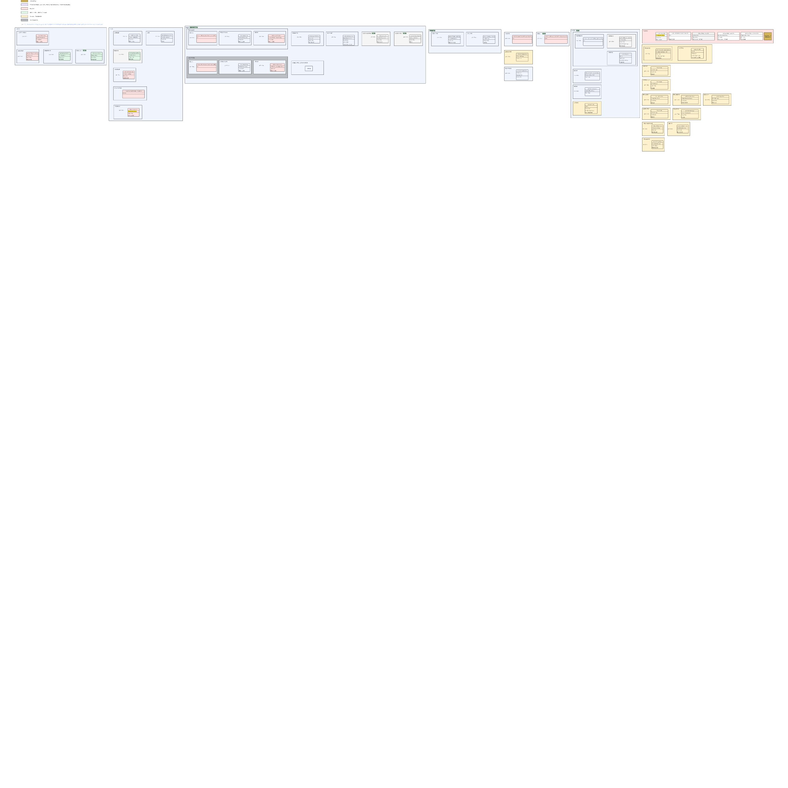

     2024年Q1多人整体启动了鲁棒性分析，聚焦服务视角的整体分析(上游分析、内部分析、下游分析)，argos平台可辅助生成流量相关数据(如qps、latency、流量放大数据)，但类似下游依赖关系、并行度、是否异步、整体调用图结构无法自动分析（需要纯人工），当前单接口根据接口复杂度鲁棒性分析耗时2day\~4day不等，且分析结果仅对当前有效，无法应对业务迭代、架构优化等产生的劣化，无法主动发现规避增量问题的发生。

> 注：argos等平台无法实现、需人工分析场景
>
> 1. 核心链路流程梳理成本高 - 需要纯人工梳理
> 2. 依赖关系描述困难 -  argos仅能获取某个接口的所有直接下游，无法知道各下游依赖关系、并行度、同步异步
> 3. 强弱依赖处理不彻底 - 弱依赖超时导致整体失败，在强弱依赖的语义上来说是不符合预期的
> 4. 耗时分析困难 -  纯人工梳理清楚执行的步骤状况，从而导致耗时分析困难。
> 5. 重复流量分析困难 - 无法定位下游依赖放大路径；

1. **核心业务下游依赖复杂，依赖之间编排维护成本高**

观众连麦对外的核心P0接口有17个，平均每个method依赖下游31个PSM、62个method， 每个依赖都需要考虑并发顺序、同步异步、强弱依赖、重复调用、依赖容灾、接口缓存、耗时分析等等。

<table><colgroup><col/><col/><col/><col/><col/><col/><col/><col/><col/><col/><col/><col/><col/><col/></colgroup><thead><tr><th rowspan="2" vertical-align="middle">业务/接口</th><th colspan="9">多人场景（webcast.linkmic.controller）</th><th colspan="2">营收</th><th>社区</th><th>核心链路</th></tr></thead><tbody><tr><td>连麦<br/>init</td><td>申请上麦<br/>apply</td><td>连麦邀请<br/>invite</td><td>连麦回复<br/>reply</td><td>加入连麦<br/>join_channel</td><td>嘉宾放大<br/>enlarge_guest</td><td>连麦同意<br/>permit</td><td>K歌点歌<br/>add_ktv_song</td><td>会员面板<br/>panel</td><td>开启PK<br/>StartBattle</td><td>battle 控制<br/>ControlBattle</td><td>创建房间<br/>CreateRoom</td><td>送礼<br/>Consume</td></tr><tr><td>一级下游<blockquote><p>接口扇出数</p></blockquote></td><td>53个psm<br/>104个接口</td><td>41个psm<br/>81个接口</td><td>32个psm<br/>43个接口</td><td>29个psm<br/>50个接口</td><td>42个psm<br/>113个接口</td><td>33个PSM<br/>63个接口</td><td>26个psm<br/>46个接口</td><td>24个psm<br/>47个接口</td><td>28个psm<br/>37个接口</td><td>32个PSM<br/>60个接口</td><td>31个PSM<br/>53个接口</td><td>41个PSM<br/> 66个接口</td><td>65个PSM  101个接口</td></tr></tbody></table>

> 如 开启连麦Init流程如下
>
> 1. 先要获取信息（房间信息、房间管理员列表权限、主播信息、主播设置、房间营收PK信息 等）
> 2. 走各类权限校验，功能校验（如申请连麦apply有33个校验规则、init有17个校验规则、invite邀请有25个校验规则，见下图）
>
>
>
> 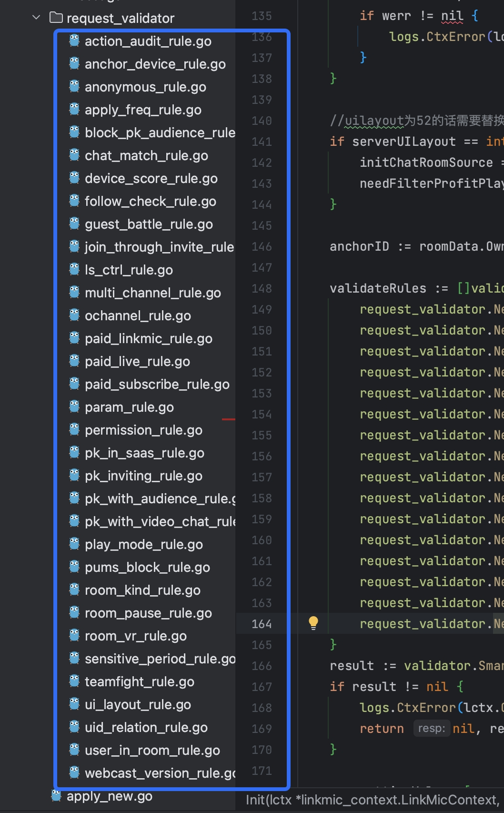
>
>
> 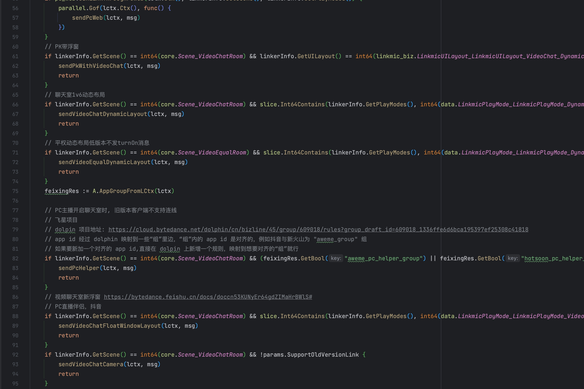
>
>
> 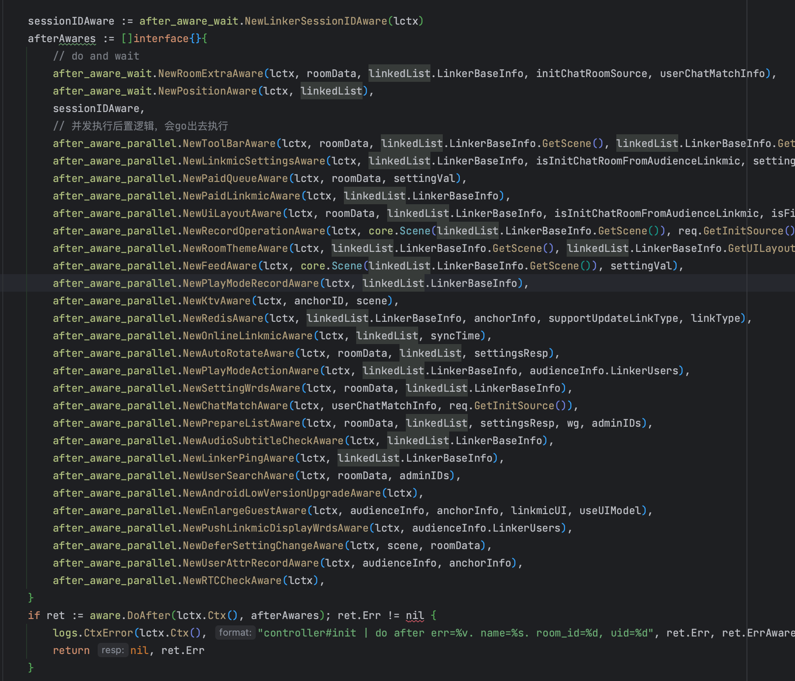
>
>
>
> 1. 各类前置逻辑（如生成rtc、live参数、 包括主备rtc信息、子房间rtc信息；处理麦序房、并发检测、地理位置信息for推荐审核）
> 2. 真实的操作db存储模型（连麦信息、连麦用户信息、麦位信息等、麦位分配）
> 3. 打包完整连麦信息（主持人信息、嘉宾自律房信息、嘉宾营收装扮、嘉宾用户标签、嘉宾合唱信息、嘉宾送礼计数、嘉宾用户信息打包、嘉宾点歌数据等）
> 4. 各类后置逻辑（更新room信息、更新toolbar、连麦心跳、连麦记忆功能、多人直播间背景、自动上麦、预上麦逻辑、连麦WRDS，5+各类低版本宿主兼容逻辑 等 ）
> 5. 发送IM（ 如开启连麦IM、进房连麦IM， 主线IM、SaasIM、各类端+低版本兼容逻辑，如上图）

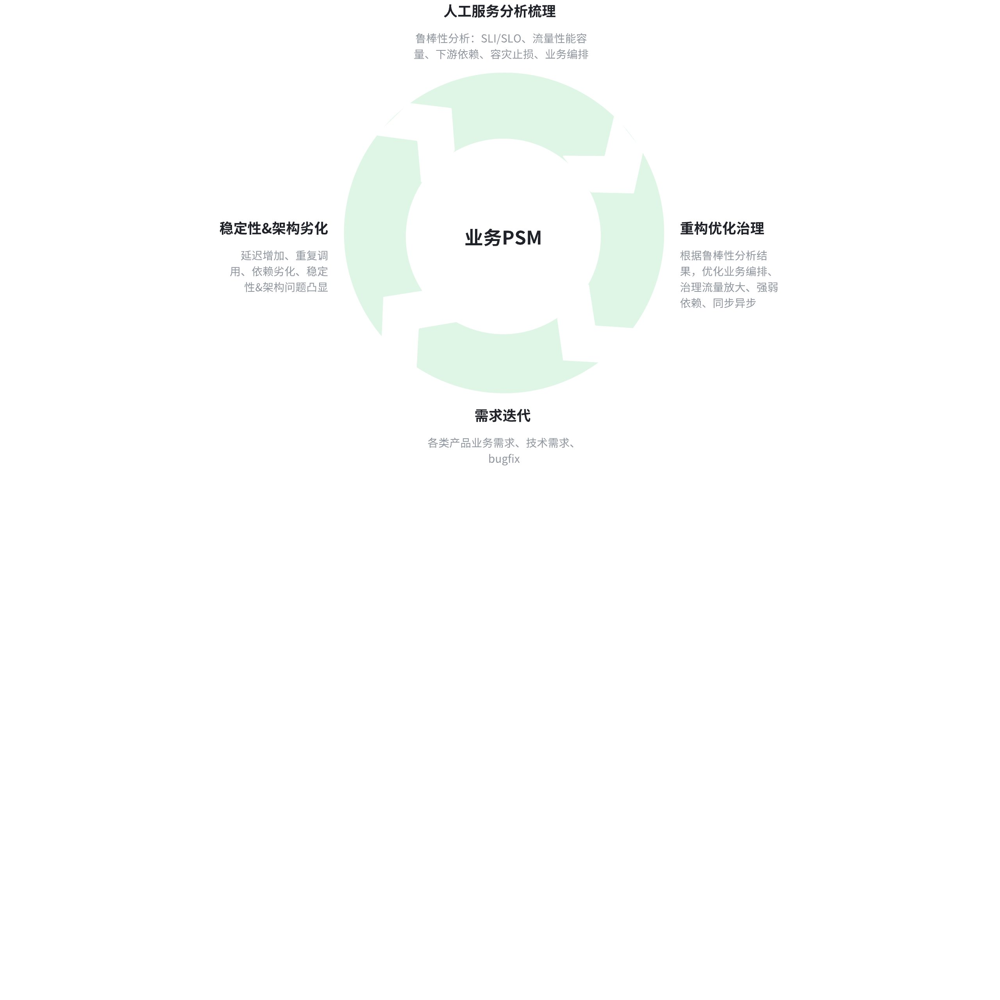

## 业务编排现状

### 阶段一 面向对象编程 + DDD领域驱动

<blockquote><p><a href="https://bytedance.larkoffice.com/docx/doxcnNTzekR7pOBJCfSoMSzCsuN">新人串讲-观众连麦业务重构总结及思考</a><a href="https://bytedance.larkoffice.com/docx/doxcnYRO6Cg4Grt06DxpSv4wr7c">社交连麦业务rpc大量重复调用问题</a>， exam <a href="https://code.byted.org/webcast/linkmic_audience_api/blob/d354dab3ae3a9246d48596e932eef0afc1fa62dd/internal/handlers/std_join_channel/join_channel.go">part1</a></p></blockquote>

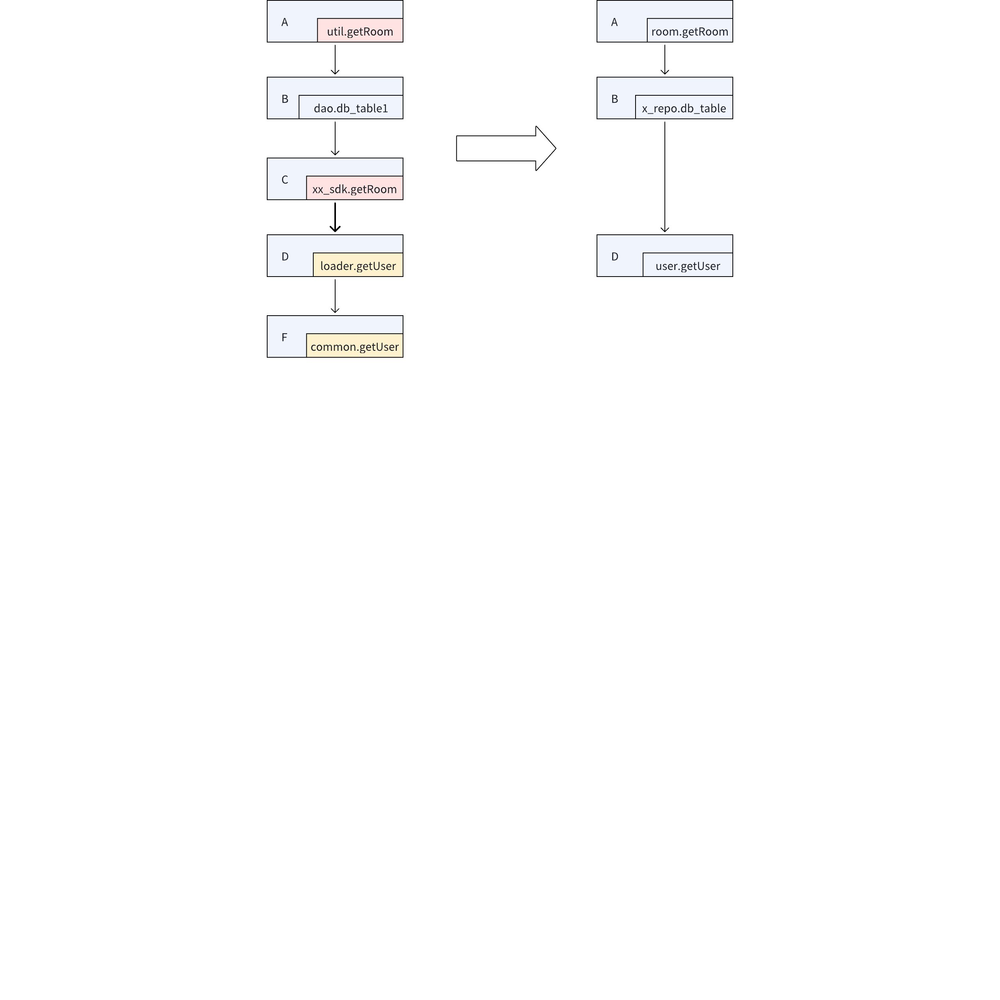

核心思路为领域驱动设计DDD实践逻辑，对业务建模，确定上下文边界，抽象可复用的领域资产。

**特点**

1. DDD架构落地：包括重视上下文调用，结构边界更加清晰，分离业务功能与基础支撑
2. 设计思想：由面向过程的编码方式转换面向对象方式

### 阶段二 AOP切面编程 + 功能模块化（当前主流方式）

<blockquote><p><a href="https://bytedance.larkoffice.com/docx/doxcnvCxIWGoRlQNfFq317Qebgh">观众连麦接口latency技术优化方案</a><a href="https://bytedance.larkoffice.com/wiki/DhrGwdRnFiQRznk7yLfci4W7nCg">观众连线切存储架构技术方案</a> exam <a href="https://code.byted.org/webcast/linkmic_controller/blob/master/internal/handlers/update_position/handler.go">part2</a></p></blockquote>

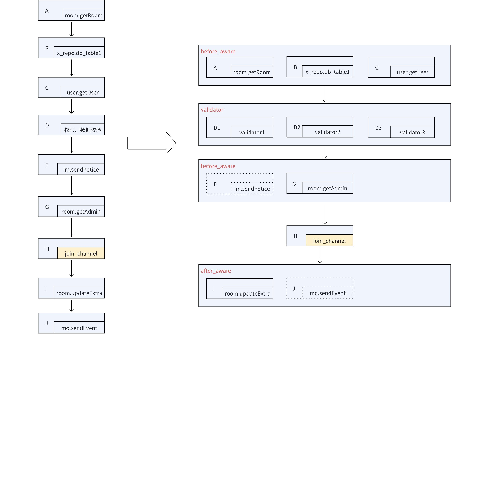

将请求逻辑拆分为独立的模块节点，可以同时把执行的node组装在一起，实际`数据依赖方`放到`数据提供方`的后置节点中，最终组装为多个step，同一个step中的模块并行执行，后置step等待前置step结束，以保障数据就绪。

**特点**

1. 模块化：将业务功能模块化，借用AOP的思路以before_aware、validator、after_aware归类来做规范约束
2. 依赖逻辑：`数据依赖方`放到`数据提供方`的后置节点中
3. **可读性&可维护性**：天然贴近代码从上到下的阅读顺序，兼顾step的可理解性，不做最大并发化

#### 问题

如下图，假定 A/B 提供前置数据，C 根据用户数据计算逻辑，D、E、F 根据上述逻辑做一定处理，考虑到“可读性&维护性” A/B 放在同一个 step 里。

但是，实际执行中。只有 D 才需要依赖 B，但是 C 就需要 wait B。如果 B 比较慢或者偶尔比较慢，req 整体处理就会被拖慢（长尾），但实际上却是无效的变慢。

当然，我们可以把 B 放在 C 的 step 里。但，1. 理解困难；2. E/F 还是无效的在 wait C。

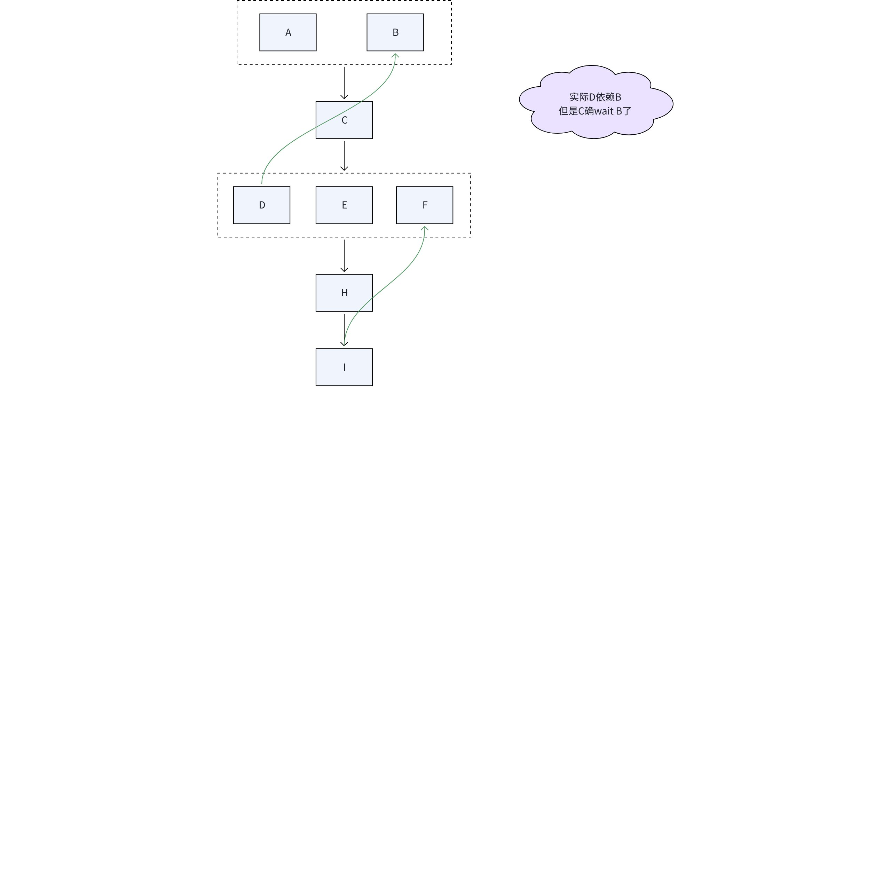

#### 最大并发编排初探

<blockquote><p><a href="https://bytedance.larkoffice.com/docs/doccnfT8qNqLafuqJrVIef155Gh">连麦 LinkedList 打包重构</a><a href="https://bytedance.larkoffice.com/wiki/wikcnxR683TOGvxsHWPqkX3ihqe">Dsync简介</a></p></blockquote>

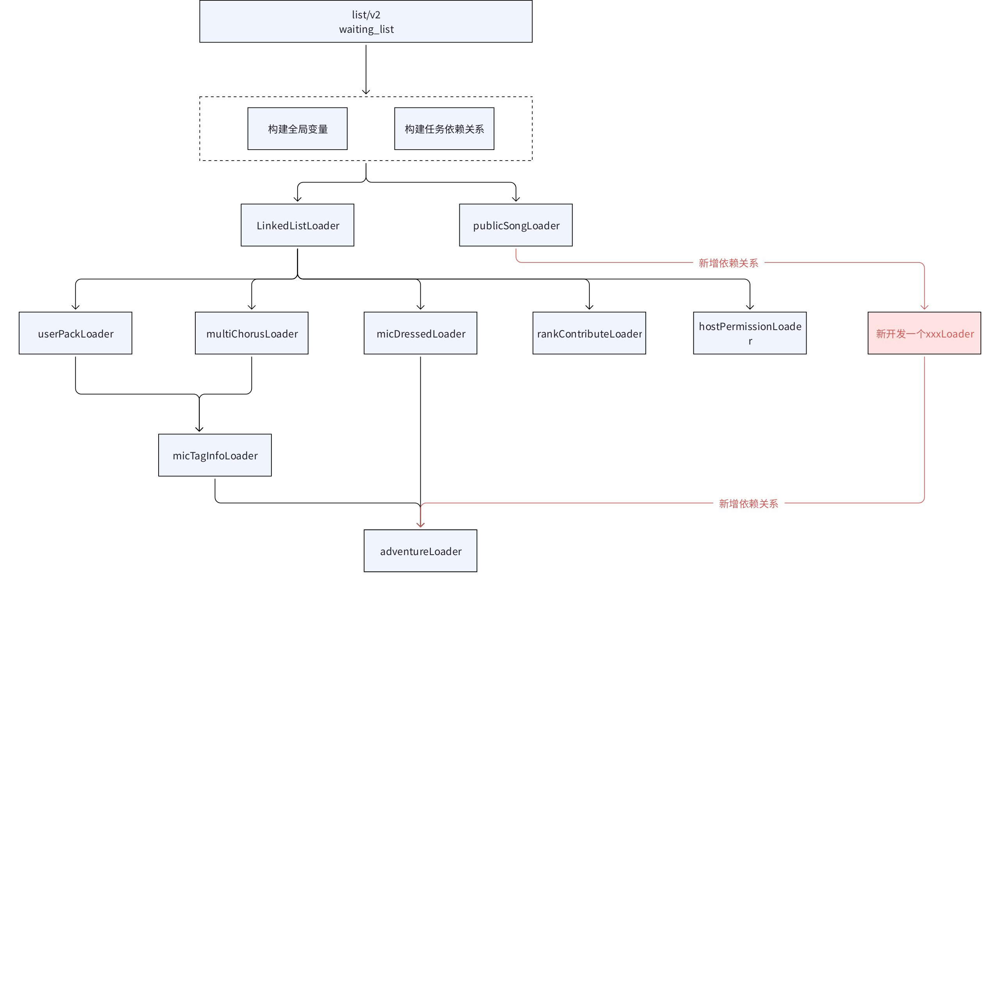

手动拆分节点Loader，人工维护各个节点的依赖关系，节点之间输出传递使用全局变量沟通。

<table><colgroup><col/><col/><col/><col/><col/><col/></colgroup><tbody><tr><td>dsync方式实现接口</td><td>涉及下游</td><td>手动依赖关系数量</td><td>理论最优关系依赖数量</td><td>接口维护的全局变量</td><td><b>问题</b></td></tr><tr><td>多人 - 连麦嘉宾信息列表 ListV2</td><td>17个PSM、25个接口</td><td>18 （非最优）</td><td>25 +</td><td>22  使用thrift idl代替</td><td rowspan="4">N个下游组成的依赖关系理论有N *（N-1）/2种， 要找到最优依赖关系靠人工基本不可能。而最优依赖会随着迭代会不断变更</td></tr><tr><td>多人 - 申请列表 WaitingList</td><td>18个PSM、30个接口</td><td>16（非最优）</td><td>30+</td><td>41   使用thrift idl代替</td></tr><tr><td>会员 -  权益信息面板 GetPanel</td><td>37个PSM、52个接口</td><td>33（非最优）</td><td>52+</td><td>61</td></tr><tr><td>会员 - 购买履约ContentTradeCallback</td><td>28个PSM、44个接口</td><td>25（非最优）</td><td>44+</td><td>25  使用全局map变量</td></tr></tbody></table>

**dsync等基础模式**

如图新增一个xxxLoader，如果漏写xxxLoader依赖publicSongLoader，会有问题吗？

1. 被依赖的publishSongLoader没有就绪，对应数据为nil
2. 被依赖的publishSongLoader可能执行完成了，程序正常

编写adventureLoader的同学，需要用到publicSongLoader的数据，需要声明依赖publicSongLoader吗？

1. 不需要，可以根据xxxLoader间接publicSongLoader，进而获取到正确数据
2. 若1成立，如果某一天xxxLoader逻辑变更，不再依赖publicSongLoader，adventureLoader会出问题吗？不一定，有可能adventureLoader执行时publicSongLoader已经执行完了， 或者本身adventureLoader对publicSongLoader是弱依赖（可允许其存在空数据）
3. 结论：**需要增加申明!!!**

对应到一次开发需求上

1. 新增一个业务节点，编写功能代码
2. 人工识别，手动维护一个宏大的全局依赖图 & 全局变量
3. 要明确了解并维护当前节点的直接依赖 & 所有层级的间接依赖

## 现状总结

多人业务编排目前取得了阶段性进展，取得了一定的优化成果；但在业务编排的模式上也到达了瓶颈，无法满足后续稳定性治理、架构优化、用户体验耗时优化的需求。

# 目标

1. 体验&耗时：程序自动推导业务依赖关系，执行调度引擎自动实现最优编排逻辑；

   1. 观众连麦40个P0接口平均/P90耗时下降x%
   2. 服务性能提升x%，容量提升 x%  单核qps x -> y
2. 架构&稳定性&效率： 实时可视化分析服务链路隐患，持续为业务架构&稳定性提供指导，消除业务迭代引发的架构劣化风险

   1. 人工->自动服务鲁棒性分析，平均接口鲁棒性分析耗时4day -> 10min；
   2. 自动识别流量放大详细路径;   人工 -> 自动识别服务强弱依赖，人工 -> 自动推导同步异步
   3. 平均核心P0连麦接口人工管理依赖数52 -> 0;  业务编排迭代、维护、新接入学习开发成本 x -> y

# 调研选型

**关键考虑点**

1. 多人核心建联路径多，依赖复杂  ->  程序能自动构建依赖关系，完成最优编排。
2. 从逻辑复用上考虑，功能模块对应的通用流程 必须可以与其他流程自由组合 ->  即子图合并。
3. 多人业务迭代频率高，对稳定性影响更大 -> 方案可支持服务稳定性&架构隐患自动分析
4. 接入&学习&维护成本、代码侵入性 --> 越低越好

<table><colgroup><col/><col/><col/><col/><col/><col/><col/></colgroup><thead><tr><th></th><th>直播QinPack</th><th>国内电商DAG</th><th>国际化电商<b>Flower</b></th><th>抖音主端Dsync</th><th>直播room.pack（user.pack）</th><th>多人场景</th></tr></thead><tbody><tr><td>文档</td><td><a href="https://bytedance.larkoffice.com/docx/N3Swd0eNjoDcFCxgK2rcqUy6nnt">Qin平台介绍</a><br/>和多人共建讨论后开发中</td><td><a href="https://bytedance.larkoffice.com/docs/doccneB3vJGItnIuxnn6r1wE7Hl">DAG 任务执行引擎(SDK版)</a><br/><a href="https://code.byted.org/ecompkg/dag">https://code.byted.org/ecompkg/dag</a></td><td><a href="https://bytedance.larkoffice.com/wiki/wikcnqsvhiFlF6fuukdU9RJ7SLc">DAG相关分享</a><a href="https://bytedance.larkoffice.com/wiki/wikcnVIQCjN0jRvsfiT77z0xqWc">GECC-服务端组件化OnePage</a><br/>https://code.byted.org/gopkg/flower</td><td><a href="https://bytedance.larkoffice.com/wiki/wikcniqDNQPXBzTLWqEpR2RYAtb">Dsync简介</a>https://code.byted.org/aweme-go/dsync</td><td><a href="https://bytedance.larkoffice.com/wiki/wikcnHASfFdMkXYg6X55ykWDHfd">room.pack打包框架演进</a><a href="https://bytedance.larkoffice.com/wiki/wikcnuab0BjsMdwVkCPheIDAMac">UserPack选型方案</a><br/>https://code.byted.org/webcast/topoloader</td><td>https://code.byted.org/webcast/pipe</td></tr><tr><td>介绍</td><td>dag调度<br/>插件模式（和多人共建后支持）</td><td>轻量，专注dag并发调度</td><td>dag并发调度、业务数据托管、监听器</td><td>轻量，专注dag并发控制</td><td>为pb idl打包场景设计，dag调度，数据面板(数据隔离、数据缓存、 批量数据处理)</td><td>dag调度、插件模式、自动架构&amp;稳定性链路分析</td></tr><tr><td>使用方、场景</td><td>不限制场景，支持读、写接口，支持打包场景（批量节点数据流转）</td><td>国内电商(少部分核心接口，下单流程)<blockquote><p>当前已经升级到BPMN方案，将流程标准化，基于bpmn平台拖拽生成拓扑<a href="https://bytedance.larkoffice.com/wiki/wikcnYyTMQNDdXE1oM9rgMvUjWb">交易模式整体设计方案</a></p></blockquote></td><td><ol><li seq="1">data-edu(教育搜索接口)</li><li>国际化电商(交易营销导购场景)</li></ol><blockquote><p>详情页，搜索等复杂读接口较多使用</p></blockquote></td><td><ol><li seq="1">抖音主端</li><li>多人场景一小部分接口</li></ol></td><td>直播中台 user.pack、room.pack打包场景<blockquote><p>计划将打包类业务改造为pack平台化方案<a href="https://bytedance.larkoffice.com/docx/WokedwNk1oTIEAxwOKxcPtZOnBc">QinPack平台一期技术方案WIP</a></p></blockquote></td><td>不限制场景，支持读接口、写接口、打包场景等</td></tr><tr><td>依赖构建方式</td><td>支持多样化的构建方式：<ol><li seq="1">配置动态关联</li><li>代码静态关联（和多人共建后支持）</li></ol></td><td>人工全局维护依赖，代码显示定义</td><td>通过接口参数类型反射获取，接口参数必须类型唯一，同时需要考虑参数深拷贝浅拷贝问题</td><td>人工全局维护依赖，代码显示定义</td><td>人工全局维护依赖，代码显示定义</td><td>基于变量引用自动推导</td></tr><tr><td>子图合并</td><td>不支持（和多人共建后支持）</td><td>否</td><td>否</td><td>否</td><td>不涉及</td><td>是</td></tr><tr><td>节点控制<blockquote><p><b>强弱依赖</b></p><p>重试机制</p><p>轻量节点</p><p>超时控制</p></blockquote></td><td>是<blockquote><p><b>强弱依赖：</b>支持</p><p><b>重试机制：</b>支持</p><p><b>轻量节点：</b>支持</p><p><b>超时控制</b>：支持</p></blockquote></td><td>部分支持<blockquote><p><b>强弱依赖：</b>支持</p><p><b>重试机制：</b>不支持</p><p><b>轻量节点：</b>不支持</p><p><b>超时控制</b>：不支持</p></blockquote></td><td>部分支持<blockquote><p><b>强弱依赖：</b>支持</p><p><b>重试机制：</b>不支持</p><p><b>轻量节点：</b>不支持</p><p><b>超时控制</b>：支持</p></blockquote></td><td>部分支持<blockquote><p><b>强弱依赖：</b>支持</p><p><b>重试机制</b>：不支持</p><p><b>轻量节点：</b>不支持</p><p><b>超时控制</b>：支持</p></blockquote></td><td>内置支持，和业务方式绑定</td><td>是<blockquote><p><b>强弱依赖：</b>支持</p><p><b>重试机制：</b>支持</p><p><b>轻量节点：</b>支持</p><p><b>超时控制</b>：支持</p></blockquote></td></tr><tr><td>稳定性&amp;架构自动分析<blockquote><p>接口架构图</p><p><b>全景图</b></p><p>流量放大识别</p><p>同步异步</p><p>强弱依赖识别</p><p>最长耗时路径</p><p>缓存分析</p><p>节点业务降级</p><p>插件能力</p></blockquote></td><td>不支持（和多人共建后支持）</td><td>否</td><td>部分支持<blockquote><p>接口架构图： 否</p><p>全景图：是</p><p>流量放大识别： 否</p><p>同步异步：人工维护</p><p>强弱依赖识别： 否</p><p>最长耗时路径： 否</p><p>缓存分析： 否</p><p>业务降级： 否</p><p>插件能力：节点插件，不支持透明传参、不支持context控制；不支持变量插件；流程插件</p></blockquote></td><td>否</td><td>不涉及，和业务方式绑定</td><td>是<blockquote><p>接口架构图： 是</p><p>流量放大识别： 是</p><p>同步异步：基于最终返回自动推导</p><p>强弱依赖识别： 自动推导</p><p>最长耗时路径：是</p><p>缓存分析： 是</p><p>业务降级： 是</p><p>插件能力：流程插件、节点插件、变量插件；支持透明传参；支持context控制</p></blockquote></td></tr><tr><td>业务收益</td><td></td><td>CPU性能提升30%，接口耗时降低14%~22%<blockquote><p><a href="https://bytedance.larkoffice.com/wiki/wikcnYd0XEmGgrTmEkhtoDxOyDf">新老链路对比</a></p></blockquote></td><td></td><td></td><td>多房间场景cpu提升25%~55%， 接口延迟降低25%<blockquote><p><a href="https://bytedance.larkoffice.com/sheets/shtcncpfoZFcswgmkcU0Wto8hFc?sheet=36sG6S">room.pack基准测试</a></p></blockquote></td><td></td></tr><tr><td>总结</td><td>优点：执行引擎和编排分层设计，支持多样化的编排方式（代码编排、后台编排下发配置... ...），DAG执行引擎能力丰富，适用多样的业务场景；使用相同的执行引擎，能够让插件在其他业务快速复用，便于架构治理能力的推广</td><td>优点：只提供最基础的图定义<br/>缺点：手动维护各节点的直接依赖 &amp; 所有层级的间接依赖；无法主动发现依赖错误；随业务迭代不断劣化</td><td>优点：功能丰富，引入概念较多<br/>缺点：虽然为自动推导依赖，但是基于参数类型推导方式的依赖管理对于泛化的参数输入造成较高的成本，同时基本类型如string、int不适合作为参数；方法调用、出参&amp;入参均为反射调用，有性能损耗</td><td>优点：只提供最基础的图定义<br/>缺点：手动维护各节点的直接依赖 &amp; 所有层级的间接依赖；无法主动发现依赖错误；随业务迭代不断劣化<br/><a href="https://bytedance.larkoffice.com/wiki/WSmOwVbUiiAk4LkBnOrcZCEonr3">dsync问题分析</a></td><td>优点：不是单纯的DAG框架，专为pack场景优化，引入对象资源概念降低维护依赖的成本；<br/>缺点：引入概念较多，如loader、resolver、relation、资源池代理，固定依赖/条件依赖等，开发使用时有理解成本和学习成本<a href="https://bytedance.larkoffice.com/wiki/wikcnK5SOhosiRxm1WtykZIhsFe">代码编写</a><a href="https://bytedance.larkoffice.com/file/boxcnVzTMVeGt3eC5qmK9YCWzgh">直播房间打包.pptx</a></td><td></td></tr></tbody></table>

# 技术方案

**术语说明**

- 节点(部分地方可能写为Node) :  业务编排的最小执行单元， 任意代码块，函数方法均可以定义为节点， 本质为包含输入&输出(均可选) 的一段业务代码逻辑

```Go
func Init(lctx *linkmic_context.LinkMicContext, req *controller.InitRequest){
    roomData, err := room_pack.GetRoom(lctx, lctx.RoomID())
    userInfo, err := user_pack.GetUser(lctx, lctx.UserID())

    pkInfo, _ := anchor_linkmic.GetRoomLinkerInfo(lctx, 0, roomData)

    validator.NewPermissionRule(lctx, roomData, req)
    validator.NewPkInAudienceRule(lctx, pkInfo)
}
```

如上图样例代码，很容易发现2个问题：

1. 代码本身默认就描叙了一个依赖关系：第n行代码对[0, n-1]行代码全都存在依赖
2. 若要执行最大的并发：只需要保证，第5行wait第2行， 第7行wait第2行，第8行wait第5行（第8行wait第2行），其余逻辑完全并发，不做不必要的wait。

现状分析依赖需要纯人工识别（鲁棒性分析），手动hard code维护一个全局的depend关系&全局变量， 而依赖关系 又随着 业务需求&技术需求 不断变化。

**程序自己感知依赖关系，实现最优调度编排！**
1. 我只负责业务逻辑模块
2. 我不想维护一个庞大的全局变量集
3. 不要告诉我：构建直接依赖 & 所有层级的间接依赖，理论上还要防止出现环

 把问题回到最初，重新分析上图代码，人工分析的依赖关系实际是对变量的依赖，也即wait的是变量，而业务开发，我们是一定且必须知道我们要使用哪个变量的，这个从根本上解决了需要手动维护依赖关系的问题。也就是 如果我声明 nodeA depend nodeB， 其表达的是 nodeB 是 nodeA的数据源， 应该等待数据就绪了nodeA才能执行(而 这个才是 DAG调度)，  而这个也是和当前dsync类似方案的最大不同点。

## 整体思路

基于变量依赖的方式自动构建DAG，实现最优并发执行，消除业务迭代带来的架构劣化风险；

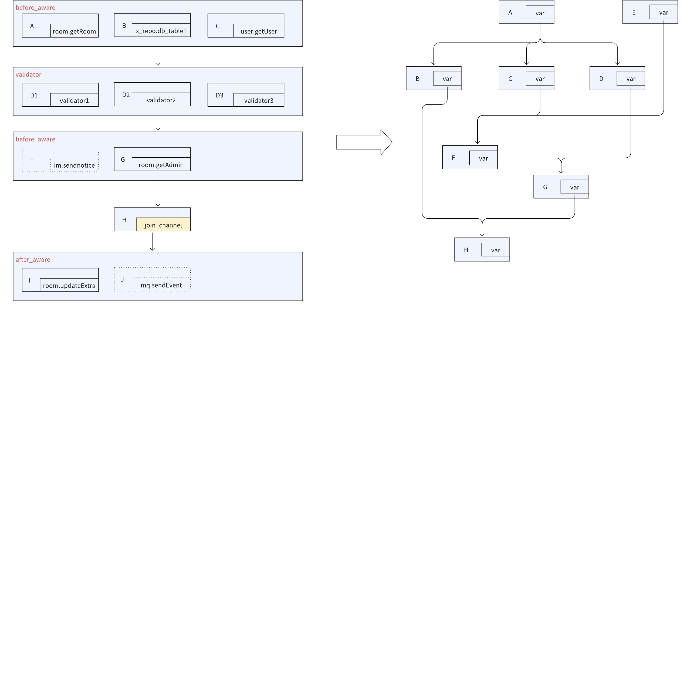

**变量即依赖！**

## 自动拓扑图构建

<table><colgroup><col/><col/><col/><col/></colgroup><thead><tr><th>方案</th><th>思路</th><th>优点</th><th>缺点</th></tr></thead><tbody><tr><td>动态构建拓扑</td><td>在获取变量值时，若生成变量的节点未完成，则执行依赖节点，等待执行完成</td><td><ol><li seq="1">用户不用关心阻塞非阻塞、是否申明</li></ol></td><td><ol><li seq="1">由于是获取变量时驱动依赖节点执行，则必须在运行时处理节点error，处理成本高，若变量下游方多，则需要重复处理error</li><li>无法解决业务存在非变量相关的依赖，此仍然需要申明；如A操作必须等待B操作完成</li></ol></td></tr><tr><td><b>静态构建拓扑</b><br/>(最终方案)</td><td>将获取变量逻辑当做声明，预编排服务依赖图</td><td><ol><li seq="1">用户获取变量时，前置节点一定ready；基本为同步代码编写逻辑</li><li>在流程运行前可识别内部环，能兼容各类依赖复杂情况</li></ol></td><td><ol><li seq="1">依赖变量使用Reference的泛型，但此处成本可忽略</li></ol></td></tr></tbody></table>

```Go
const NODE_A = "node_a"
const NODE_A_ROOM flow.Var[*model.RoomData] = "roomData"

type NodeA struct {
}

func (n *NodeA) Exec(ctx flow.Ctx){
   roomData, err := room_pack.GetRoomData(ctx, roomID);
   if err != nil{
     return err
   }
   //输出该节点变量
   flow.SetVar(ctx, NODE_A_ROOM, roomData)
}

const NODE_B = "node_b"
const NODE_B_PK flow.Var[*anchor_linkmic.PkInfo] = "pk"
type NodeB struct {
  roomData flow.Reference[*model.RoomData]
}

func (n *NodeB) Run(ctx flow.Ctx) error{
   roomData := n.roomData.Get(ctx)

   //输出该节点变量
   flow.SetVar(ctx, NODE_B_PK, pkInfo)
   return err
}

func (n *NodeB) Declare(ctx flow.Declarer) {
   n.roomData = flow.ReferenceVar(ctx, NODE_A, NODE_A_ROOM)
}

func Init(ctx context.Context, req){
  nodeA = &NodeA{}
  nodeB = &NodeB{}
  //由程序分析变量依赖，自动构建拓扑最大化调度执行
  pipe.MustRun(ctx, nodeA, nodeB)
}
```

**问题**

1. 使用了变量，但不写Declare方法会有问题吗？  有问题，程序可自动识别， 未declare使用变量时会panic
2. 若节点声明了变量，但是不使用，此时并发劣化，能主动发现吗？ 可以，程序会自动得到声明变量的使用率，可配合下文自动鲁棒性分析发现更多架构问题

### 调度实现

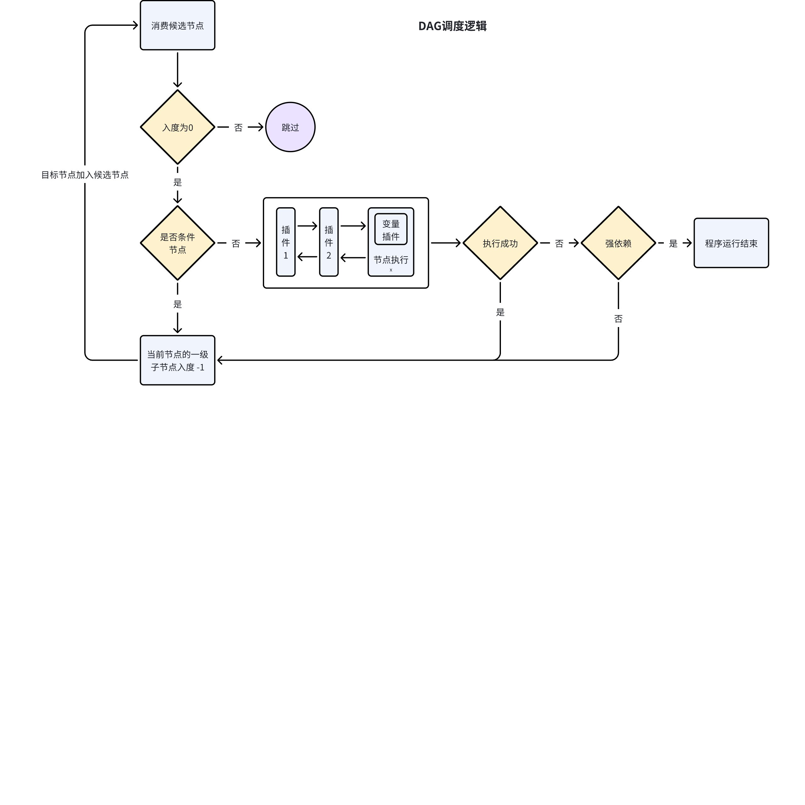

**核心思路**：拓扑排序，为每个节点初始化一个入度in-degree，如节点A依赖节点B， 则节点A的入度+1；检测节点环、并发调度均如上图所示

### 子图合并

```Go
func JoinChannel(ctx context.Context, req){  //观众上麦
   roomData, err := room_pack.GetRoom(lctx, lctx.RoomID())
   userInfo, err := user_pack.GetUser(lctx, lctx.UserID())
   //各类其他逻辑

   //执行通用方法
   common_module.CommonJoinChannel(ctx, &CommonJoinChannelParam{
      roomData: roomData,
   })
}
```

业务开发过程中，为了提高复用度，通常会将共用逻辑抽取为一个通用方法，假设完整流程为A， 通用方法为B， A = A' + B + ...， 常规实现，A' 和 B之间是串行执行的(如上图代码所示)。若用图执行，那么就会存在至少2以上的DAG流程了(A' 和 B分别对应一个执行图)，若要达到最优调度， 则必须解决子图合并的问题，即将A' 和 B 合并为一张新的图；

此时面临2个问题

1. 图需要支持独立运行，也需要支持和其他图合并执行，需要避免多个子图串行执行
2. 必须考虑多个图之间的动态依赖关系，例如B可以A'合并为一张新图，B也可以和C'合并为一张新图

**核心思路**

仍然是以变量依赖为思路(如上图第7行wait第2行) ，但这里第8行所代表的子图，只有部分节点才需要wait第2行变量。也就是子图合并的关键问题在于：一个图中部分节点依赖某个输入变量，这个输入变量由另外一个图的某个节点生成，这里引入一个概念 Input变量来解决图之间的数据依赖关系。

```Go
type f1NodeB struct {
  roomId flow.Reference[int64]
}

func (f *f1NodeB) Name() string {
    return "B"
}

func (f *f1NodeB) Exec(ctx flow.Ctx) error {
    roomId := f.roomId.Get(ctx)
    fmt.Printf("f1 B done.., inputRoomId:%d\n", roomId)
    return nil
}

func (f *f1NodeB) Declare(ctx flow.Declarer) {
    f.roomId = flow.DependInput[int64](ctx, "roomId")
}

func Init(ctx context.Context, req){
  f1 := pipe.NewFlow("F1").
     CodeBlock(&f1NodeA{}, &f1NodeB{}, &f1NodeC{}).
     Input("roomId", int64(100))  //可以手动指定输入

   //由程序分析变量依赖，自动构建拓扑最大化调度执行
   pipe.MustRun(ctx, f1)
}

func dagMerge(ctx context.Context, req){
  f1 := pipe.NewFlow("F1").
     CodeBlock(&f1NodeA{}, &f1NodeB{}, &f1NodeC{})

  f2 := pipe.NewFlow("F2").
     CodeBlock(&f2NodeH{}, &f2NodeB{}, &f2NodeI{})

  f := pipe.NewMultiFlow("F12").
    Flow(f1, f2).   //合并子图
    Autowired(func(ctx flow.Autowired) {
       //图f1中依赖的roomId输入 由图f2的node_f2NodeB节点提供数据
       ctx.DependInput(f1, "roomId").ProvideBy(f2, node_f2NodeB)
    })

    //由程序分析变量依赖，自动构建拓扑最大化调度执行
    pipe.MustRun(ctx, f)
}
```

## 自动鲁棒性分析

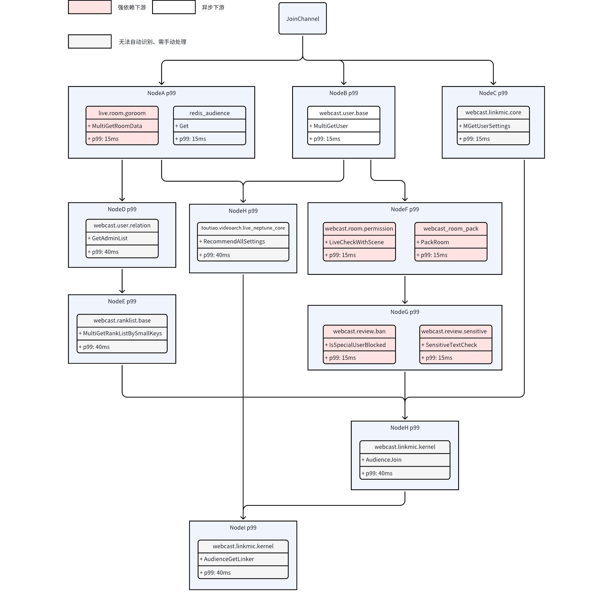

如上分析已经可以根据变量依赖自动推导程序执行拓扑图，服务的基础骨架已经完成，若可以知道节点中运行的实际逻辑，即可补全完整执行图。

核心思路：**节点执行支持Middleware**, **逻辑为每一个节点分配一个独立context**，在节点执行kitex、redis、evenbus调用时由对应组件middleware将执行数据绑定到 任务节点的context中，从而可以得到所有下游耗时、强弱依赖（当前执行失败， 但整体流程成功），异步下游(下游执行结束时间 > 节点完成时间)、流量放大路径。

### 框架实现

```Go
flowR := pipe.New("JoinChannel").
     Use(flowKitexMiddleware).  //添加自动分析插件
     Node(nodeA, nodeB, nodeC).
     MustRun(ctx)

func kitexClientMiddleware(next endpoint.Endpoint) endpoint.Endpoint {
    return func(ctx context.Context, req, resp interface{}) error {
       v := ctx.Value(autodag_node)
       if v == nil {
          return next(ctx, req, resp)
       }

       ns := v.(*NodeSpan)

       rpcInfo, _ := kitexutil.GetRPCInfo(ctx)

       start := time.Now()
       err := next(ctx, req, resp)

       kc := &kitexCall{
          startMs:    start.UnixMilli(),
          durationMs: time.Now().UnixMilli() - start.UnixMilli(),
          psm:        rpcInfo.To().ServiceName(),
          method:     rpcInfo.To().Method(),
          err:        err,
       }

       ns.lock.Lock()
       defer ns.lock.Unlock()

       ns.kitexCalls = append(ns.kitexCalls, kc)

       return err
    }
}
```

### 全景图&分支图

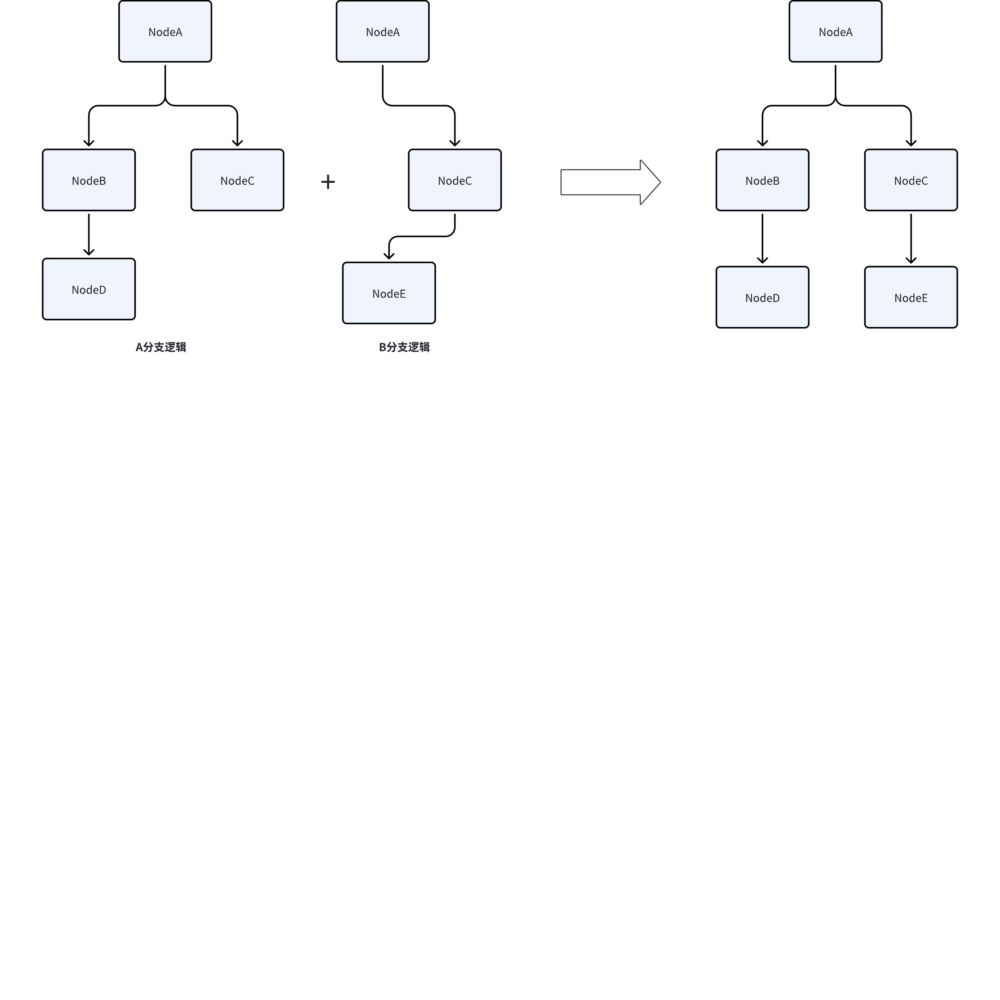

     业务开发中广泛存在if-else，单一请求几乎不可能走过接口的全部逻辑，对应到执行图上，可能一次请求走A/B/C/D节点，另外请求走A/C/E节点，即每次请求只能得到分支图，但我们在做架构分析时更希望得到的是全景图。 常规思路为基于多个请求数据，然后合并图，实现显然复杂([ByteTrace 拓扑图实现方式](https://bytedance.larkoffice.com/wiki/wikcnTQhUIVcLTFkX8m4rd9WoVc))，同时还需要保留最近N个数据用来合并，N基本无法确定且还需考虑高QPS接口问题

**核心思路**

节点提供Skip条件方法，只跳过执行动作，任一请求仍会执行全部节点，那么每一次执行均为全景图；插件只需统计每个节点内部的执行情况即可

### 自动最大耗时链路分析

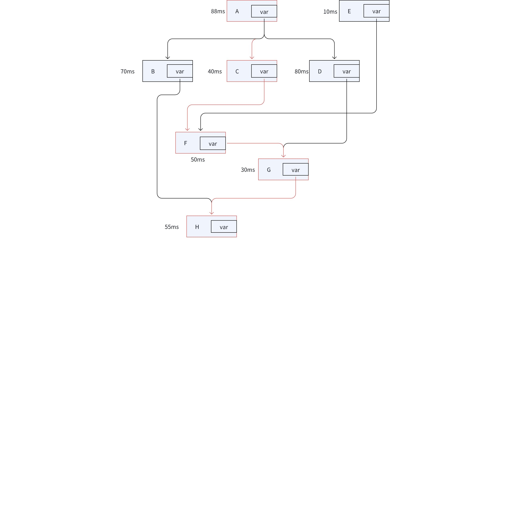

得益于框架的插件机制， 可以很容易得到接口总耗时以及各个节点的耗时，进而得到最大耗时链路。配合接口P99延迟，得到最大耗时链路节点，通过简单的统计计数即可知道 各个节点在最大耗时链路的时延分布、次数分布等情况，rd分别只需要治理对应节点即可。

## 技术能力一览

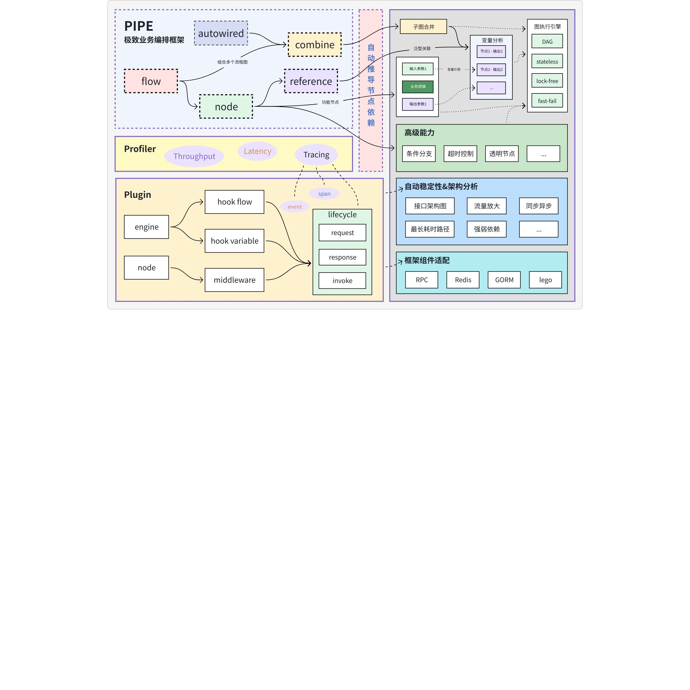

<table><colgroup><col/><col/><col/><col/><col/></colgroup><thead><tr><th>模块</th><th>功能</th><th>方案简述</th><th>备注</th><th>进度</th></tr></thead><tbody><tr><td rowspan="3">基础能力</td><td>最优并发</td><td>基于变量自动推导、见上文</td><td></td><td>100%</td></tr><tr><td>dag调度</td><td>节点拓扑、见上文</td><td></td><td>100%</td></tr><tr><td>子图合并</td><td>基于输入变量自动合并，见上文</td><td></td><td>100%</td></tr><tr><td rowspan="3">插件模式</td><td>流程插件</td><td>职责链</td><td> 灵活感知控制 流程开始、完成</td><td>100%</td></tr><tr><td>节点插件</td><td>职责链</td><td> 灵活感知控制 节点执行</td><td>100%</td></tr><tr><td>变量插件</td><td>代理模式</td><td> 灵活感知控制 变量生成、引用传递</td><td>100%</td></tr><tr><td rowspan="4">节点控制</td><td>条件分支</td><td>每一次执行均为全景图，见上文</td><td></td><td>100%</td></tr><tr><td>轻量级节点</td><td>支持业务控制是否开启协程执行节点<blockquote><p>部分节点逻辑仅为纯内存操作、如排序、过滤、合并组装等</p></blockquote></td><td>自动方案： 配合插件能力，如框架感知某节点2分钟内，所有执行耗时均小于1ms，则逐步放量1%~100% 以轻量模式执行节点，若某次请求耗时大于1ms，则该策略失效</td><td>100%</td></tr><tr><td>超时控制</td><td>控制节点整体超时</td><td></td><td>100%</td></tr><tr><td>重试</td><td>控制节点整体重试策略</td><td></td><td>10%</td></tr><tr><td rowspan="7">稳定性&amp;架构<blockquote><p>完全基于插件模式，可拔插设计，支持一键禁用，保持基础核心能力稳定；</p><p>业务完全无感，使用该方案，支持自动分析</p></blockquote></td><td>接口架构图</td><td>见上文，鲁棒性分析</td><td></td><td>单次请求图60%<br/>聚合请求图 20%</td></tr><tr><td>流量放大、不合理调用</td><td>自动识别，可精确定位放大路径</td><td></td><td>单次请求图60%<br/>聚合请求图60%</td></tr><tr><td>同步异步</td><td>异步节点&amp;RPC自动推导</td><td><ol><li seq="1">若某几个节点为等待节点，则其父节点和间接父节点均为同步节点，其余节点均为异步，异步节点中所有RPC均为异步</li><li>若某个节点为同步节点，该节点中RPC的结束时间 大于 节点完成时间，则此RPC为异步</li></ol></td><td>30%</td></tr><tr><td>强弱依赖</td><td>基于error自动推导</td><td><ol><li seq="1">若某个RPC返回error，当前error和整体流程失败error一致（此处比较指针），则该RPC为强依赖</li><li>关键路径下的弱依赖节点耗时 大于 接口整体耗时</li></ol></td><td>0%</td></tr><tr><td>最长耗时路径</td><td>自动推导dfs、见上文</td><td></td><td>单次请求图 70%<br/>聚合请求图 20%</td></tr><tr><td>缓存分析</td><td>接口中各节点维度内部缓存请求数，命中率，回源信息等</td><td></td><td>0%</td></tr><tr><td>框架组件适配</td><td>KiteX、Redis、DB、MQ、AnyCache</td><td></td><td>KiteX 100%<br/>Redis 100%</td></tr><tr><td rowspan="3">平台化<blockquote><p>长期</p></blockquote></td><td>Mock能力</td><td>基于流程插件、节点插件、变量插件机制，来mock流程执行；mock节点执行成功失败；mock变量值</td><td>业务无需提前预埋逻辑，框架默认提供能力</td><td>0%</td></tr><tr><td>业务降级</td><td>业务无需提前预埋逻辑，框架默认提供能力</td><td><blockquote><p>如：连麦强依赖roomExtra引发事故，<a href="https://bytedance.larkoffice.com/wiki/FwiqwthIki1KGSk0L76cftyln6f">[240329][notice]【补录】房间依赖的Bytedoc扩容，在数据搬迁过程中发生异常 复盘文档</a></p></blockquote></td><td>0%</td></tr><tr><td>精细化观测</td><td></td><td></td><td>0%</td></tr></tbody></table>

> 目前方案实现在和直播QinPack平台合作共建，底层使用QinPack执行引擎，支持：
>
> - 代码编排的最优并发的DAG执行能力
> - 基于远端配置的节点执行控制（超时、同步/异步、条件化执行...）
> - 共建依赖分析的可视化报告生成，链路瓶颈优化分析能力

# 接入成本分析

当前编排核心为基于变量自动推导业务依赖关系，和常规模式 一个区别是需要定义一个节点（成本可忽略），另一个最大的区别在于使用变量上，但如上文提到，业务开发，我们是一定且必须知道我们要使用哪个变量的，因此引入的变量方式并未带来过多成本，本质是换了一种变量写法。

```Go
//原始写法
func doNodeBFunc(ctx context.Context, roomData *model.RoomData) error{
   // 业务逻辑，执行rpc、db操作、发送im、ifelse
   return err
}

// 新的写法
const NODE_B = "node_b"
type NodeB struct {
  roomData flow.Reference[*model.RoomData]
}

func (n *NodeB) Run(ctx flow.Ctx) error{
   roomData := n.roomData.Get(ctx)
   // 业务逻辑，执行rpc、db操作、发送im、ifelse
   return err
}

func (n *NodeB) Declare(ctx flow.Declarer) {
   n.roomData = flow.DependVar(ctx, NODE_A, NODE_A_ROOM)
}
```

## 增量开发

<table><colgroup><col/><col/><col/></colgroup><tbody><tr><td>需求类型</td><td>开发步骤</td><td>开发成本</td></tr><tr><td>新增业务逻辑</td><td><ol><li seq="1">将新的业务逻辑定义为一个节点 -&gt;  成本低</li><li>引用其他节点变量   -&gt;  业务开发原本就需要知道自己使用哪个变量</li><li>编写业务逻辑  -&gt; 无新增成本</li></ol></td><td>低<blockquote><p>开发模式和原本模式主要区别在于变量使用方式不一样，新的方式使用为Reference[T]的泛型</p></blockquote></td></tr><tr><td>改动已有节点逻辑</td><td><ol><li seq="2">引用其他节点变量   -&gt;  业务开发本身就需要知道自己使用哪个变量</li><li>编写业务逻辑  -&gt; 无新增成本</li></ol></td><td>低<blockquote><p>开发模式和原本模式主要区别在于变量使用方式不一样，新的方式使用为Reference[T]的泛型</p></blockquote></td></tr></tbody></table>

## 存量改造

改造工作量及风险主要为将串行逻辑拆分成N个节点，节点之间的变量依赖可通过Reference[T]泛型做强类型约束，改造期间可配合框架自动分析接口架构图来辅助定位问题

<table><colgroup><col/><col/><col/><col/></colgroup><tbody><tr><td>存量类型</td><td>接入步骤</td><td>改造成本</td><td>风险</td></tr><tr><td rowspan="3" vertical-align="middle">常规业务代码</td><td><ol><li seq="1">将原业务串行代码的方法&amp;代码块拆分为Node节点</li></ol></td><td>中 （视拆分颗粒度决定）<blockquote><p>理论上 最优方式为 每一个跨节点调用拆分为单独节点；如Init接口有100个下游调用，则会拆分为100+节点</p></blockquote></td><td>中<blockquote><ol><li seq="1">主要风险在于拆分代码有遗漏</li><li>另：因为引用变量为强类型，改造过程ide可发现大部分问题</li></ol></blockquote></td></tr><tr><td><ol><li seq="2">转换Node节点中使用的变量为Reference[T]泛型写法</li></ol></td><td>低<blockquote><p>构建变量引用为强类型约束，编译期IDE即可发现错误</p></blockquote></td><td>低<blockquote><p>转换变量写法过程中，变量可能为nil，改造过程可能引入panic；不过核心接口自动化测试 + qa 基本可覆盖</p></blockquote></td></tr><tr><td><ol><li seq="3">定义流程，将节点加入流程</li></ol></td><td>低</td><td>非常低<blockquote><p>节点遗漏添加，构建图时一定可以发现</p></blockquote></td></tr><tr><td rowspan="2" vertical-align="middle">Dsync等dag模式</td><td><ol><li seq="1">将节点使用的全局变量改为Reference[T]泛型写法</li></ol><blockquote><p>删除手动构建的依赖关系代码，删除全局变量定义；</p></blockquote></td><td>较低<blockquote><p>节点已经拆分过，最多的工作量基本完成； </p><p>剩余将全局变量，改为变量引用的同时就已经组织好了依赖关系</p></blockquote></td><td>低</td></tr><tr><td><ol><li seq="2">定义流程，将节点加入流程</li></ol></td><td>非常低</td><td>非常低</td></tr></tbody></table>

## 改造Case样例

多人申请连麦接口(一级下游41个PSM、81个接口)，改造前（左） VS 改造后 （右）

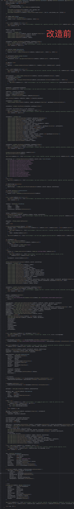

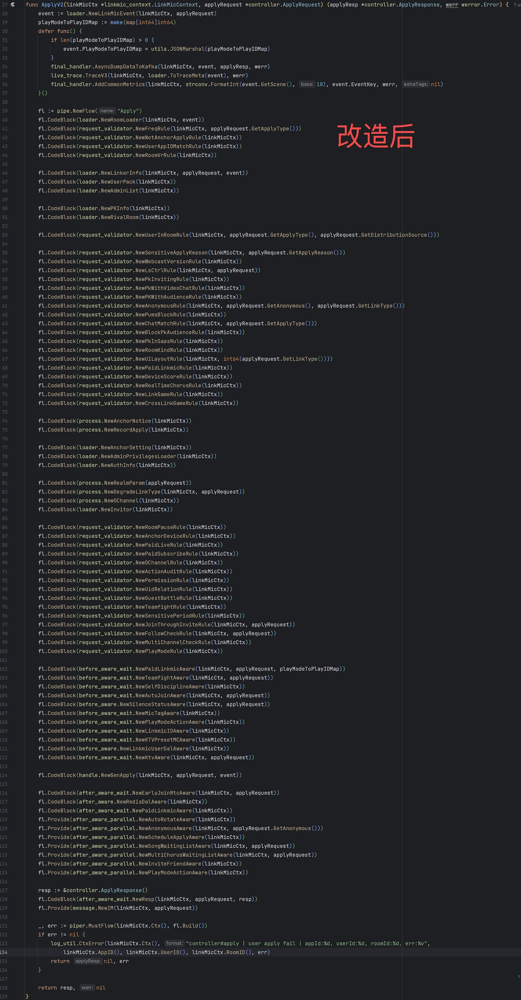
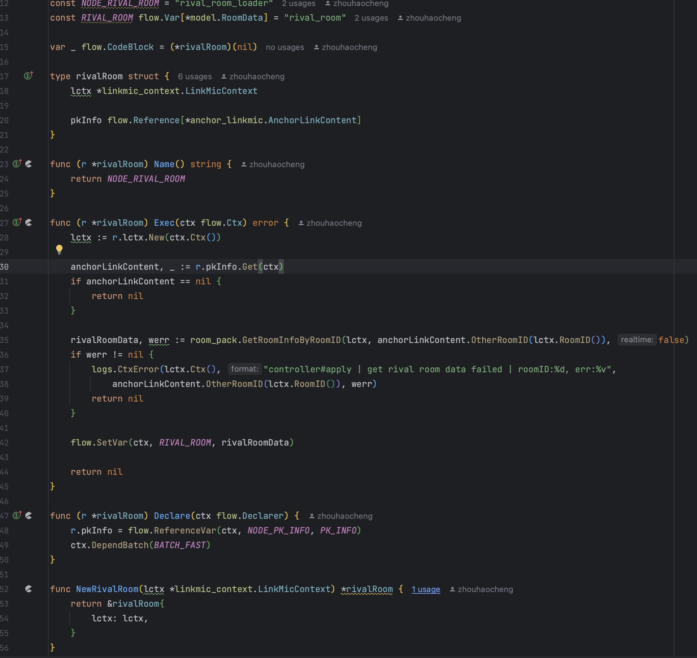

### **接口耗时优化**

自动化case适配各种申请上麦路径，对比线上，接口耗时优化43%

> 注：因为改造节点颗粒度问题，并发度非最优， 不过根据自动生成的架构图分析，后续优化空间不大

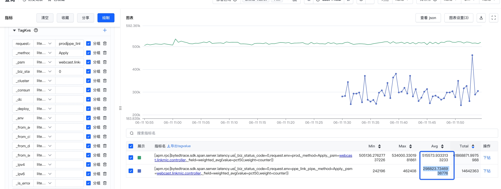

### 接口架构图分析

> 自动生成接口架构图链接case：[申请连麦Apply](https://tosv.byted.org/obj/webcast/webcast_linkmic_apply.html)(改造case，可直接查看)，下图以邀请列表[InviteList架构图](https://mermaid.live/edit#pako:eNq9WVtv4jgU_iuRq77RLIGBoWi2UrvdGXWHSlXZmYedVMgkBiwSBzmmHbbiv6_tGGOH3JqOVn2oz7F9fPydq8MrCJIQgTHwyfn5KyaYjZ1XxweLKHkJVpAyH2SMFYujCZyjKBUcRreo44MQLeA2Yo-IhIgiymc4Dy4punihcLMRnP3e2Z-f-2TJGStn8uiTO_KMGZrglM0mmKxjHNyRRfJXMv_hA5vhk9sthQwn5D4dO94gTn3y4_Hhj6cXNA9gytwoWz6LuDA3SCg6-4KYkPy954zKVrtrRAmKzq63IUYkQHIL4UzH6_M94MknKdtFyClV1GHoJ7uAEV6ScYQWzLrTY5LEN5CxCGVXsmj7Rl2p4i3acPy-Q_o0duxzXKhUnGHOKNbMEl-pmC374uKqTIq16zOOGKLZVfS47hqfEQtWcqW7EMNvOMwveYA4nOBncZ674WNuw2dUsGa6nacBxXO5MD0QuYW3FKWpWLDCYYjIbHt6XiWylUtfIGaYLGfbFNGTW3yV-q9zbAtOdy5HxebTkDb3Kdtyhk0M7he8YJnN1Mi2WM8bndhMnHELGRQaH8btMdRquQs5UqH4Kd1A4kgUfvd56okSOqYo9MGVML9L-bnuMhH_zu55YsE8Ng-6OB_i9NNvYv9VLq4pJGuZAeYwRcd9nCuwuNlNYxhFX9Eu5fcujXCFU6UZ9KVsE2iIDd40ocoAalQbMqeAmdN3hPNQKiS5WI2L3PzPIIkPYYX4ODd9HfG8LhQU8894UxCYDWJX-MEjl05DsUqk1RmVZH7hNx4yDzBYi2UifIo85QFSGKdZGhCjAhFTBtk21UJSSebWKSO4qSgDBa4t5Ih54VsylPPI3Pyt4BUr4LzYS5QxK71EaWL7iPYCg2egw_3EoGxf-fBmZykJZTNmBAIc8GCdxYs4GIVCBac_KgsRQ8M2YWJdMMfXFlZAaLoubJp4WA1anynPYqF0r0U2bJ_26sKvkZNZAFQibdz-FGsDw7KZeh-VBY4bRf6vM8Z7S0ghGvLk1o2N0jvPaVJDjduoNk5RNgxD3We-p7gNj8WttM1Tx1dioT2Mq6zHrexWqIYWWduuKHk20IZGBtcIGq61QdXqLUIs5uQh-tO6eHuzv55Up0JYDJ2bWceGxbpyzrF1nVWvI03XgXOSikofNlpkpe6GPFv7nFZlM_W55th5iLeGJuouWtNA1DpJTc6uLQ-FPVVxs6_v1A5pExODfXj9cNQOw1YPtEKdDxKrK74WZyt8VKeA2SQHG69EUYSO1C8oRc0xMM5tBYOldzG_aUFSbawqSIp6cypoC4RxZisgLJ2L-Q1aktxXAeUYJut_9w7z8NYuYt-gYrKJsxzTlkimmsg9LfpvzaYFFfXkWUFRJE8QH-Oyk4VGRd_vZEsk9pxN0BIGu3u-Q_jBHRFWcTxP74AvKEYuzlbPYMC4O8umUbdS15InmsDspOIMrIFoU6dNGAvZjdJ1NlQl_UjkvtCcpuxWdahNN3PUqdqVS65tXslyYnW2jFc1zrlj00CtdLnrMMZEelzpxx59frs21lDfurf-RCMNq6k3NzAlVtECK7XW0vJWMfQp5tenXrOXEiXIIN_bpTV-gpiHtgHCVrpkoll_XnJCSZood6eTN6oZyuIhZ5C_8C1nSG35nLP0KplolBPLN5jZRHxpnMpr9Dr9Tq_b6XmdHh8MOv0uf3fTZI3Eg7ujn96gA2JEY14-wRi8-sRxfMBWvJKI37D0z1c-8MmeL4Vblkx3JABj-fMW2G5CyNAthktu5gMThZgl9D770Uz-dtYB_Nn-D8fosISTYPwKfoLxwHMvu163fznwPg57fW_UATsw7vW67nDkDYe9y1535I0-DvYd8K8U0OXr-Z_XHQz6l_2ed7n_D4AuULE)举例
>
> 注：架构图自动分析更多能力还在开发中

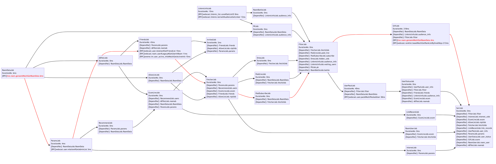

如上图，我们分析即可得：

- 每个节点中包含当前执行耗时，节点中存在的rpc、redis、cache等， 若要治理重复rpc，则直接根据当前图来改造对应节点即可
- 红色指向线为接口最长耗时路径，做耗时优化即优化当前路径上的耗时各个接口（如是否有重复rpc，逻辑是否冗余，是否可异步，是否可合并节点等）
- 如强弱依赖，同步异步、缓存分析节点等等，直接基于当前图分析完成即可（开发中）
- 其他各类分析，节点成功率p90/p99，节点耗时分布，节点内各下游执行分析.......
- 如申请连麦Apply接口，其包含77个节点、几百条边，考虑同步异步并发关系等，由人工去维护依赖&全量变量方式基本不可能，当前方案则为由程序自动推导关系

## 方案引入的问题及适用场景

### 引入问题

- **可读性的部分损失**

  - 读接口：本身需要执行并行，这块其实变化不大。
  - 写接口：写接口整体可以基于AOP思路做业务功能拆分，如数据加载loader、校验逻辑validator、前置逻辑before_aware、真实动作action、后置逻辑after_aware， 当前编排逻辑并没有打破这个规则，业务开发也是往里面填充节点。
- **少量学习成本**：引入节点、变量传递的概念，会增加一点学习成本；

不过仍需承认，上图改造示例，代码执行主干逻辑无法直接阅读得出，因为rd开发的是各业务逻辑节点，其执行流程完全交给框架调度，这个如上述写接口所述，配合代码组织分层可解决。另外**阅读代码可结合接口架构全景图来看，当前方式支持自动生成接口架构图**，rd可以直接实时生成，若要了解整体执行逻辑，可以更细致分析

当然此方式也会带来一个优点，代码逻辑拆分为业务节点，代码天然更有模块化

### 适用场景

适用于**依赖链路复杂、追求极致性能**的场景，同时可以很好的支持稳定性分析。对于依赖下游RPC较简单的场景也可以不使用该方案，比如依赖下游RPC少于xx个。

# 讨论记录

## 2024.5.17  苏文钦 敖路 陈琪 吴健辉 周浩成 张仁涛

1. 业务编排能力建设，需要往标准化方向走，后续会直播内推动。敖路
2. 多人业务需要建设 dag 编排（自动构建、子图合并、节点控制）和稳定性自动分析（接口架构全景图｜流量放大识别｜同步异步识别｜强弱依赖识别｜最长耗时路径分析｜缓存分析｜节点业务降级）能力。

   1. 其中 dag 编排，qin的编排能力比较完善<a href="https://bytedance.larkoffice.com/docx/N3Swd0eNjoDcFCxgK2rcqUy6nnt">Qin平台介绍</a>，多人和 qin 共建，以 qin 为主，结合多人的方案，qin 迭代一些能力以支持多人业务，确保业务更优雅的的接入。周浩成  吴健辉
   2. 稳定性自动分析能力具备通用价值，也需要形成标准化能力，便于能力后续的推广。多人和 qin 共建，以多人为主，人力上如果有缺口，可以qin这边帮助支持。周浩成  吴健辉
3. 预计 6 月上旬，完成复议会评审。

## 2024.5.16  敖路 薛国林 周浩成 张仁涛

1. 当前直播在服务内部做架构&稳定性分析较少，当前方案稳定性&架构相关有通用性， 可考虑抽取为公共基础能力
2. 当前QinPack也在做编排相关方案，可考虑共建； 待后续会议讨论

## 2024.5.14 方明 陈琪 吴健辉 周浩成

1. 多人对业务编排的诉求

   1. 多人核心建联路径多，依赖复杂 -> 程序能自动构建依赖关系，完成最优编排。
   2. 从逻辑复用上考虑，功能模块对应的通用流程 必须可以各类与其他流程自由组合 -> 即子图合并。
   3. 多人业务迭代频率高，对稳定性影响更大 -> 方案可支持服务稳定性&架构隐患自动分析
   4. 接入成本、代码侵入性 --> 越低越好
2. 针对多人诉求，当前QinPack方案无法直接支持，需要评估是否可以开发改造
3. 具体QinPack的设计思路&能力现状规划 及是否和多人共建匹配， 后续由吴健辉  约一个会议讨论
