# 从多人游戏到云 Agent：有状态服务的统一架构设计实践

> 离线范文快照：来源正文 revision 4065，抓取于 2026-09-08。保留原文文字、表格和代码，图片引用改为本地文件。
> 已保存 10 张原始图片、12 张正文画板预览及 1 张同步引用画板；15 个视频仅保留名称、原文链接和来源信息，未下载视频二进制。
> 另一个 RTC 同步引用无权限读取，正文对应位置明确标记未离线。范文包含未核验的历史技术判断和数据；适用边界见 [导读](notes.md)，来源与校验值见 [source.json](source.json)。

# 业务场景

近两年 在直播互动业务遇到 3 类典型业务场景，三条业务线技术栈完全不同（Go / C++ / C# / TypeScript / Rust），但遇到同一个问题，都要求server 必须为每一个用户 / 直播间 / 游戏房间维护一份长时间存活、绑定进程的状态，而这种形态在无状态微服务下几乎无法支持。

## 云 Agent（Codex / OpenCode 服务化 ）

开源 SOTA Agent（如 Codex、ClaudeCode）原生设计聚焦单机本地运行，要云端服务化 则要求 为每个用户 session 拉起一个独立运行环境，跑 shell、读写文件、调用工具，会话结束再回收。一次对话通常持续数十分钟到数小时，中间若发生 server 重启或迁移，运行中的 shell 进程、打开的文件句柄、动态安装的依赖会一起丢失。

## 直播实时音视频互动（AI 嘉宾 / 万人合唱 / AI 分身）

> 详见 [多人 RTC 业务架构方案和规划](https://bytedance.larkoffice.com/docx/FYxWd9Xq5op8VMxn1TncWGrJnKg)

<table><colgroup><col/><col/><col/><col/></colgroup><tbody><tr><td>AI嘉宾<em>(主播模式 - 多人)</em></td><td>直播 - 演唱会</td><td>万人合唱</td><td>PK伴播<em>(主播模式 - PK)</em></td></tr><tr><td><div><div><figure view-type="Preview"><a href="https://bytedance.larkoffice.com/docx/WKg2dQEJDoUf43xZOl5c0QVsndh#W8tgdcJ01oQrfixFQvNc4gDznDg">视频：山城小艾和杠上花.mp4（未离线，见原文）</a></figure></div><div><figure view-type="Preview"><a href="https://bytedance.larkoffice.com/docx/WKg2dQEJDoUf43xZOl5c0QVsndh#JCoYdtwDvoCZ22xFTxqc5TyNnyf">视频：克莱因-文乐2.mp4（未离线，见原文）</a></figure></div></div></td><td><figure view-type="Preview"><a href="https://bytedance.larkoffice.com/docx/WKg2dQEJDoUf43xZOl5c0QVsndh#FSXxdDwKXoqg98xpYqAc2Ekmn1f">视频：244633131.mp4（未离线，见原文）</a></figure></td><td vertical-align="middle"><figure view-type="Preview"><a href="https://bytedance.larkoffice.com/docx/WKg2dQEJDoUf43xZOl5c0QVsndh#FpqDdaUt2oWetSxOjwrcjRf0njg">视频：想你时风起 片段.mp4（未离线，见原文）</a></figure></td><td><div><div><figure view-type="Preview"><a href="https://bytedance.larkoffice.com/docx/WKg2dQEJDoUf43xZOl5c0QVsndh#HPIKdDQ4ooMFhbxTMZwcnNhCnjc">视频：pk过程聊天拱火.mp4（未离线，见原文）</a></figure></div><div><figure view-type="Preview"><a href="https://bytedance.larkoffice.com/docx/WKg2dQEJDoUf43xZOl5c0QVsndh#EjyNdVHVZojnhkxzjjUc4H4gnJb">视频：ai抛问题给对方主播.mp4（未离线，见原文）</a></figure></div></div></td></tr></tbody></table>

抖音 AI 嘉宾、抖音直播万人合唱、AI 分身这类玩法，server 端要从 RTC 房间拉流、经过业务化逻辑、做音视频加工（人声分离、ASR、Agent、TTS）、再把结果推回 RTC 房间，端到端延迟必须压到秒级以内。一场直播平均 20 分钟，音视频编解码 + 算法处理稳态占用 0.3\~2 Core CPU，且必须独占。任务生命周期与直播间绑定， TCE 迁移和发布会重启进程，实时音视频流断掉，用户体感"AI 突然不说话了"、"合唱掉拍了"

## 多人网络游戏（游戏Unity DS /  游戏房间GameServer）

> 详见 [Hamlet 有状态服务架构简化方案](https://bytedance.larkoffice.com/docx/XEmHdK7hXocW8JxuUikctUTZn7e)

<table><colgroup><col/><col/><col/><col/><col/><col/><col/><col/><col/><col/></colgroup><thead><tr><th colspan="3"><b>基础体验</b></th><th colspan="4"><b>社交互动</b></th><th colspan="3">UGC/PGC世界</th></tr></thead><tbody><tr><td>地图探索</td><td>音乐&amp;观影</td><td>场景物交互</td><td>多人牵手</td><td>道具整蛊</td><td>双人动作</td><td>打字or语音聊天</td><td><b>斗罗大陆</b></td><td><b>逆水寒新春</b></td><td><b>守望先锋</b></td></tr><tr><td>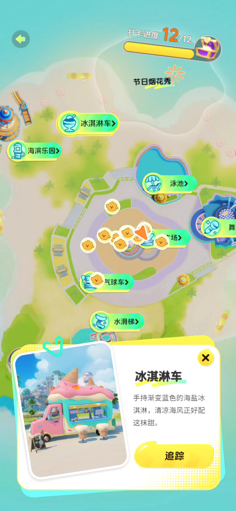</td><td><figure view-type="Preview"><a href="https://bytedance.larkoffice.com/docx/WKg2dQEJDoUf43xZOl5c0QVsndh#N6c5dZrDSog3lbxaNF9cJhACn2b">视频：3d6990131bd23e1bbfbb94eb9c743cf0.mp4（未离线，见原文）</a></figure></td><td><div><div>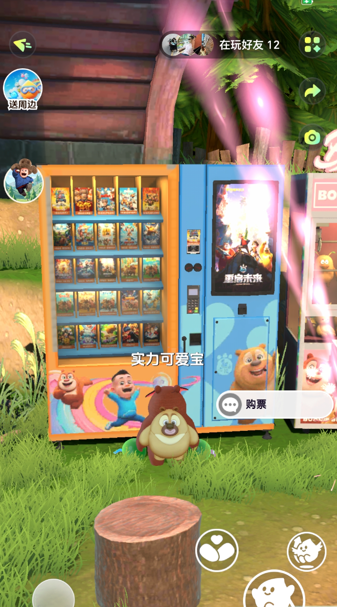</div><div></div></div></td><td><figure view-type="Preview"><a href="https://bytedance.larkoffice.com/docx/WKg2dQEJDoUf43xZOl5c0QVsndh#SskFd1itwo1DtQx8KLUcaauGnpc">视频：826135100.mp4（未离线，见原文）</a></figure></td><td><figure view-type="Preview"><a href="https://bytedance.larkoffice.com/docx/WKg2dQEJDoUf43xZOl5c0QVsndh#AEq6dCKSAoCnkOxGwSYc5KZHn3b">视频：fb875ab893fdfa1c69ee619dca68f4ac.mp4（未离线，见原文）</a></figure></td><td><figure view-type="Preview"><a href="https://bytedance.larkoffice.com/docx/WKg2dQEJDoUf43xZOl5c0QVsndh#HaUbdM673oreufxAj7qc2fadngg">视频：c0ad3b9caed50625faa86c02900dd92e.mp4（未离线，见原文）</a></figure></td><td></td><td><figure view-type="Preview"><a href="https://bytedance.larkoffice.com/docx/WKg2dQEJDoUf43xZOl5c0QVsndh#XRVVdN57noYY1mxIC4oc47sEnIh">视频：214b63aa1e2e725112e60f7a7341b743.MP4（未离线，见原文）</a></figure><figure view-type="Preview"><a href="https://bytedance.larkoffice.com/docx/WKg2dQEJDoUf43xZOl5c0QVsndh#DhSsd09y3oHRS7xY1dxc2vRQnSh">视频：5b6021b0ebad229b0f8de650dadb822e.MP4（未离线，见原文）</a></figure></td><td><figure view-type="Preview"><a href="https://bytedance.larkoffice.com/docx/WKg2dQEJDoUf43xZOl5c0QVsndh#DKqedfi1qo32plx3YOZc44nFnwd">视频：be7d44843fa2e1cd8d5340e4ced57fa2.MP4（未离线，见原文）</a></figure><figure view-type="Preview"><a href="https://bytedance.larkoffice.com/docx/WKg2dQEJDoUf43xZOl5c0QVsndh#Y1fudpQoqoPJNqxuX1acVYdhnBb">视频：c068d9c8a7098dd40fc4f66b3b67fd98.MP4（未离线，见原文）</a></figure></td><td><figure view-type="Preview"><a href="https://bytedance.larkoffice.com/docx/WKg2dQEJDoUf43xZOl5c0QVsndh#Ngr9drKfFoHk1Bx9E7IcPExGnrf">视频：5a007f8c8365c3f0729cfc95fb853b0d.MP4（未离线，见原文）</a></figure></td></tr></tbody></table>

多人在同一个游戏房间内实时互动（开放世界、射击、竞技），server 侧维护整个房内所有玩家、物体和 NPC 的实时状态——玩家位置、血量、道具、物理模拟，按每秒13 帧的固定 tick 广播给所有玩家，每帧网络发包带宽44.8 KB， 这要求 每帧业务逻辑耗时必须 < 77ms，每个游戏房间每秒 137 Mbps 稳定带宽，中间任何业务有问题，就是体感就是"卡"、"漂移"、"打不中"。

# 为什么无状态 +  DB/Cache中心化存储 不够

不考虑业务差异，如果坚持用 TCE 无状态服务 + Redis /DB 存 session 的经典设计，

**只把会话元数据放 KV，恢复不了真实运行态。** 云 Agent 的 shell 进程、打开的文件句柄、后台 tail 出来的日志流、Agent 沙箱里 clone 出来的 repo、编辑到一半的文件，这些都活在进程和 container 的本地状态里，不是"存到 KV 里再读回来"能重建的。RTC 房间的推拉流会话、编解码上下文、SDK 内部状态同理；游戏对局的物理引擎状态、玩家位置、AOI 分块更是每帧都在演化。

**强行外置会把复杂度和延迟一起放大。** 把这些状态改造成"随请求从存储拉一次"意味着两件事：一是每次交互都要付出一次网络往返，秒级或毫秒级 SLA 会被直接吃掉；二是引入新的一致性问题——两个副本同时把状态写回、副本切换时的读写冲突、缓存与真源的偏移。在音视频互动 和 多人游戏对局、 AI Agent场景，这些副作用远比"就让状态待在进程里"更贵。

**一致性 Hash 不能解决根本问题，** 常见兜底方案是"按 room_id 一致性 Hash 到具体机器"。这在实例集合稳定时能工作，但扩缩容、发布、故障恢复都会改变 Hash 环——新进来的请求路由到一台不承载该房间状态的机器，等同于状态丢失。有状态服务需要的路由是**权威路由**，而不是概率路由。

# 这类业务的的技术特点

三个场景形态差异大，但底层技术诉求高度重合，可抽象为三个核心特点：**有状态**、**实时互动**、**长耗时任务**。

- **有状态**

  1. 调度粒度是"实例"，"pod"，也不是"请求"，  一个实例承载一份不可迁移的运行态，路由必须精准命中承载实例。
  2. 资源精细化 + 独占， 不同实例的 CPU / Mem / 网络 / 磁盘差异极大，必须按实例配额。
-  **实时互动**

  1. 用户实时性， 请求路由 + 状态访问 + 业务处理，全链路延迟必须压到几十毫秒。
  2. 无损发布 + 灵活扩缩容， 发布不能重启运行中的任务，扩缩容不能影响正在进行的会话
-  **长耗时任务**

  1. 动态分配资源， 实例按需 init → 分配资源 → 执行 → 回收，需要横向弹性。
  2. 容灾， 秒级检测故障节点、自动重新调度，任务不丢，每个任务有进度，重调度要能续跑。
  3. 多版本共存 + PPE， 灰度、泳道要能落到"每个新实例走哪个版本"，而不是"整个集群统一切换"。

> **一句话定义：** 有状态服务 = 状态强绑定实例 + 长生命周期 + 实时交互 + 无损变更。四条约束叠加，就必须重新设计调度、路由、发布与容灾。

# 调研

调研分两步走：**先看云 Agent、实时音视频、多人游戏是不是同一类问题（下面场景对齐表），再看公司内外都有哪些解法、为什么最后收敛到 lambda**。

下表把三类业务的状态载体、生命周期、实时性、发布诉求横向对比。

| 业务 | 状态载体 | 状态生命周期 | 实时性 | 变更/发布诉求 | 典型业务 |
|-|-|-|-|-|-|
| 云 Agent 服务化 | 沙箱容器 + 工具进程 + 会话事件日志（内存/本地磁盘） | 分钟 \~ 小时级，长任务可续跑 | SSE 流式，秒级响应 | 长任务跨发布窗口，发布打断体验差，需多版本共存 | Claude Managed Agents、抖音 BMA |
| 实时音视频互动 | RTC SDK 推流实例 + 业务逻辑（内存 + 音视频链路） | 一次会话（几分钟 \~ 几小时） | 百毫秒 RTC 低延迟 | 老流不能断，发布需多版本 + 秒级异常迁移 | 直播万人合唱、AI 嘉宾、豆包 1v1 |
| 多人网络游戏 | 游戏主循环 + 房间状态（内存，强绑定实例） | 一局游戏时长（几分钟 \~ 几小时） | 帧同步/状态同步，10\~50ms 级 | 房间内不能重启，需多版本 + 房间粒度隔离 | Hamlet DS / GameServer、Roblox |

状态跑在实例内存 / RTC SDK / 子进程里跨实例迁移代价高、单次会话跨越多次发布窗口、老任务不能因为发布而中断，三类业务是**同一类问题**——有状态 + 实时 + 长任务  + 频繁发布。

## 典型业务调研

我们选取了公司内包括业界的具体实现：云 Agent（Claude Managed Agents / 字节 AIME / 抖音 BMA）、音视频（Data lambda / 万人合唱 / 火山 RTC / 豆包）、多人游戏（Roblox / Hamlet），以及作为对照参考的存储型（WDS/USS）和 TCE StatefulSet。

<table><colgroup><col/><col/><col/><col/><col/><col/><col/><col/><col/><col/><col/><col/></colgroup><thead><tr><th></th><th colspan="3">云Agent</th><th colspan="4">音视频</th><th colspan="2">多人网络游戏</th><th>有状态存储</th><th>TCE 有状态集群</th></tr></thead><tbody><tr><td>场景</td><td>Claude Managed Agents</td><td>字节 - AIME</td><td>抖音架构-BMA</td><td>Data - 视频架构  lambda</td><td>直播-万人合唱 / AI嘉宾</td><td>火山引擎 - RTC</td><td>豆包 - 语音视频通话 </td><td>Roblox</td><td>Hamlet - 游戏房间服务 &amp; DS 服务</td><td>抖音 -直播 基础架构 - WDS/USS存储</td><td>K8s原生StatefulSet</td></tr><tr><td>架构图</td><td>https://www.anthropic.com/engineering/managed-agents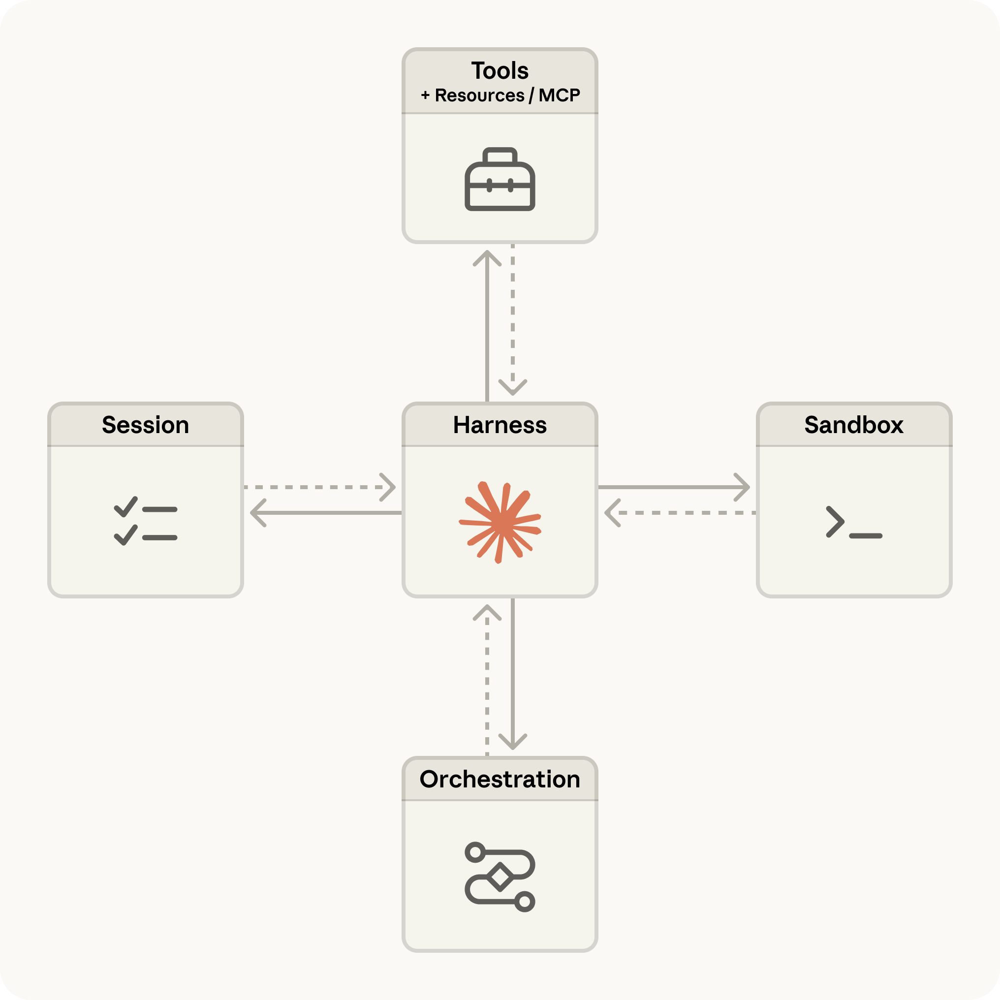</td><td><a href="https://bytedance.larkoffice.com/wiki/Qm2nwFnSHigdu7kQl2ictHURnxf">AIME Assistant：从个人到组织级 Agent 系统</a>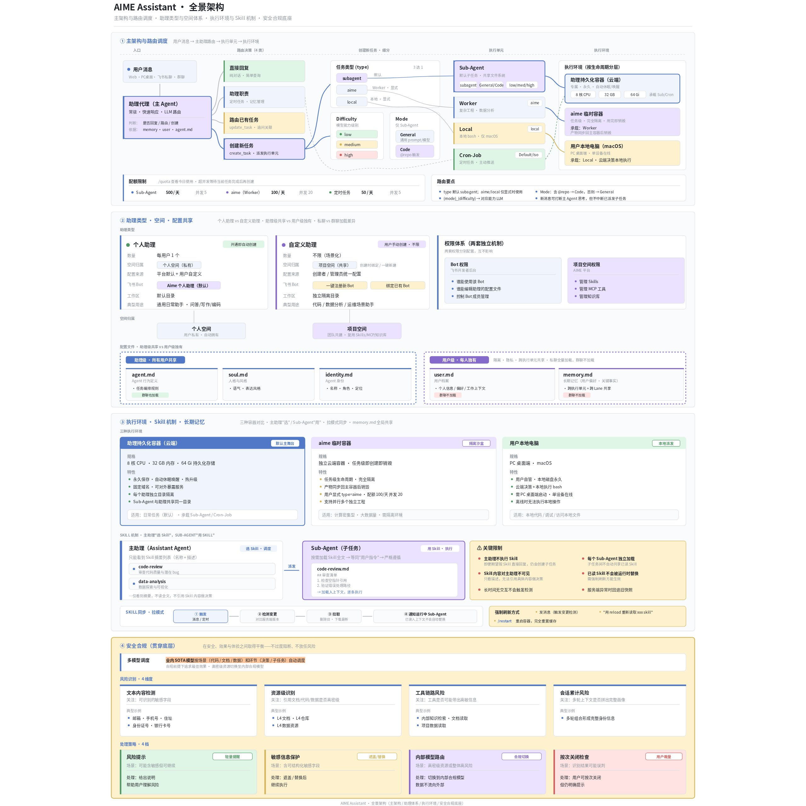</td><td><a href="https://bytedance.larkoffice.com/docx/IFvNdNz3koYGKRxHapzcnB0HnCc">Agents Platform详细设计</a>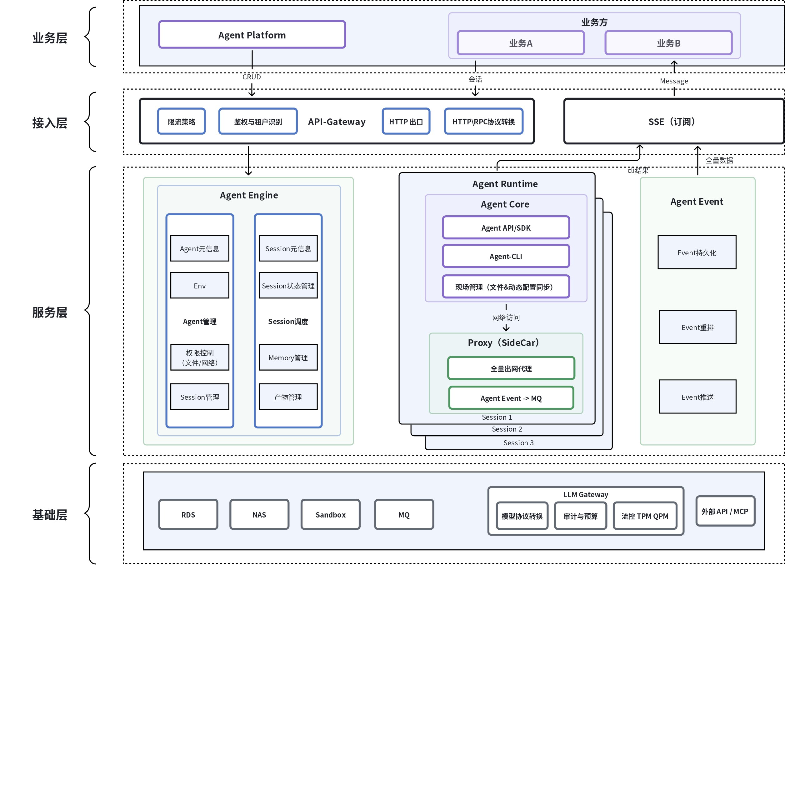</td><td><a href="https://bytedance.larkoffice.com/docx/K6m1d9Mvnocx4Ux4o4fccK2jnKh">调度框架功能特性和使用情况</a> <br/>CPU型 - 去中心化调度<blockquote><p>简化版gossip 来解决单点问题，各节点通过 gossip 解决最终一致问题。类似的业界解法有 zab raft paxos</p></blockquote></td><td><a href="https://bytedance.larkoffice.com/docx/FYxWd9Xq5op8VMxn1TncWGrJnKg">多人RTC业务架构方案和规划</a><a href="https://bytedance.larkoffice.com/docx/FYxWd9Xq5op8VMxn1TncWGrJnKg#W0KudVUhysjPBgbDRpoclRHonkd">同步引用：多人 RTC 架构（未离线：源文档无查看权限，错误 3380004）</a></td><td><a href="https://bytedance.larkoffice.com/wiki/SVHUwFmzGianhckaWxncAUfgn5g">RTC 后处理架构介绍</a>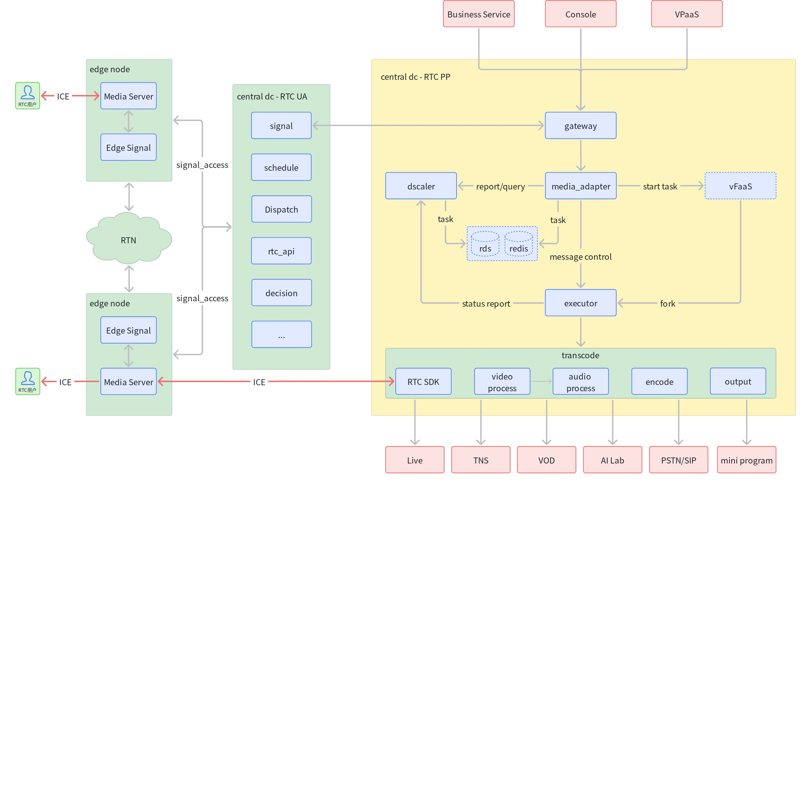</td><td><a href="https://bytedance.larkoffice.com/wiki/UShXw5JtEiNfEPkcYrccITQ0nsb">豆包音视频理想架构分享</a>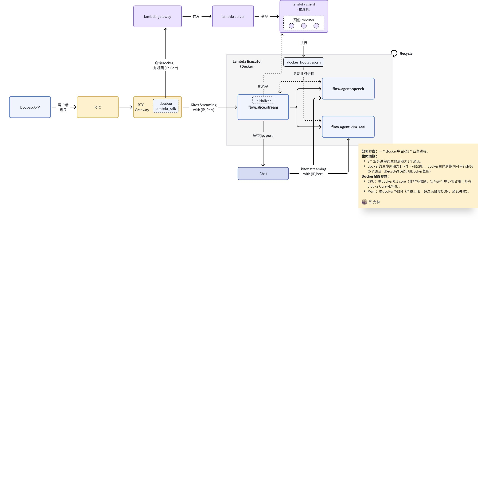<br/>老架构为<a href="https://bytedance.larkoffice.com/wiki/BpRvwgnLHisF9KkUnGNcVTlLnxg">websocket的tce有状态服务</a>，25年Q1升级为RTC Gateway + lambda方案  解决链路稳定性&amp;服务稳定性问题。</td><td>https://portworx.com/blog/architects-corner-roblox-runs-platform-70-million-gamers-hashicorp-nomad<br/>https://about.roblox.com/newsroom/2023/12/making-robloxs-infrastructure-efficient-resilient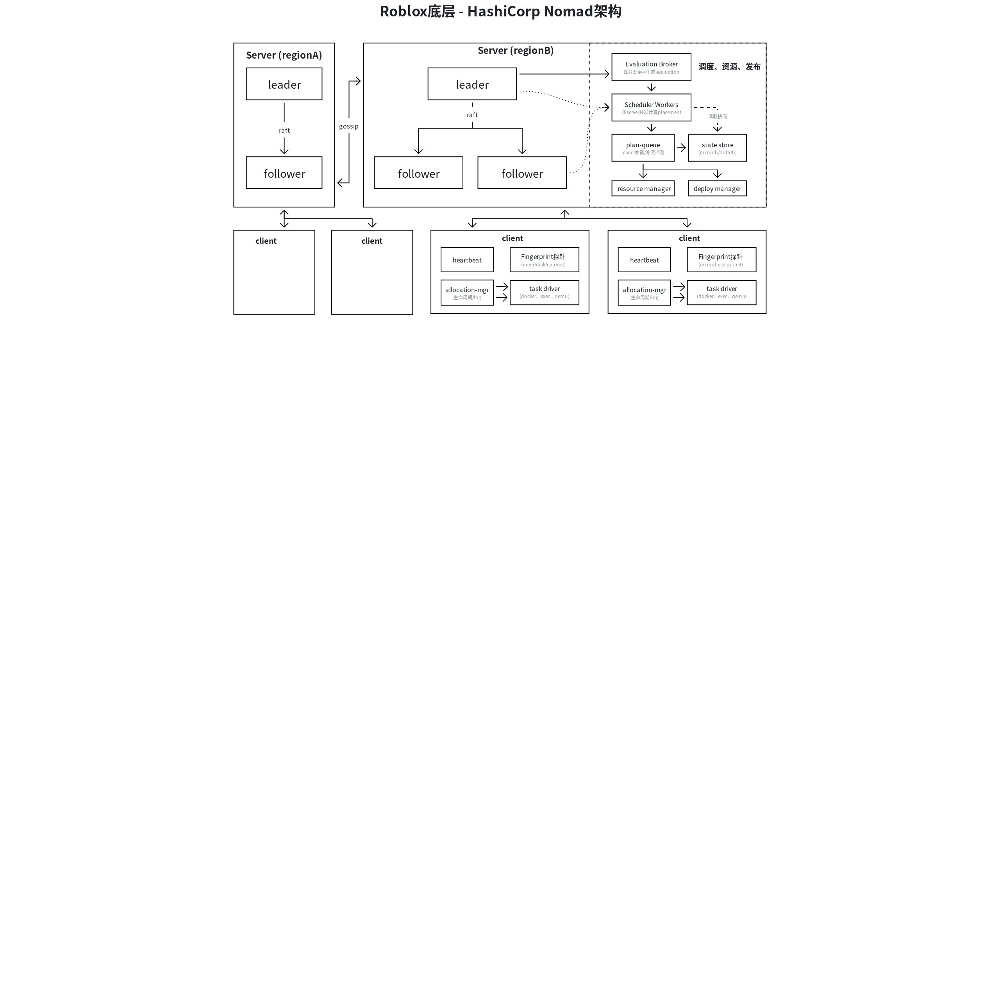</td><td><a href="https://bytedance.larkoffice.com/docx/XEmHdK7hXocW8JxuUikctUTZn7e">Hamlet 有状态服务架构简化方案</a><a href="https://bytedance.larkoffice.com/docx/XEmHdK7hXocW8JxuUikctUTZn7e#Gn5wdyHYssMfZKbskIccrPHwnWc">同步引用：Hamlet 架构（源文档 revision 7962）</a>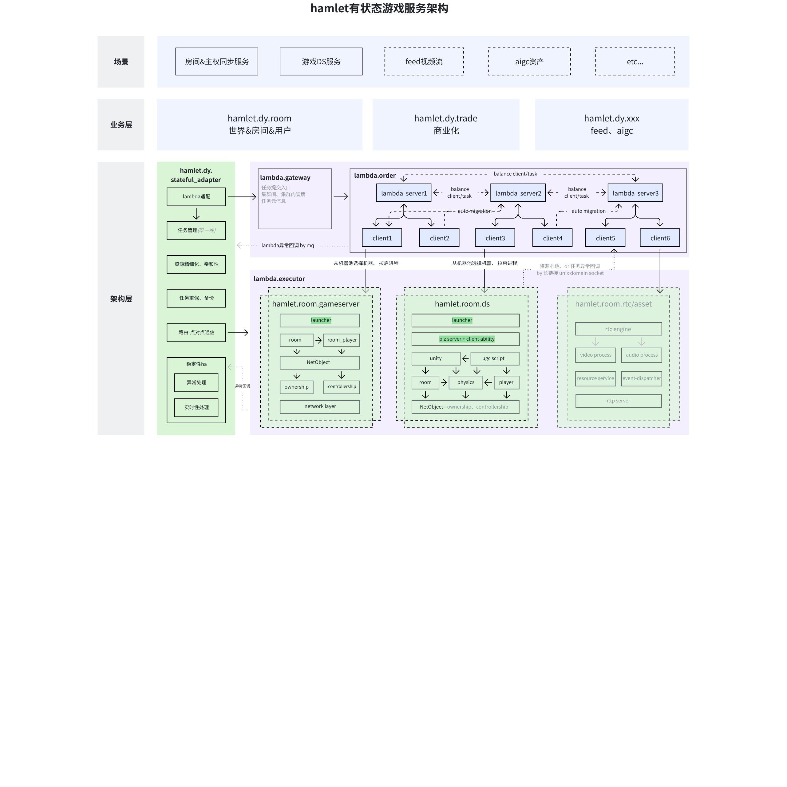</td><td><a href="https://bytedance.larkoffice.com/wiki/KGHewSQ9Ci8YA5kfEfwc5tlinKf">直播存储解决方案一期-WDS服务架构设计</a><br/>存储型 - 中心化调度<blockquote><p>使用redis 解决 mateserver 的单点问题，通过多节点自由抢锁，保证这个模块的平行拓展</p></blockquote></td><td><a href="https://bytedance.larkoffice.com/wiki/wikcnDEAxnmNXrQ2KKTbYxhpexe">分片（ShardID）使用指南【文档不再更新，请前往新地址】</a></td></tr><tr><td>方案简述</td><td>核心设计：将Brain 与 Hand解耦合<ul><li>Brain，即Agent Runtime 的Harness 部分， 无状态，可重启，可水平扩</li><li>Hand，指 执行操作的沙箱和工具 以及“会话”（会话事件日志）， 特点：统一接口， execute(name, input) → string，一个有状态容器。</li></ul><br/>Brain 和 Hand 各自成为一个接口，彼此之间几乎没有任何假设，而且任何一个部分都可以独立发生故障或被替换。</td><td><ul><li>每个用户拥有一个<b>专属的持久化容器</b></li></ul></td><td>三层架构设计<ul><li>接入层，提供http、rpc、sse对接协议，负责鉴权、多租户、限流等能力。</li><li>服务层：分 engine、runtime设计<ul><li>engine为 负责session会话管理、agent(skill、memory、产物管理)</li><li>runtime为原生agent运行时，如claude code、codex等</li></ul></li><li>基础层：基础存储（DB、Cache）、 agent沙箱、各LLM接入层</li></ul></td><td>三层结构，server-client-executor 三层调度结构，<br/>server 无状态，每个 server 管理一批 client 资源，分配到client，server 之间负责维护任务的负载均衡。<br/>client 是有状态机器节点，节点内维护 exector 池。<br/>executor 是任务执行单位，以 container 形式运行任务，支持指定配额的资源。</td><td><ul><li>webcast.linkmic.rtc_adapter，负责任务的管理，运行在TCE，做任务入口、生命周期控制、任务路由，  <b>业务服务只与该服务端交互，</b>对业务提供可靠的任务执行能力：包括任务去重、状态干预、任务异常恢复。</li><li>webcast.linkmic.rtc_worker,  接受调度框架的调度, 执行真实的任务， 运行在lambda平台</li></ul></td><td>利用 lambda 做任务调度；利用 adapter 和 scaler 提升业务稳定性：<ul><li>任务去重（推重复的流）</li><li>异常恢复：通过心跳检测任务、机器、集群状态，统计集群健康度，辅助决策任务调度；</li><li>异常恢复：pending 任务重新调度（无法推流）</li></ul></td><td>整体同 直播-万人合唱，但 业务逻辑 调度与RTC音视频逻辑 耦合高，未来会规划把和 lambda 的交互放到豆包侧维护。<blockquote><ul><li>使用lambda的底层docker做亲和性部署(数据量+逻辑串联服务、 视频模型agent、 语音模型agent)</li><li>稳定性考虑、tce迁移&amp;发布影响大</li><li>rtc后处理通过kitex streaming流式传输音视频 数据 给业务团队</li></ul></blockquote></td><td><ol><li seq="1"><b>触发：</b>用户提交作业或集群状态变更时，Evaluation Broker 生成调度评估任务进入队列。</li><li><b>调度：</b>Scheduler Worker 并发读取 State Store 的全集群资源快照，结合作业约束、亲和性策略、优先级规则计算最优节点放置方案，生成调度计划。</li><li><b>仲裁：</b>调度计划提交至 Leader 节点的 Plan Queue 进行冲突检测与仲裁，避免并行调度的资源抢占冲突，校验通过后写入持久化状态存储。</li><li><b>执行：</b>部署管理器将任务分配 (Allocation) 下发至对应 Client 节点，Allocation Manager 调用 Task Driver 启动任务，Fingerprint 探针和心跳持续上报运行状态，异常时自动触发重调度。</li></ol></td><td></td><td>核心使用2个服务， 元数据节点metaserver、 数据存储服务dataserver<ul><li><b>分区</b>： 按 key hash 分区，key 对应 shard 的路由表存储在metaserver；</li><li><b>复制：</b>dataserver为一主多从，利用 metaserver 选主，slave 通过binlog/dts异步复制</li><li><b>高可用：</b><ul><li>metaserver一主多备，通过分布式锁选主</li><li>dataserver定时心跳 上报 + 主从同步延迟 给 metaserver，mateserver 决定dataserver主从切换</li></ul></li><li><b>备份与恢复：</b>dataserver使用wal机制做回放&amp;同步</li><li><b>热点机制</b>：proxy模式 热点自动发现 + dataserver本地缓存 + dataserver从节点提供 读能力</li></ul></td><td>底层采用 Kubernetes 的 <a href="https://kubernetes.io/docs/concepts/workloads/controllers/statefulset/">StatefulSet</a> 实现，所属集群开启分片且挂载存储<ul><li>唯一性：对于包含 N 个副本的 StatefulSet，每个实例会被分配一个 0 ~ N-1 范围内的唯一序号，具体体现在实例名称的副本序列号（Replicas ID）。 </li><li>顺序性：StatefulSet 中实例的启动、更新、销毁默认按顺序进行。 </li><li>稳定的持久化存储：当实例被重新调度后，仍然能挂载原有的持久卷(内存、磁盘)</li></ul></td></tr><tr><td>有状态<br/>高效调度&amp;高可用&amp;<br/>分片路由</td><td>本质是<b>定制化Agent Runtime，设计为无状态服务</b><ul><li>Agent 服务完全无状态，可重启，任意路由</li><li>有状态部分，通过sandbox沙箱 &amp; 会话存储解决</li></ul></td><td>本质是<b>定制化Agent Runtime，设计为无状态服务</b><ul><li>核心服务无状态，任意路由</li><li>状态强绑定实例，每用户专属持久化容器</li></ul></td><td><ul><li>每 session 固定 faas 实例，请求粘连该实例</li></ul><blockquote><p>注：faas 最长</p></blockquote></td><td>平台只负责容器拉起，不提供分片路由， 需业务自建<blockquote><p>另一优点：不混部，demonset、不超售</p></blockquote></td><td><ul><li>资源调度依赖lambda</li><li>业务worker 承载任务态，adapter 负责路由</li></ul></td><td><ul><li>资源调度依赖lambda，实例承载推流态</li><li>业务worker 承载任务态，adapter和scaler 管理  + 负责路由</li></ul></td><td><ul><li>资源调度依赖lambda，实例承载音视频态（与业务逻辑耦合高）</li></ul></td><td>平台只负责容器拉起，不提供分片路由， 需业务自建，整体设计 和lambda 几乎同源</td><td><ul><li>实例承载局内状态，不可迁移</li><li>业务worker 承载任务态，adapter 负责路由</li></ul></td><td><ul><li>存储型，按 key hash 分片强绑定</li><li>不支持实时调度tce机器资源，需提前发布一个特殊psm节点</li><li>新增了一个standby角色机器，用来快速扩容(当前有4种角色leader、follower、 learner、standy)， 线上关闭关闭 自动扩缩容</li></ul><blockquote><p>在TCE上和离线任务混部，可能受到离线任务导致机器CPU/内存等资源使用率上升的影响</p></blockquote></td><td><ul><li>TCE 每个分片的实例数量都要保持一致，不支持单独对某个分片扩容</li><li>唯一序号 + 持久卷，实例强绑定</li></ul></td></tr><tr><td>实时互动</td><td>面向 Agent 执行，SSE流式传输</td><td>面向 Agent 执行，SSE流式传输</td><td>面向 Agent 执行，SSE流式传输</td><td>面向 CPU/GPU 密集密集型任务，非实时优先</td><td>直播万人合唱实时互动、AI实时语音&amp;视频通话</td><td>RTC 音视频，毫秒级低延迟</td><td>1v1 语音视频通话实时</td><td>仅调度框架，和lambda平台核心设计&amp;定位相同</td><td>多人游戏房间实时互动</td><td>存储读写低延迟，强调数据一致性、可用性，非交互会话</td><td>无实时互动能力，发布应用即重启</td></tr><tr><td>长耗时任务<br/>多版本&amp;PPE</td><td><ul><li>会话事件日志支持长任务，可重启续跑</li><li>通过优雅停机 安全摘除流量即可</li></ul></td><td>持久化容器支持长会话</td><td>本质还是faas任务</td><td>多版本共存，老任务自然结束 + 动态资源<ol><li seq="1">升级：lambda支持线上多版本共存，老流量&amp;任务 走之前版本，自然结束；新任务走最新版本</li><li>测试： <a href="https://bytedance.larkoffice.com/wiki/wikcnFaCWFpniU7RqbW9wc12ALb">支持PPE能力</a></li></ol></td><td>同 lambda</td><td>同 lambda</td><td>同 lambda</td><td>底层提供能力支持，业务自建</td><td>同 lambda</td><td>发布重启全部任务，不支持多版本<ol><li seq="1">升级： 不支持多版本，上线会把线上任务全部重启</li></ol><blockquote><p>串行单实例发布，如 dataserver发布上线需要1天；</p></blockquote><ol><li>测试： 建设boe测试， 线上测试使用不同的cluster来实现功能测试， 不支持PPE测试</li></ol></td><td> 发布重启全部任务，不支持多版本<br/> 升级： 不支持多版本，上线会把线上任务全部重启</td></tr></tbody></table>

## 方案选型对比

| 方案 | 有状态支持 | 实时互动 | 长任务 / 多版本 | 业务改造复杂度 | 结论 |
|-|-|-|-|-|-|
| 无状态微服务 + KV / Redis | 弱：状态外置，运行态（RTC 会话、子进程、游戏主循环）无法序列化 | 中：无粘性路由，得业务自建 | 弱：发布即重启，任务被打断 | 中：状态外置改造成本高，且改不动运行态 | ❌ 不适用：CPU 型运行态状态本质上无法外置 |
| K8s StatefulSet / TCE 有状态集群 | 强：稳定序号 + 持久卷 | 弱：发布即全量重启，无实时互动能力 | 弱：不支持多版本共存，PPE 缺失 | 高：分片必须整体扩缩，粒度过粗 | ❌ 不适用：为分片存储设计，不适合"每实例=1房间/1任务"模型 |
| 存储型服务（WDS / USS） | 强：key hash 分片 + 主从复制 + 热点自动发现 | 弱：面向存储读写，非交互会话 | 弱：串行发布可达 1 天，不支持 PPE | 中：需业务自建路由和分片逻辑 | ❌ 不适用：解决的是分布式存储分区&复制问题，与 CPU 型任务调度错位 |
| Nomad / Roblox 自研调度 | 强：任务级调度，Fingerprint + 心跳 | 强：任务级隔离，调度&冷启动架构级支持，实时性由业务保证 | 强：多版本共存 + 亲和性策略 | 高：只提供调度框架，路由、去重、生命周期全部业务自建 | ⚠ 部分适用：能力对齐 lambda，但业务侧要重复造轮子 |
| FaaS（如通用 FaaS 平台） | 中：session 粘连实例 | 中：SSE 流式 OK，弱隔离、调度&冷启成本高 | 弱：函数最长执行时间受限，难支持多版本 | 低：业务改造轻 | ❌ 不适用：函数执行时长约束是硬边界 |
| **lambda + 业务 Adapter** | 强：任务=实例，容器级隔离 | 强：Adapter 做粘性路由 + 调度&冷启动架构级支持，秒级异常迁移 | 强：多版本共存 + PPE + 老任务自然结束 | 低：业务只需实现 Adapter，调度、发布、容灾复用平台 | ✅ 收敛点：四个约束同时满足，且是公司内已跑通的能力 |

公司内的有状态服务解决方案本质上分两类：一类是 **USS / WDS 这样的存储型服务**，解决的是分布式存储分区和复制；另一类是 视频转码平台 lambda （对标业界 HashiCorp Nomad / Apache Mesos），解决的是 CPU 密集型任务的调度。云 Agent、网络游戏、音视频这三类业务基本都是 CPU 型有状态服务——没有存储型的复制诉求（节点故障重新调度即可），也没有强路由诉求（低负载资源池随机挑一台就行），**天然是 lambda 的目标场景**。

> **lambda 非常适合解决 有状态 + 长任务 + 实时性 业务场景**

# 整体架构

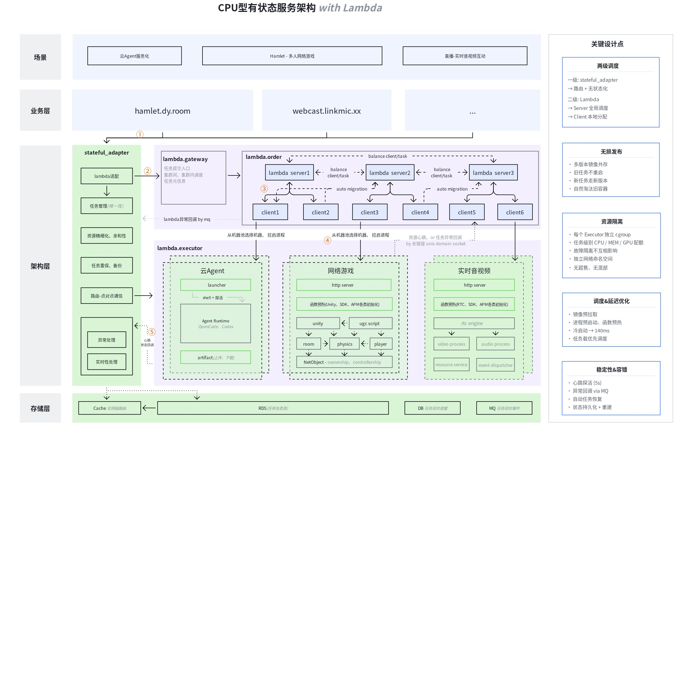

关键点：以无状态服务 stateful_adapter(运行在 TCE) 管理有状态服务，无状态服务对外提供唯一任务入口，提供可靠的任务执行能力。

# 关键设计

结合上面 3 个业务场景的共性技术特点，整体架构方案最终选择 **Lambda + 业务 Adapter 两级调度设计**。下面按 4 个关键技术模块展开设计细节。

<table><colgroup><col/><col/><col/></colgroup><thead><tr><th>关键设计</th><th>技术特点</th><th>说明</th></tr></thead><tbody><tr><td><b>两级调度架构</b></td><td>有状态</td><td><ol><li seq="1">Lambda 负责实例级资源调度,业务 Adapter 负责状态强绑定路由</li><li>使请求精准命中承载运行态的实例,解决"调度粒度是实例"的核心诉求。</li></ol></td></tr><tr><td><b>业务执行层设计</b>(实例服务化 / cmd 子进程  / 多语言)</td><td>有状态 + 长耗时任务</td><td><ul><li>实例内承载不可迁移运行态(有状态)，进程预启动压低冷启动</li><li>双进程支持任意语言业务 长时间运行(长耗时任务)。</li></ul></td></tr><tr><td><b>调度性能 &amp; 延迟</b></td><td>实时互动</td><td>请求路由 + 状态访问 + 业务处理全链路极简设计、整体延迟百毫秒,支撑 RTC 音视频、游戏房间等低延迟交互。</td></tr><tr><td><b>稳定性</b>(无损发布 / 任务去重 / 异常恢复)</td><td></td><td><ul><li>无损发布保证发布不中断进行中的会话(实时互动);</li><li>异常恢复让故障任务秒级重调度、带进度续跑(长耗时任务);</li><li>任务去重兜底避免重复执行</li></ul></td></tr></tbody></table>

不同于无状态微服务，有状态服务的 逻辑强绑定 运行实例，即核心要解决5个点：实例级别的生命周期、实例级别路由分片、实例的实时调度的性能与延迟、实例级别的 可观测性、实例级别的 稳定性设计。

## 两级调度架构

Lambda 平台本身解决的是**资源调度**问题：给你一个 container，里面有 CPU/Mem/磁盘/网络，你的代码在里面跑。但它不管业务语义：

- 同一个直播间不能同时跑两个伴奏任务
- 一个任务实例启动之后，如何做服务实例发现，如何实现路由通信。
- 任务 pending 超过 3s(可配) 没跑起来，要重调度
- 不同业务场景的 CPU/Mem 配额策略不同
- 需要 PPE 泳道测试能力

这些都是**业务调度**的事，Lambda 不干，所以必须在 Lambda 上面加一层 Adapter，形成两级调度。

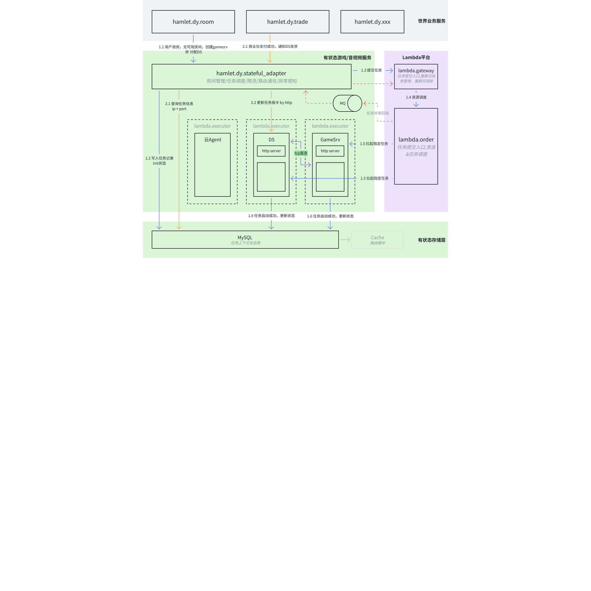

业务调度层（hamlet.dy.stateful_adapter）是 无状态业务服务 与 有状态游戏服务的调度与通信桥梁，负责任务的管理，运行在TCE，做任务入口、生命周期控制、任务路由、稳定性ha，  **业务服务只与该服务端交互。**

> 一句话， Lambda 管 资源，Adapter 负责 业务。业务服务只跟 Adapter 打交道，理论都不需要知道 Lambda 的存在。

### 接口设计

```Thrift
// 1. 创建任务（异步）—— 业务传入房间/会话信息，Adapter 提交 Lambda 调度
CreateTaskResponse CreateTask(1: CreateTaskRequest req);

// 2. 控制任务（同步）—— 通过 task_id 路由到 Executor，透传控制指令
ControlTaskResponse ControlTask(1: ControlTaskRequest req);

// 3. 销毁任务（同步）—— 主动结束任务，回收资源
DestroyTaskResponse DestroyTask(1: DestroyTaskRequest req);

// 4. 迁移任务（异步）—— 异常场景，将任务从故障节点迁到新节点
TransferTaskResponse TransferTask(1: TransferTaskRequest req);

```

### 存储设计

```SQL
-- 每天新增150w记录，以room_id分片
CREATE TABLE `hamlet_job` (
  `id` bigint unsigned NOT NULL COMMENT 'id',
  `room_id` varchar(256) NOT NULL COMMENT '房间ID',
  `task_type` varchar(32) NOT NULL COMMENT '任务类型，ds(DedicatedServer)、gs（GameServer）、rtc（音视频）、asset(资产构建)',
  `task_id` varchar(256) NOT NULL COMMENT 'order创建任务ID',
  `func_version` varchar(1024) NOT NULL COMMENT '当前任务版本',
  `join_content` varchar(2048) NOT NULL COMMENT '任务启动参数',
  `content` varchar(2048) NOT NULL COMMENT '任务业务信息（如gamesrv启动后存放的tcp ip+port）',
  `host`    varchar(256) NOT NULL DEFAULT '' COMMENT '任务所属节点http ip',
  `port`    bigint NOT NULL DEFAULT '0' COMMENT '任务所属节点http port',
  `status`  bigint NOT NULL DEFAULT '0' COMMENT '任务状态, 0 - 待调度、1 - 迁移中、2 - 已启动、 100 - 已完成、3 - 任务异常',
  `log_id`  varchar(1024) NOT NULL COMMENT '创建任务上下文、logid',
  `env`     varchar(256) NOT NULL COMMENT '创建任务上下文、env',
  `dc` varchar(256) NOT NULL COMMENT '任务所在机房',
  `retry_count` int NOT NULL DEFAULT '0' COMMENT '重试次数',
  `create_time` datetime NOT NULL DEFAULT CURRENT_TIMESTAMP COMMENT 'DB插入时间',
  `update_time` datetime NOT NULL DEFAULT CURRENT_TIMESTAMP ON UPDATE CURRENT_TIMESTAMP COMMENT '更新时间',
  PRIMARY KEY (`id`),
  UNIQUE KEY `uk_rid_type` (`room_id`, `task_type`),
  UNIQUE KEY `uk_tid` (`task_id`)
) ENGINE=InnoDB DEFAULT CHARSET=utf8mb4 COLLATE=utf8mb4_general_ci COMMENT='hamlet任务调度表'
```

## 业务执行层设计

执行层的核心 本质在Lambda平台拉起一个pod之后，启动业务进程，wait进程结束，业务进程结束则释放资源。

除了通用任务通用参数解析（如logid、泳道env、workDir、taskID等），镜像预留等可以通过Lambda提供的平台能力支持， 还要解决实例服务化、 cmd 子进程、 函数预热、日志接管、资源池化、等支持。

### 实例服务化 by HttpServer

业务实例启动后，其本质还是一个服务，需要对其他业务提供可访问的功能接口， 常规kitex 服务consul注册、负载均衡 没有意义，同时要支持跨语言场景，当前提供统一的 http server 对外服务即可。

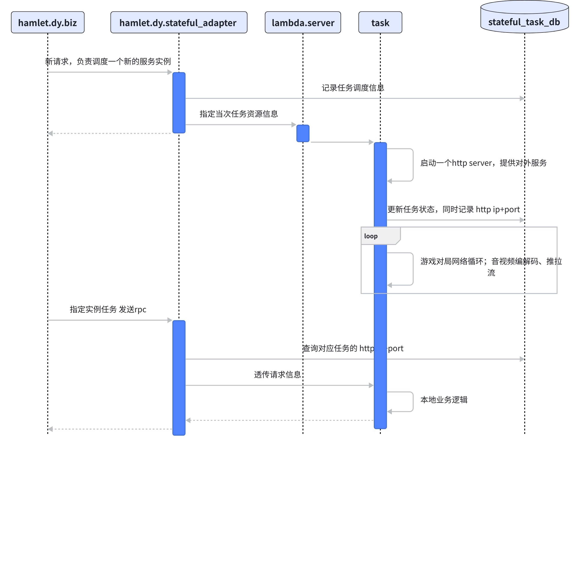

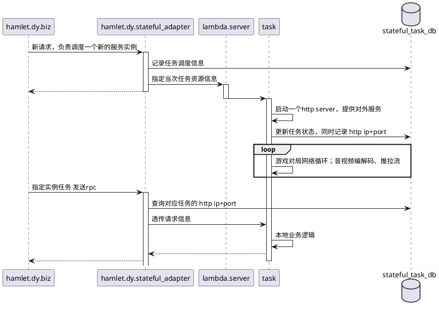
```plantuml
@startuml
participant hamlet.dy.biz as biz

participant hamlet.dy.stateful_adapter as adapter
participant lambda.server as lambda
participant task as task

database stateful_task_db as db

biz -> adapter: 新请求，负责调度一个新的服务实例
activate adapter
adapter -> db: 记录任务调度信息
adapter -> lambda: 指定当次任务资源信息
activate lambda
adapter --> biz
deactivate adapter

lambda -> task
deactivate lambda
activate task
task -> task: 启动一个http server，提供对外服务
task -> db: 更新任务状态，同时记录 http ip+port
loop
task -> task: 游戏对局网络循环；音视频编解码、推拉流
end

biz -> adapter: 指定实例任务 发送rpc
activate adapter
adapter -> db: 查询对应任务的 http ip+port
adapter -> task: 透传请求信息
task -> task: 本地业务逻辑
task --> adapter
adapter --> biz
deactivate task

@enduml
```

```C#
public void HandleLambda(LambdaContext ctx, string req){
   Dictionary<string, string> dict = JsonConvert.DeserializeObject<Dictionary<string, string>>(req);

   ctx.Route("/system/echo", httpReq => HttpResponse.Ok(httpReq.Path));
   ctx.Route("/system/leave", httpReq =>
   {
      GameStart.Instance.ExitRoomFromUnity(RoomExitCode.ActiveExit,string.Empty,"normal_leave");
      return HttpResponse.Ok();
   });

   _quitRouter = ctx.RouteBySeq("/system/quit", (seq, httpReq) =>
   {
       string logID =  httpReq.Headers.GetValueOrDefault("X-TT-LOGID","");
       runtime.End("0");
       ThreadLoop.AddJob(() =>
       {
           Application.Quit();
           _quitRouter.Complete(seq, HttpResponse.Ok());
       });
   });

   // 切换游戏状态机
   AppFSM.SwitchState()
}
```

### cmd子进程方案

为了支持任意程序进程，当前通过双进程方案来解决，在agent服务化场景非常合适，因为要支持各个语言的AgentRuntime，如Codex(Rust)、OpenCode(TypeScript)，包括业务自建Agent，几个关键设计点：

- 子孙进程泄漏：内部再fork子进程、后台进程、daemon，bash 被 kill 后，子进程可能还活着问题。
- 子进程std日志：接管子进程标准输出输出，接入argos，提供可观测能力。
- 子进程空闲监测：双进程要支持一套心跳保活机制，可以支持用网络流量监测即可。

```Go
command := exec.CommandContext(ctx, "/bin/bash", "-lc", req.Command)
command.Dir = lctx.Lambda().WorkDir

command.SysProcAttr = &syscall.SysProcAttr{Setpgid: true}
command.Cancel = func() error {
    return syscall.Kill(-command.Process.Pid, syscall.SIGKILL)
}

command.Env = append(os.Environ(),
    "AGENT_WORK_DIR="+lctx.Lambda().WorkDir,
    "AGENT_SVR_PORT="+strconv.Itoa(agentPort),
)

stdout, err := command.StdoutPipe()
stderr, err := command.StderrPipe()

if err = command.Start(); err != nil {
    logs.CtxError(lctx.Ctx(), "agent#start | command start error | roomID:%s, userID:%s, err", lctx.RoomID(), lctx.UserID(), err)
    return nil, err
}

go pipeToLog(lctx.Ctx(), stdout, "agent#stdout")
go pipeToLog(lctx.Ctx(), stderr, "agent#stderr")

err = command.Wait()
```

### 进程预启动模式

**核心思路**： 进程预启动，本质就是把冷启动变成热启动：多个版本镜像提前下载好、容器提前起、业务进程提前跑完初始化，用户请求到达时只做最后一步 payload 派发。

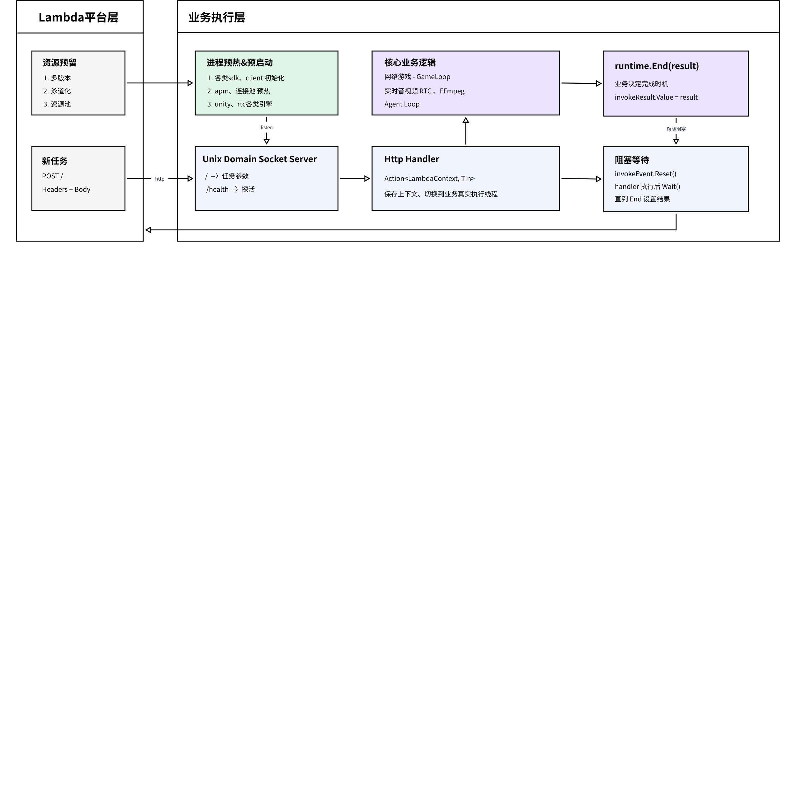

### 多语言支持

有状态服务的一个现实问题：**不同业务的技术栈天然不同**，没法强制统一到一门语言

- 业务调度层stateful_adapter，对外提供唯一任务入口，提供可靠的任务执行能力，直接使用golang部署TCE即可。
- 执行层要能同时支持 Go、C#、TypeScript 、Pyhton等各类语言项目， 主要2个思路：

  - 实例服务化：通过启动 http server对外提供服务，用stateful_adapter解决分片路由问题
  - 运行模式：**简单模式**通过cmd子进程 接管stdout/stderr、pid 探活跟业务解耦， 即可快速接入；**增强模式**（如支持预启动、实时函数、执行池化等）接入原声lambda sdk即可，官方团队提供了golang、python语言支持，hamlet团队开发了对应规范的 c#语言支持。

## 调度性能&延迟

有状态服务对调度延迟极度敏感 —— 用户点击「开始合唱」，3s 后伴奏还没出来，体验直接崩了；玩家匹配成功，5s 进不了房，必然投诉。

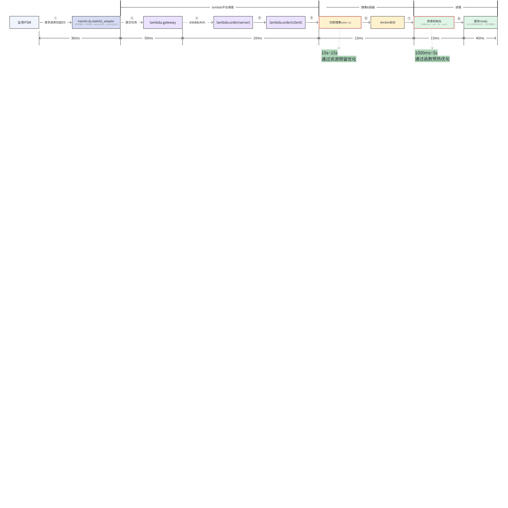

### **资源预留**

> 解决步骤 ⑤ & ⑥

提前在 Client 节点预拉取业务镜像，并预启动一批空闲 Executor 容器。任务来了直接从预热池分配，不需要等镜像下载和容器创建。

- 预留策略：按集群配置预留比例（如 20% buffer），根据历史流量模型动态调节
- 冷启动兜底：预留耗尽时走冷启动，P99 仍会到 10s+，因此预留量需要覆盖峰值

### **进程预加载 / 函数预热**

> 解决步骤 ⑦ & ⑧

业务进程在 Executor 启动后立即完成初始化（Unity引擎初始化、RTC SDK 加载、网络建连、内存池预分配），等到任务 Payload 到达时直接进入业务逻辑。

```Go
// Lambda 函数预热模式：进程启动即初始化，等待 Payload
func main() {
    // 预热阶段：进程启动时完成重型初始化
    rtcEngine := brtc.CreateRtcEngine(appID, "")  // RTC SDK 初始化 ~200ms
    ffmpegInit()                                     // FFmpeg 解码器预加载

    // 注册 handler，等待 Lambda 平台派发 Payload
    lambda.Start(func(ctx context.Context, req TaskRequest) (TaskResponse, error) {
        // 收到 Payload 后直接执行，不需要再初始化
        room := rtcEngine.CreateRTCRoom(req.RoomID)
        room.Join(req.UserID, req.Token)
        return runTask(ctx, room, req)
    })
}

```

**核心思路：** 把「冷启动」变成「热启动」—— 镜像提前拉、容器提前起、进程运行，用户请求来了只做最后一步 payload 派发，用空间换时间，用预留成本换用户体验。

> RTC 音视频互动：15s -> 140ms
>
> Hamlet 游戏进房:  5.5s -> 300ms

## 稳定性

有状态服务的稳定性设计跟无状态服务完全不同 —— 无状态服务挂了换一台就行，有状态服务挂了意味着任务丢失、用户断流、游戏局崩盘，必须从 **发布 → 运行 → 异常** 全生命周期设计。

### 无损发布

tce服务，一次上线发布，所有服务节点就会重启，实时推、拉流中间必然断开重连。无损发布这块，主要还是依赖 lambda 平台能力，平台允许同时存在多版本在线上，旧版本节点等待自然流量消亡后升级，发布变更并不会影响正在运行中的任务。主要2个方式

- 上线时，保留多个版本服务编译镜像， 上线前版本 运行中的服务不重启，随任务自然结束。
- 提交任务时，指定运行镜像版本，默认运行最新上线版本。

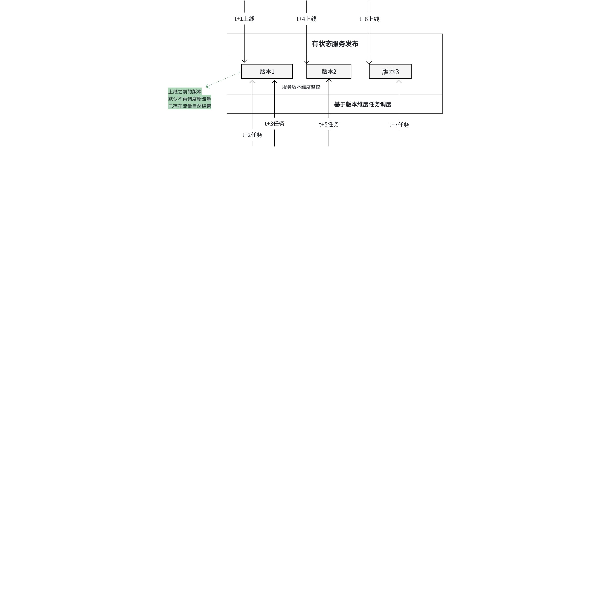

### 任务去重

**问题：** 业务超时重试、并发请求、异常回调误触发都可能导致同一房间启动多个重复任务。

**两层防御：**

1. **提交任务幂等：** 任务提交前查 DB，同一 room_id + task_type 有运行中记录则拒绝。
2. **运行时 去重机制：** 同一 RTC 房间、同一 UserID 进房会触发先进者被踢回调； 游戏房间同理，同一 room_id 新 DS 启动后旧 DS 收到销毁信号

### 异常恢复

故障恢复这块有 3 个手段保障，一是任务启动确认，任务启动后，2 秒后会确定任务是否执行。二是资源/进程异常恢复，依赖 lambda 平台的监控，针对节点故障，进程 panic，会发出流水消息，业务订阅消息决定是否重新调度，可以到<10 秒级。三是指定任务重试，执行中业务返回特定重调度错误码，让 lambda 平台重新调度执行任务。

- 任务启动确认：由于提交任务是一个异步过程，任务可能启动一直pending，当前提交任务前，会启动一个定时器任务(2s后回调），来check任务，以保障任务指定时间内启动成功

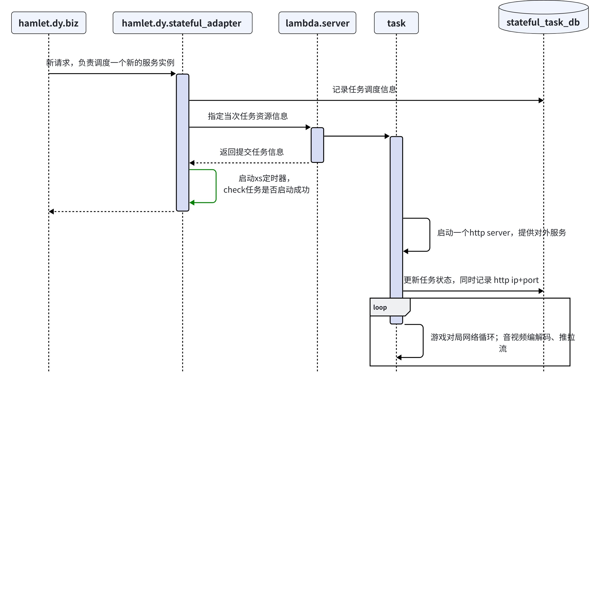

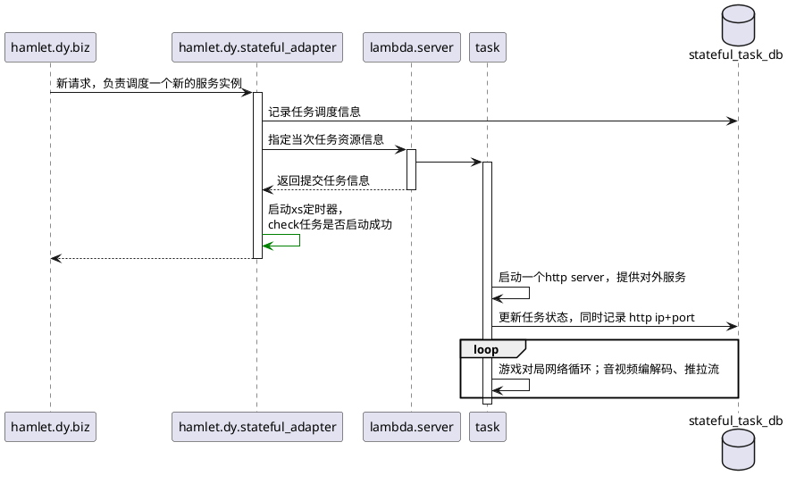
```plantuml
@startuml
participant hamlet.dy.biz as biz

participant hamlet.dy.stateful_adapter as adapter
participant lambda.server as lambda
participant task as task

database stateful_task_db as db

biz -> adapter: 新请求，负责调度一个新的服务实例
activate adapter
adapter -> db: 记录任务调度信息
adapter -> lambda: 指定当次任务资源信息
activate lambda
lambda -> task
activate task

lambda --> adapter: 返回提交任务信息
deactivate lambda

adapter -[#green]> adapter : 启动xs定时器，\ncheck任务是否启动成功

adapter --> biz

deactivate adapter

task -> task: 启动一个http server，提供对外服务
task -> db: 更新任务状态，同时记录 http ip+port
loop
task -> task: 游戏对局网络循环；音视频编解码、推拉流
end

deactivate task

@enduml
```

- 资源/进程异常回调：提交任务时使用RocketMQ接收任务异常回调<a href="https://bytedance.larkoffice.com/wiki/wikcnOjMMIec12MY4HspMxc54Jw">【废弃/deprecated】lambda 对外文档</a>， 由业务决定是否迁移任务

> 如任务进程崩溃、运行机器异常(CPU打满、磁盘打满)等

- 指定任务重试：监听任务运行异常状态，根据指定错误码&重试策略，由order平台自动拉起重试

<blockquote><p><a href="https://bytedance.larkoffice.com/docx/BtiCdLZJ2oRzaWxB4aDcuAhMnle">Lambda 任务失败自定义重试接入</a>由于 lambda 任务重试只在计算平台内部进行，整个的链路比返回到业务上游，由业务上游重新下发任务链路更短， 常见任务异常退出(lambda函数 return error)</p></blockquote>

```SQL
curl -L https://v-lambda.bytedance.net/lambda/apis/gateway/v1/invoke -X POST \
-d '{
    "FuncName": "hamlet_room_ds",
    "Qualifier": "prod",
    "Payload": "{\"room_id\": \"123456\", \"user_id\":\"23_ab134fcd\", \"token\":\"xxxxx\"}",
    "Annotations": {
        "Cluster": "default_test_lq"
    },
    "InvokeType": "async",
    "Envs": {
        "LAMBDA_ENV_CUSTOM_PSM": "hamlet.room.ds"
    },
    "Callback": "rmq:{topic}/{cluster}",    // 任务执行异常回调MQ
    "CallbackArgs" "{\"room_id\": \"123456\"}",  // 任务执行异常回调透传参数
}'
```

## 过去三场景在统一模型下的映射

前面讲了共性抽象和统一架构，回过头看每个业务在这套模型下具体落座的位置。

| 场景 | 状态对象 | 调度单位 | 恢复要求 | 差异点 |
|-|-|-|-|-|
| **云 Agent** | session 沙箱容器 + 工具子进程 + 会话事件日志 | 每 session 一个 executor container | 会话事件日志续跑；子进程挂了从上一步 checkpoint 恢复 | 需要跑 shell / 文件系统 / 子进程树，**容器隔离最重**；SLA 秒级 |
| **实时音视频** | RTC SDK 推拉流通道 + 编解码上下文 + 业务逻辑 | 每个音视频任务一个 executor（推流方向） | 老流不能重连；靠多版本共存 + 秒级重调度，让老任务自然结束 | 毫秒级 RT + SDK 内部状态跨实例不可迁移 |
| **多人游戏** | 游戏主循环 + 房间内玩家/物体/物理模拟状态 | 每房间一个 GameServer 实例 | 整局不迁移；断线重连兜底；对局结束才回收 | **每帧 <77ms 硬时限** + 状态高频演化（AOI/物理），迁移代价最高 |

三个场景差异点看似很大（云 Agent 要跑 shell、RTC 要毫秒级、游戏要 tick 硬时限），但在 **状态对象 + 调度单位 + 恢复要求** 三个维度上表现出同一个结构——都是 "实例 = 状态承载单元 + 调度单元 + 生命周期单元"。差异只体现在 **SLA 严格程度** 和 **状态是否允许跨实例迁移** 两点上，而这两点已经被平台的两级调度 + 无损发布 + 秒级重调度机制统一兜住。

# 落地收益与适用边界

平台已经在直播互动、AI 音视频、Hamlet 游戏服务上跑通，主要收益：

- **直播Hamlet - 网络游戏**

  - 最大在线服务实例规模容量3K -> 10w+， 并可横行扩展；
  - 通过版本化升级替换蓝绿集群部署、资源按需调度 DS服务资源利用率 10% ->60+%
  - 通过镜像预留和进程预启动 方式，有状态服务拉起调度[pct50 延迟5s](https://metrics-fe.byted.org/web/plot/metrics#now-1h(-none),now,,,,,,,cn,false,,;avg:store:hamlet.dy.room.room_init_finish.latency.pct90;0) -> 400ms，[p90延迟24.2](https://grafana.bytedance.net/d/Yh_9-T0Hk/hamlet-shi-jie-da-pan?editPanel=285&viewPanel=285&orgId=1&from=now-6h&to=now&var-env=Bytetsd-China-North&var-bosun=Bosun-China-North)[s](https://grafana.bytedance.net/d/Yh_9-T0Hk/hamlet-shi-jie-da-pan?editPanel=285&viewPanel=285&orgId=1&from=now-6h&to=now&var-env=Bytetsd-China-North&var-bosun=Bosun-China-North) -> 800ms。
- **直播多人 - 万人合唱**

  - 沉淀了抖音万人实时合唱行业能力， 首次实现线上线下30万人跨时空大合唱，合唱同步延迟<100ms， 累计合唱人数25万，最高同时合唱2.5万人，刷新合唱派对直播参与用户和行业新记录<a href="https://bytedance.larkoffice.com/docx/JQurd7XBzoF8IhxiPrgcOWwanEd">复盘 | 抖音落日合唱派对活动(更新至8.29场)</a><a href="https://bytedance.larkoffice.com/wiki/QmsIw8tUOiHKsJkrvyKcn4lenei">实时合唱演唱会模式Server方案设计</a>
- **直播多人 - AI伴播**

  - 基于有状态RTC音视频架构能力，建设了 实时音频采集->降噪/人声分离/AED -> ASR -> LLM -> TTS 整体链路基建技术<a href="https://bytedance.larkoffice.com/docx/HgAgdS3PZoZbZpxavG4cTLftnjb">直播场景 - AI音视频互动实践</a>
  - 端到端对话延迟2.2s ( vs 豆包语音通话 2s)，人均对话时长8min，主播人均对话轮次40轮。

## **适用场景**

只要业务同时命中"**有状态**、**实时互动**、**长耗时任务**"中的一项或多项，就适合本方案，常见场景包括：

- 云 Agent：Codex、OpenCode 等 AgentRuntime，进程内上下文重、单会话长耗时，需本地 shell / GPU 执行环境。
- 实时音视频互动：连麦、合唱、AI 音视频处理，全链路低延迟、长连接会话。
- 多人在线游戏服务：Hamlet 游戏房间，进房快、局内状态不可迁移、单局时长长。
- 实时协作 / 长会话应用：在线文档协同、实时仿真、直播互动等有状态长连接场景。

**适用边界**

- 适合： 长连接 / 长会话业务；进程内状态重、迁移代价高；对冷启动敏感；需要本地执行环境（shell、GPU、编解码 SDK、游戏引擎），发布频繁且不接受断流。
- 不适合： 纯 CRUD 服务；短请求、无上下文；状态可完全外置到存储；弹性 / 利用率优先于粘性；单实例语义强、需要跨副本强一致的场景（走 K8s StatefulSet 或专用存储更合适）。

## 设计权衡

相对于无状态服务，有状态设计不是免费的，有几组权衡：

- **成本 vs 隔离。** 预留容器 + 独占 CPU 保证了延迟与稳定性，但也意味着资源利用率不会像纯无状态服务那样高。
- **冷启动 vs 资源利用率，** 预热池越大，冷启动越少，但这也会影响资源利用率。我们做法是按历史PCU / QPS 预留比例，预留耗尽走冷启动，这个时候直接反映为 P99 长尾延迟高。
- **一致性 vs 可用性。** 任务去重、迁移、状态恢复本质是分布式一致性问题。我们的选择偏向可用性：允许短时"两份"，靠运行时踢出机制收敛；异常场景优先重新调度而不是全局锁。这套语义对 RTC / 游戏 / Agent 都够用，但不适合有强单点语义的场景（例如资金场景）。

# Reference

<a href="https://bytedance.larkoffice.com/docx/HgAgdS3PZoZbZpxavG4cTLftnjb">直播场景 - AI音视频互动实践</a>

<a href="https://bytedance.larkoffice.com/docx/FYxWd9Xq5op8VMxn1TncWGrJnKg">多人RTC业务架构方案和规划</a>

<a href="https://bytedance.larkoffice.com/docx/XEmHdK7hXocW8JxuUikctUTZn7e">Hamlet 有状态服务架构简化方案</a>

<a href="https://bytedance.larkoffice.com/wiki/Qm2nwFnSHigdu7kQl2ictHURnxf">AIME Assistant：从个人到组织级 Agent 系统</a>
