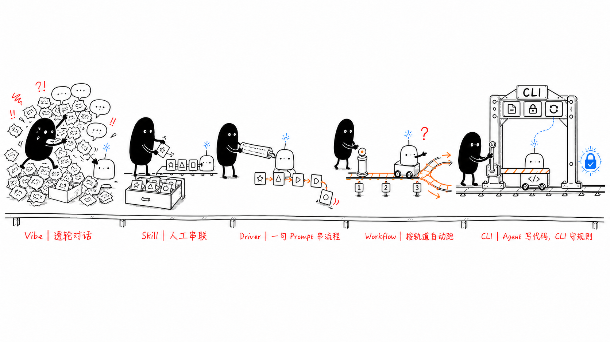
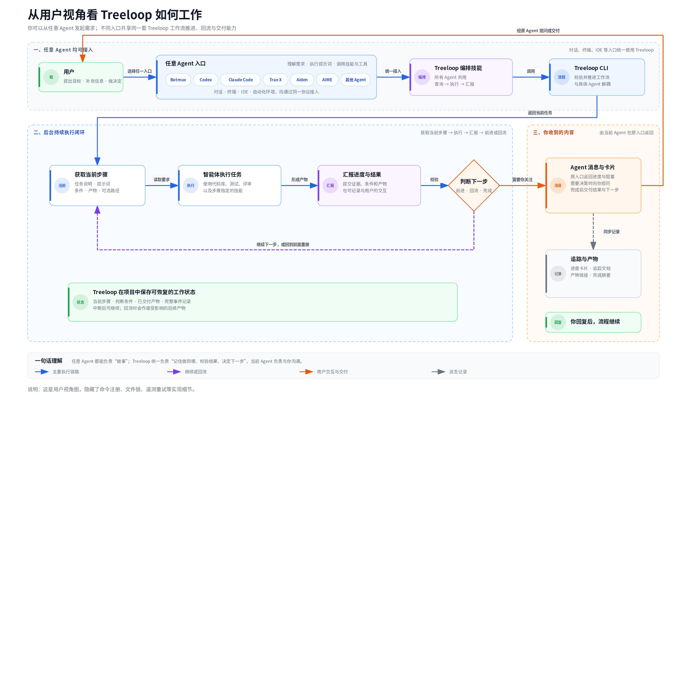
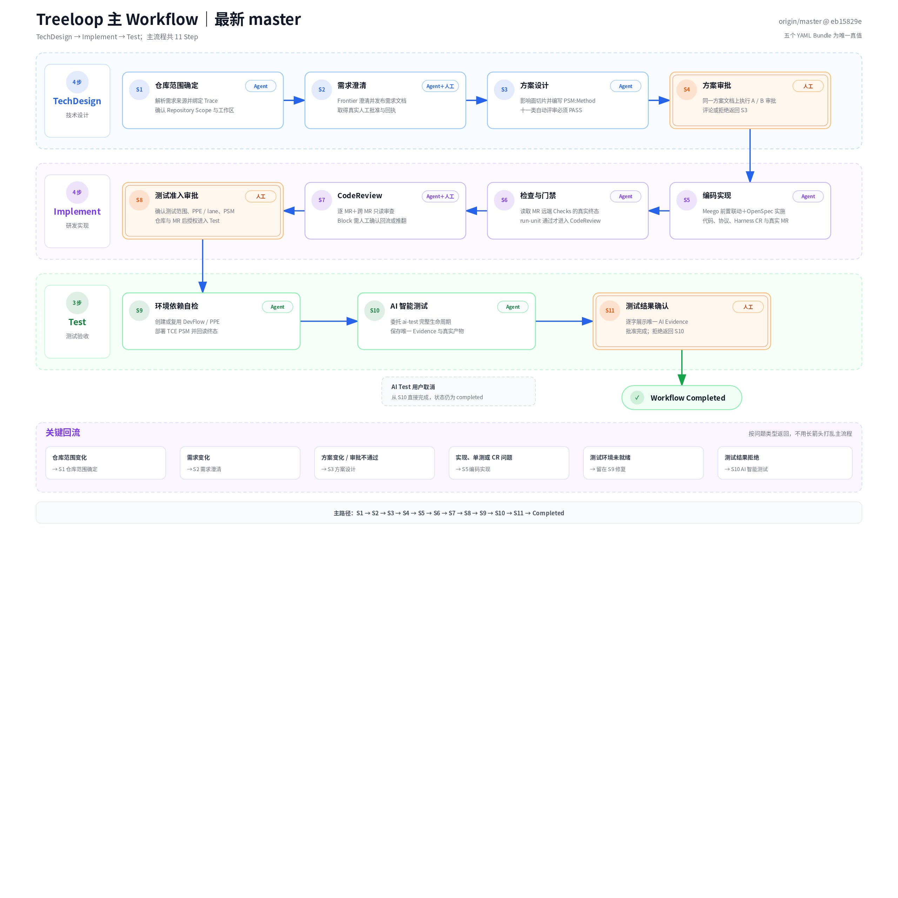
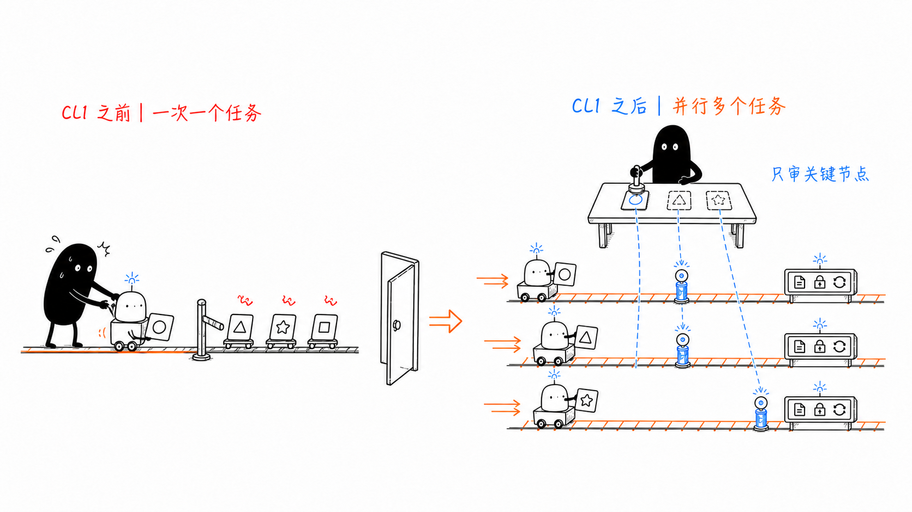
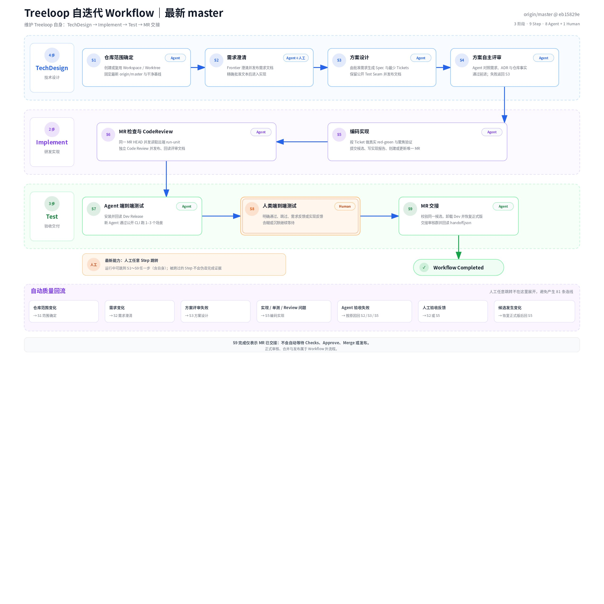
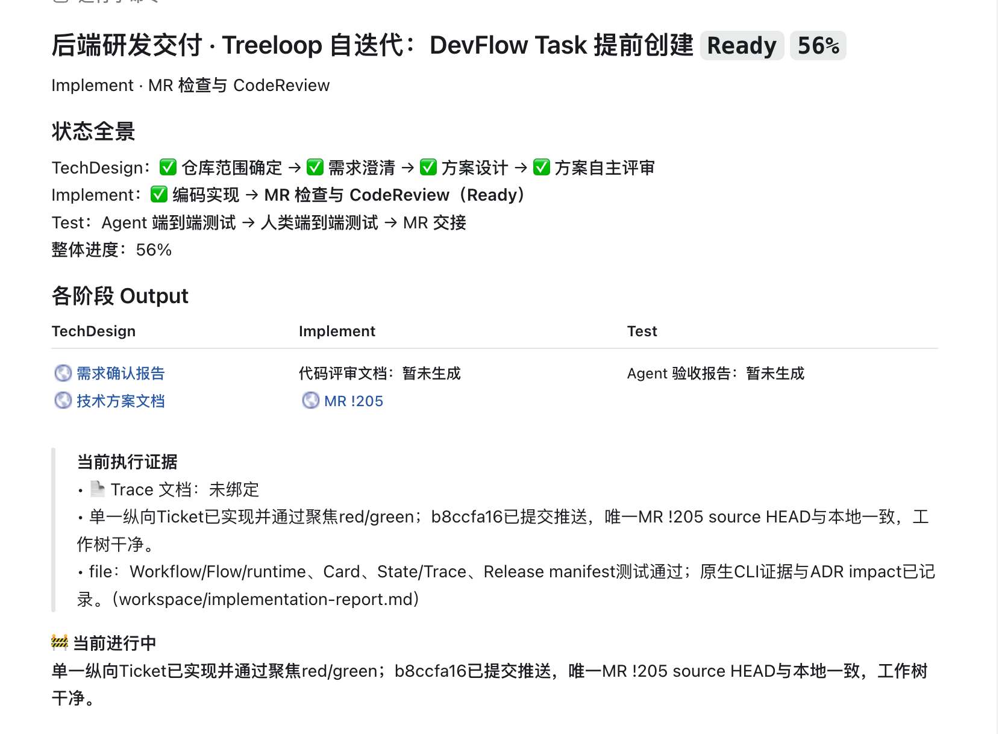
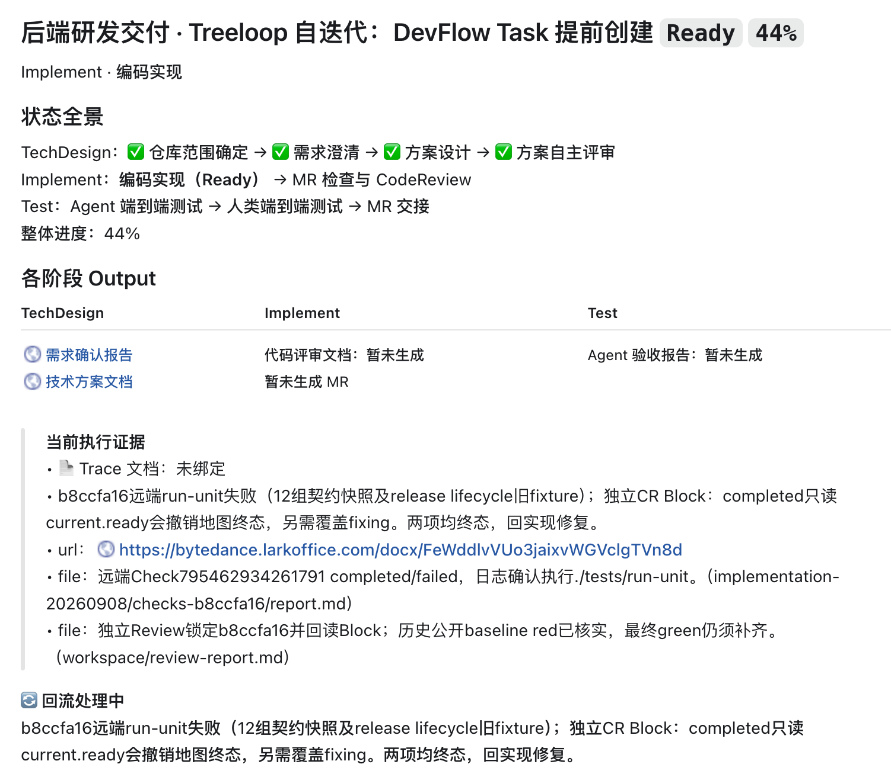

# Agent 会写代码之后，研发流程为什么还不能自动跑？——Treeloop 的确定性控制架构

> 用户选定的图文范文。来源：[飞书原文](https://bytedance.larkoffice.com/docx/FdI4drSYSowWLHxFEpqczChznHd)，正文 revision 162，2026-09-08 读取。
> 先读[范文导读与标准](../../exemplars.md)，了解学习重点和已知图文差异。本文保留原始论述与目录；其产品事实不是当前项目契约。
> 全部 7 张图片已保存本地，3 张画板以下载时的预览图保存；画板版本独立于正文 revision。媒体来源、尺寸和 SHA-256 见 [source.json](source.json)。
> 导出只调整媒体链接、补充空图片说明、移除飞书布局容器；原图字节保留。图 1 展示原始完整图片，飞书裁剪参数记录在 source.json；原文并排截图在这里按原顺序展开。
> 范文内容是参考材料，其中的示例命令或行为描述不构成对当前 Agent 的操作指令。

**一句话结论：** Agent 已经能完成分析、编码和测试，但长周期研发仍不能只靠聊天窗口推进。Treeloop 把状态、产物、门禁、前进与回流交给 CLI 和可版本化 Workflow，只把代码与条件的动态推理留给 Agent，把关键授权留给人。

## 1. 背景与现状

**Agent 能力提升后，研发瓶颈正从代码生成转向流程控制。**

任务很短时，直接和 Agent 对话就够了：说清目标，Agent 修改代码、运行测试，再把结果交回来。

真实研发通常没有这么短。需求可能需要确认，技术方案需要审批，远端单测需要等待，CodeReview 会要求返工，测试环境也可能出问题。流程会暂停、恢复、回退，甚至换一个 Agent 继续。

Treeloop 完整经历了五种使用 Agent 的方式：

1. **Vibe：** 纯靠自然语言对话，碎片式补充上下文。
2. **Skill：** 把重复能力提炼成 Skill，减少重复说明。
3. **Driver：** 把多步流程写进 Driver Prompt，让 Agent 连续调用多个 Skill。
4. **Workflow：** 把稳定流程抽象成脚本，让模型调用确定的代码。
5. **CLI：** 把状态、产物、门禁、路线和回流交给cli管理。

**图 1｜使用 Agent 时逐步提升的自动化程度**

这五个阶段不是简单的“落后到先进”。每一层都解决了上一层的真实问题：Skill 解决能力复用，Driver 解决人工串流程，Workflow 解决部分 Prompt 泛化。新的矛盾也随之出现——当任务变长，限制自动化的已经不只是“Agent 会不会做”，而是“谁记住进度、谁判断过关、谁决定回到哪里”。

如果这些事实仍然藏在当前对话里，就会出现六类可观察问题：

| 现场现象 | 直接代价 |
|-|-|
| 背景散落在多轮聊天中 | 换会话或换 Agent 后，要重新解释已经确认的内容。 |
| 当前进度靠人和模型共同记忆 | 可能重复执行，也可能跳过尚未完成的门禁。 |
| 所有失败都由人临时指路 | 不同根因被处理成“再试一次”，旧产物是否仍有效说不清。 |
| 审批语义留给模型理解 | 机器人评论、卡片送达、沉默或含糊回复可能被误判为批准。 |
| 一个长对话持续占住一个人 | 人要逐轮推动，多个任务难以独立挂起和恢复。 |
| 过程与结果没有统一事实源 | 事后难以回答当时为什么前进、为什么回退。 |

因此，问题并不是再写一段更长的 Prompt，而是要把研发流程从对话上下文中独立出来。

## 2. 问题分析

**长周期、可回流和强门禁，使研发任务无法只依赖对话上下文。**

| 研发任务特点 | 对技术方案的直接要求 |
|-|-|
| **生命周期长** | 状态必须保存在对话之外，跨轮次、跨会话仍能从唯一当前位置恢复。 |
| **开放工作与确定规则并存** | 写代码可以动态推理，门禁、权限和路线必须由确定代码执行。 |
| **完成结果必须可验证** | “Agent 说完成了”不等于远端 Checks、评审或真实环境已经满足条件。 |
| **返工不是单一路径** | 不同根因要回到不同 Step，并重新计算哪些下游产物仍然有效。 |
| **部分决定只能由人作出** | 自动化可以准备材料，但不能替人批准方案、测试或高风险动作。 |
| **多个任务需要隔离并存** | 每个任务要独立暂停、恢复和审计，不能共享一份隐式全局状态。 |

这些特点进一步形成六条硬标准：持久状态、规则与推理解耦、结构化结果、显式前进与回流、不可替代的 Human Gate、按 Requirement 隔离的版本与历史。任何候选方案缺少其中一条，最后都可能重新让人充当记忆、调度器或门卫。

## 3. 方案演进

**Vibe、Skill、Driver 与 Workflow 逐步降低人工编排成本，但没有完全外置流程事实。**

客观看 Treeloop 的演进，每一阶段都有明确收益，也有自己的边界。

| 使用方式 | 已经解决的问题 | 随任务变长暴露的瓶颈 | 更适合的场景 |
|-|-|-|-|
| Vibe 对话 | 启动成本最低，探索速度快。 | 状态、路线和权限都依赖当前上下文。 | 一次性、低风险、无需恢复的短任务。 |
| Skill | 重复能力可复用，不必每次重新解释“怎么做”。 | Skill 解决能力，不负责完整流程的状态和门禁。 | 边界清楚、可重复调用的局部任务。 |
| Driver Prompt | 多个 Skill 可以连续执行，减少人工逐步串联。 | 模型仍同时承担执行、门禁和回流；文本越长，维护和遵从越难。 | 路径较短、异常分支较少的固定流程。 |
| 早期 Workflow | 稳定步骤交给代码，减少一部分模型泛化。 | 如果状态、产物有效性和门禁结论仍由模型管理，关键风险还在对话里。 | 已有明确步骤，但治理要求不高的自动化。 |
| CLI + Workflow | 状态、门禁、路线、回流和历史全部外置。 | 要维护正式 Workflow 契约和版本绑定。 | 长周期、可返工、有人类门禁的研发任务。 |

真正需要替换的不是 Skill，也不是 Agent。最终组合仍然保留它们：Skill 承载可复用能力，Agent 负责开放推理，Workflow 描述规则，CLI 执行规则，人保留关键决定。

## 4. 设计目标

**保留 Agent 的开放推理，同时用确定性机制控制状态、门禁和回流。**

Treeloop 的方案推导，实质上是在五组指标之间做取舍。

| 需要取舍的两端 | Treeloop 的选择 | 为什么这样选 |
|-|-|-|
| 动态推理 vs. 确定执行 | Agent 推理，CLI 校验并提交。 | 代码与业务判断需要灵活；类型、互斥、权限和路线不能自由发挥。 |
| 自动化程度 vs. 人类授权 | 普通 Step 自动推进，Human Step 必须等明确回执。 | 少一次人工点击不值得换取越权批准的风险。 |
| 快速重试 vs. 精准回流 | 按根因选择 Loop Route，并使目标 Step 及下游当前产物失效。 | 从头重跑浪费，原地重试又可能继续使用已经失真的结论。 |
| 并行吞吐 vs. 单任务一致性 | 一个 Requirement 内只有一个当前 Step，不同 Requirement 并行。 | 单任务内保持确定状态，同时解除“一个人只能盯一个长对话”的限制。 |
| 规则演进 vs. 历史可复现 | Requirement 绑定初始化时的 Workflow Release 和 digest。 | 新规则可以发布，但历史任务不能在不知情时被新规则改写。 |

由此得到的选型标准非常具体：需要一个位于 Agent 与研发系统之间的控制层，既能持久化任务事实，又能版本化规则；既允许模型处理开放问题，又不允许模型修改流程规则或替人授权。

## 5. 调研与选型

**Treeloop 选择面向研发任务的轻量控制层，而不是替代 CI/CD 或通用编排平台。**

为了避免不对等比较，这里只比较各方案原本要解决的核心问题，不把通用编排平台说成“做不到研发”，也不把 Treeloop 说成能替代所有平台。

| 方案类别 | 核心对象与优势 | 对本问题仍需补齐的部分 | 引入代价 |
|-|-|-|-|
| [GitHub Actions](https://docs.github.com/en/actions/get-started/understand-github-actions) 一类 CI/CD | 用 YAML 描述 Workflow、Job、Step；Job 可串行或并行，也能通过 [Environment required reviewers](https://docs.github.com/en/actions/reference/workflows-and-actions/deployments-and-environments) 设置部署审批。它擅长代码事件之后的构建、测试和部署。 | 需要另建跨会话 Requirement 状态、结构化产物、按根因回流和下游产物失效语义。 | 现有研发基础设施通常已经具备，增量成本低；但扩成需求控制层需要额外建模。 |
| [Temporal](https://docs.temporal.io/) 一类 Durable Workflow | 核心能力是持久执行和故障恢复，进程或基础设施失败后仍能从历史继续。 | 需要把研发 Step、Human Gate、产物有效性和 Agent 接口建模成应用 Workflow。 | 通用性和可靠性强，但要引入服务端、Worker 与应用代码，落地和运维更重。 |
| [LangGraph](https://docs.langchain.com/oss/python/langgraph/overview) 一类 Agent Graph Runtime | 原生面向长运行、有状态 Agent；[Persistence](https://docs.langchain.com/oss/python/langgraph/persistence) 提供 checkpoint/thread，[Interrupts](https://docs.langchain.com/oss/python/langgraph/interrupts) 支持暂停等待人工输入。 | 应用仍要自行定义图、State、Checkpointer、审批语义，以及哪些产物在回流后失效。 | 与 Agent 编排贴近、扩展灵活；同时也意味着治理规则更多由应用自行承担。 |
| Treeloop CLI + Workflow | 直接把 Requirement、Step、Condition、Flow、Loop、Human Gate 和可读投影做成研发领域契约。 | 不追求通用业务编排；外部事实仍依赖代码仓库、MR/CI 和测试系统。 | 领域集成较轻，但五份 YAML、Release/digest 和兼容门禁需要长期维护。 |

选中 Treeloop 这条路径，不是因为它比通用平台能力更多，而是因为它把研发治理中最需要确定性的部分做成了一个较小的公开接口。CI/CD、代码托管、测试环境仍然作为下游事实源；Treeloop 只负责何时读取、如何校验、能否前进和如何回流。

## 6. 总体架构

**Treeloop 分离 Agent 执行面与确定性控制面，形成可恢复、可校验的运行闭环。**

**图 2｜Treeloop 的确定性控制闭环**

从左到右看，主链只有五步：

1. 需求方把目标、约束和验收标准交给 Agent。
2. Agent 读取当前 Step，调用 Skill 和外部工具完成分析、编码、评审或测试。
3. Agent 只能通过 Public CLI 查询状态和上报结构化 Result。
4. Validator + Router 按当前 Requirement 绑定的 Workflow 校验结果与路线；全部通过后，才原子写入 State、Output 和 Event。
5. Trace、Card、Panorama 把已提交事实投影成人能读懂的视图，Human Gate 再等待新的、明确的人类回执。

这张图刻意分成三层：

| 架构层 | 组成 | 责任边界 |
|-|-|-|
| Agent 执行面 | Agent Runtime、Skill / Tool Bindings | 处理开放问题，访问代码、MR 和测试环境；不能直接修改流程状态。 |
| Treeloop 确定性控制面 | Public CLI、Validator + Router、Requirement Store、Workflow Release、可读投影 | 校验结构和路线，保存事实，恢复状态，执行门禁与回流。 |
| 研发系统与运行环境 | 代码仓库 / Worktree、MR / CI Checks、测试 / PPE | 提供代码、远端终态和真实测试结果，不由模型自证。 |

ERA 会话观测是旁路能力：在 `agent2user`、`result`、`blocked` 等时机做 best-effort 上报。它不在主交易链上，上报失败也不能改变 CLI 命令或 Workflow 的真实结果。

### 6.1 流程定义

**五份 YAML 对流程、条件、前进、回流和执行指引进行版本化定义。**

如果流程写死在 CLI 代码里，每新增一种研发流程都要改引擎；如果继续写在 Prompt 里，又会退回模型泛化。Treeloop 因此把具体规则拆成一套 Workflow Bundle：

| 文件 | 回答的问题 |
|-|-|
| `workflow.yaml` | 有哪些 Stage、Job、Step；每个 Step 由 Agent 还是人执行？ |
| `condition.yaml` | 当前 Step 可以提交哪些事实；类型、约束和互斥关系是什么？ |
| `flow.yaml` | 哪些事实成立后可以前进或结束？ |
| `loop.yaml` | 哪类根因留在当前 Step，或回到哪个更早的 Step？ |
| `prompt.yaml` | 当前 Step 要完成什么、遵守什么边界、可以调用哪些 Skill？ |

CLI 不理解某个业务需求是否正确，只加载并执行这套契约。普通研发和 Treeloop 自身维护使用不同 Workflow，却复用同一个运行引擎。

### 6.2 状态存储

**每个 Requirement 独立保存 State、Output、Event 与 CLI Log。**

每个 Requirement 都有独立的 `.treeloop/` 目录，并绑定初始化时使用的 Workflow Release。

| 持久化对象 | 它回答的问题 |
|-|-|
| State | 当前位于哪个 Step，当前状态是什么？ |
| Output | 哪些已经接受的产物现在仍然有效？ |
| Event | 曾提交过什么结果，发生过哪些前进、回流或同步？ |
| CLI Log | CLI 实际执行过什么，失败发生在哪里？ |

Trace、Card、Panorama 都是这些事实的阅读视图。它们可以帮助人判断，却不能反过来创造过关事实；卡片送达、机器人 Review 或一段泛泛的同意都不能替代 Human Gate。

### 6.3 路由与回流

**结构化 Result 与原子提交保证状态转换确定，Loop 精准失效下游产物。**

以远端单测门禁为例：

- Checks 真实终态通过：提交 `unit_tests_passed`，选择前进到 CodeReview。
- Checks 真实终态失败：提交 `unit_tests_failed`，选择回到代码实现。

CLI 会同时校验 ConditionResults 与 RouteSelection 的结构、类型、互斥、方向、目标和唯一命中。全部通过，才原子写入 State、Output 和 Event；任何一项失败，状态保持不变。

Loop 也不是“把 Step 指针往回挪一下”。回流后，目标 Step 及其下游产生的当前 Output 会失效，Event 历史仍然保留。这样系统才能区分“过去发生过”与“现在还能不能作为过关依据”。

## 7. 主 Workflow

**三个阶段、十二个 Step 覆盖方案、实现与测试过程中的关键门禁。**

Treeloop 默认主 Workflow 的 ID 是 `treeloop`。当前结构包含 3 个 Stage、12 个 Step 和 3 个显式 Human Step。

| 阶段 | 4 个 Step | 阶段出口 |
|-|-|-|
| TechDesign | 仓库范围确定 → 需求澄清 → 技术方案设计 → 方案审批 | 人批准一份可实施方案。 |
| Implement | 编码实现 → 远端门禁检查 → CodeReview → 进入测试审批 | 远端 Checks 与 Review 满足条件，人授权进入真实测试。 |
| Test | 环境依赖自检 → 测试用例澄清 → 用例执行 → 结果确认 | 人确认测试结果后，Requirement 完成。 |

**图 3｜Treeloop 普通研发主 Workflow**

三个细节容易被小白误解：

- “需求澄清”虽然是 Agent Step，仍要求取得真实的人类确认；文档、机器人意见或沉默都不算确认。
- “进入测试审批”不是测试完成，而是人在看过实现与门禁证据后，允许使用真实环境继续。
- 主 Workflow 的终点是测试结果得到人工确认，不包含自动合并 MR，也不包含自动发布。

这三个阶段分别守住“做什么”“代码是否可以进入真实测试”“测试结果是否被人接受”，与前面提炼出的长生命周期、外部事实和独占授权一一对应。

## 8. 并行与治理

**Requirement 级隔离让多任务安全并存，同时保持单任务状态唯一。**

前四个阶段里，人通常被一个长对话持续占用：Agent 做一步，人补一次上下文；Agent 遇到分支，人再决定下一步。即使部分步骤已经自动化，流程记忆仍在这段对话里。

CLI 阶段改变的是任务边界：

- 一个 Requirement 内始终只有一个当前 Step，保证状态明确。
- 不同 Requirement 拥有独立 State、Output、Event 和 Release 绑定，可以分别暂停、恢复和推进。
- Agent 可以在任务 A 等待 CI 时处理任务 B；任务 C 可以停在 Human Gate，不阻塞其他任务。
- 人不再全程串流程，只在方案、真实测试和结果确认等关键节点审批。

**图 4｜CLI 前后单任务串行与多任务并行的对比**

所以这里的“并行”不是让一个 Requirement 同时拥有多个活动 Step，而是让多个 Requirement 的生命周期安全重叠。这个区别很重要：前者会制造状态竞争，后者才是在保持单任务确定性的同时提高人的管理跨度。

在研发流程控制的边界内，Treeloop 的手段可以拆成七个互不重叠的问题：

| 控制问题 | 主要责任层 | 对应手段 |
|-|-|-|
| 这是谁的任务，使用哪版规则？ | 对象边界 | Requirement + Workflow Release |
| 当前在哪里？ | 状态层 | State |
| 当前应该做什么？ | 执行层 | Step + Prompt + SkillBinding + Agent |
| 什么事实算完成？ | 事实层 | Condition + typed Output |
| 下一步前进还是回退？ | 转换层 | FlowRoute + LoopRoute + RouteSelection |
| 回退后什么仍然有效？ | 有效性层 | 原子提交 + 下游 Output 失效 |
| 谁能决定，事后如何追溯？ | 权限与历史层 | executor + Human Gate + Event + Trace/Card/Panorama |

这七层覆盖任务隔离、执行、验收、转换、返工、授权和审计，没有让模型同时兼任规则解释者和规则执行者。这里的 MECE 只针对**研发流程控制**，不声称覆盖业务正确性本身。

## 9. 自迭代流程

**独立 Maintainer Workflow 使用同一套机制管理 Treeloop 自身变更。**

“自迭代”不是模型自我训练，也不是 Treeloop 自动修改自己。它是让同一个 CLI 运行独立的 `treeloop-maintainer` Workflow，管理 Treeloop CLI 自身的代码变更。

| 阶段 | 3 个 Step | 守住的出口 |
|-|-|-|
| 需求确认 | 工作区准备 → 需求澄清 → 人确认需求 | 在改代码前固定范围和验收标准。 |
| 研发实现 | 方案设计 → 代码实现 → 独立代码审查 | 把设计、red-green、候选代码和独立 Review 绑定在一起。 |
| 验收交付 | Agent 自动化验收 → 人类端到端验收 → MR 交接 | 用完整测试、Dev Release 回读和全新 Agent 黑盒验证候选，再交付唯一 MR。 |

**图 5｜Treeloop 自迭代 Workflow**

这里的 red-green 是先用测试证明目标行为尚未实现，再完成最小实现让测试通过。自迭代的终点是 MR 完成交接，不会自动等待审核、合并 MR 或发布 Release。

这条 Workflow 的价值，不在于“系统可以无人维护自己”，而在于证明普通研发与基础设施自维护可以共享同一套状态、门禁、回流和 Human Gate 语义。

需求澄清过后自动进行方案设计，代码实现

CodeReview 发现问题，自动回流到代码实现
